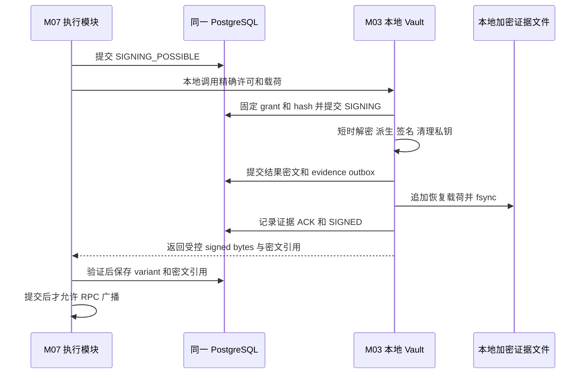

# M03：项目内密钥 Vault、硬化派生与受限签名

返回 [设计总览](README.md)。关联需求：助记词安全存储、加解密、派生泄露防护、签名与恢复。

> 工程位置：`wallet-vault` 独立 library crate；编译进唯一应用。没有独立 Signer 服务、内部网络协议或外部密钥托管依赖。

## 1. 职责与实际安全边界

M03 拥有密钥生成、密文封装、解锁会话、私有派生、签名准入及结果证据。M04 只取得叶公钥/地址；M07 只取得特定批准交易的签名结果。资金密钥类型、派生中间节点、解密仓储不出本 crate；不提供 `export_seed`、`export_xprv`、`sign_hash` 或任意 calldata 签名入口。

| 威胁 | 本版措施与边界 |
|---|---|
| 仅数据库/备份被复制 | 密钥密文不含解锁秘密；Argon2id 增加离线猜测成本，随机解锁秘密提供高熵 |
| 密文或租户/用途被替换 | AEAD 与确定 AAD 绑定环境、租户、版本和用途，解密失败即拒绝 |
| 普通模块误用、业务参数篡改 | 私有类型、用途白名单、交易模板重解码、精确许可和持久幂等 |
| 叶私钥与父 xpub 同时泄露 | 全硬化路径消除非硬化父私钥反推条件；不分发扩展公钥 |
| 根/VMK 泄露 | 受影响根或 Vault 内密钥仍失守；分租户随机根、分 Vault、在线资金上限限制范围 |
| 应用任意代码执行、主机管理员、恶意依赖 | 同进程可访问解锁内存，crate 不能提供操作系统/硬件隔离 |
| 同库记录及同机证据整体回退 | 本地 hash 链不能自行证明最新状态；必须结合未回退的离线检查点/副本，否则保持恢复屏障 |

不同 crate 的数据库连接仍属同一应用安全主体。签名复核用于防止正常调用路径越权，不宣称能抵御已经完全控制此进程的攻击者。

## 2. 密钥分域与记录所有权

默认每租户一个资金 Vault，各 Vault 独立随机 VMK 与解锁秘密；平台通信/审计和平台恢复证据分别使用独立 Vault。高风险租户可进一步按充值/运营用途分 Vault，不从全平台种子派生各租户根。

| 类别 | 密钥来源 | 允许用途 |
|---|---|---|
| `DEPOSIT_HD` | 租户、地址域、分片/版本各自随机根 | 充值地址派生、向本租户金库归集 |
| `HOT` | 与充值根无派生关系的随机材料 | 已批准提现与受控调拨 |
| `GAS_POOL` | 独立随机材料 | 向登记充值地址补原生币、批准的余额归还 |
| `TREASURY` | 独立随机材料 | 向本租户登记热钱包/Gas 池补仓 |
| `COLD` | 仅离线保管 | 人工离线调拨；在线 Vault 不保存其私密材料 |
| `WEBHOOK/HTTP_ENCRYPTION/TLS/AUDIT` | 按用途独立材料 | 通信与审计，不能授权链资金签名 |
| `EVIDENCE` | 独立证据 Vault，按租户/分段独立 DEK | 签名结果与发行清单的加密恢复证据，不解封资金材料 |

同租户多个根共享 VMK 时，VMK 泄露影响这些在线根；多个根只缩小单根泄露范围。一个在线进程同时解锁多个 Vault 时仍共享内存风险。

表均位于同一 PostgreSQL；`vault` schema 由 M03 私有仓储维护，不是独立安全存储服务。

| 表 | 核心字段与约束 |
|---|---|
| `vault_headers` | `vault_id, environment, owner_scope, epoch, kdf_profile, salt, wrapped_vmk, wrap_nonce, format_version, state` |
| `vault_key_materials` | `key_id, vault_id, tenant_id, purpose, key_version, material_format, scheme_version, material_ciphertext, material_nonce, wrapped_dek, dek_nonce, envelope_version, state` |
| `vault_nonce_claims` | `encryption_key_id, domain, nonce`；同加密 key+nonce 唯一，旧封装使用记录不静默删除 |
| `key_roots` | M04 可读元数据视图：根/租户/地址域/用途/版本、样本叶公钥 hash；不含 xpub/chain code |
| `signing_grants` | `grant_id, business_operation_key, execution_id, family_id, unsigned_hash, exact_payload, fee_caps, approval_digest, policy_version, pause_epoch, expiry, state` |
| `signer_business_operations` | 租户+稳定业务键唯一；保存 active execution、attempt、最终未付款证明 |
| `signer_requests` | grant 唯一；固定 payload hash、结果密文/tx hash、证据 ACK、水位、状态 |
| `signer_budget_reservations` | 同 execution 金额只计一次；同 Nonce 费用替代按最大可能支出预留 |
| `vault_evidence_outbox` | 唯一 event ID、类型、密文恢复载荷、序号、文件持久 ACK |

## 3. 助记词生成与恢复权威

1. 通过操作系统 CSPRNG 生成 256-bit 熵，形成 24 词 BIP39；不得使用 UUID、时间戳或普通伪随机数生成密钥。
2. 根恢复权威为版本化 `BIP39_ENTROPY_V1`：32-byte 熵、wordlist、passphrase 规则与校验元数据，整体 AEAD 封装。默认英文词表、额外 BIP39 passphrase 为空。
3. 在 M03 内短时还原助记词并生成 64-byte BIP39 seed，再建立 BIP32 根；不同时在数据库保存另一份明文/独立种子副本。熵、助记词和 seed 是不同表示。[BIP39](https://github.com/bitcoin/bips/blob/master/bip-0039.mediawiki)
4. 导入非空 BIP39 passphrase 必须明确规范化规则与加密恢复载荷；在线签名需要此材料时也封装入根载荷，不能声称它仍是独立离线保护因子。
5. 建钥仪式校验完整路径样本，生成项目内加密离线恢复包，双人复核后激活。普通 HTTP、管理页面和日志不返回明文助记词。
6. 临时词串、熵、seed、中间扩展私钥和叶私钥都按敏感内存处理。离线展示助记词仅限明确的建钥/恢复流程，禁止落入终端录屏和 shell history。

**Vault 解锁口令不是 BIP39 passphrase**。更改存储口令不改变链地址；更改 BIP39 passphrase 会改变根和全部派生地址，必须作为新根版本处理。

## 4. 项目内分层加密

```text
离线保管的解锁秘密
  └─ Argon2id + 独立 salt → 32-byte Unlock KEK（仅解锁瞬间存在）
       └─ AEAD 解封独立随机 32-byte Vault Master Key / VMK
            ├─ AEAD 解封各记录独立随机 32-byte DEK
            │    └─ AEAD 解密该根熵/单钱包私密材料
独立证据 Vault 的 VMK
  └─ AEAD 解封 Evidence DEK → 加密追加恢复证据
```

默认解锁秘密为 CSPRNG 生成的 32-byte 随机值，离线保管；人工口令模式必须使用足够强的口令。两种模式均执行登记的 Argon2id，不将应用登录密码当作资金解锁秘密。

| 参数 | 一期契约 |
|---|---|
| KDF | Argon2id v1.3，salt 至少 16-byte 随机，输出 32-byte |
| 校准基线 | RFC 9106 的受限内存方案：`m=65536 KiB, t=3, p=4`；上线按目标机器测量并审批，不自动降级 |
| KDF 资源控制 | profile 白名单、输入长度/m/t/p 上限、解锁串行/小并发、失败退避；先校验参数再申请内存 |
| AEAD | XChaCha20-Poly1305，256-bit key、24-byte nonce、16-byte tag；禁止 reduced-round 或自实现算法 |
| nonce | 每次封装由 CSPRNG 生成；同一加密 key 不复用；记录加密 key 标识与 nonce，持久唯一检查辅助防错 |
| 编码 | 固定版本和字段顺序的确定二进制编码；不使用可歧义的字符串拼接/任意 JSON 作为 AAD |

Argon2id 参数选择参考 [RFC 9106 §4](https://www.rfc-editor.org/rfc/rfc9106.html#section-4)。XChaCha 的长 nonce 支持随机生成，但仍要求同一 key 下唯一。[libsodium 官方说明](https://doc.libsodium.org/secret-key_cryptography/aead/chacha20-poly1305/xchacha20-poly1305_construction) Rust 实现可使用 [RustCrypto chacha20poly1305](https://docs.rs/chacha20poly1305/latest/chacha20poly1305/)；它是本地密码库，不是外部加解密服务。

三类封装使用不同域标签和固定 AAD，元数据参与认证：

| 封装层 | AAD 关键字段 |
|---|---|
| `VMK_WRAP` | format/environment/vault/owner scope、VMK epoch、KDF profile/salt |
| `DEK_WRAP` | environment/vault/tenant/key/purpose、材料 scheme、DEK ID、当前 wrapping VMK epoch、wrap version |
| `MATERIAL` | environment/vault/tenant/key/key version/purpose、material format/scheme、DEK ID、material generation |

材料 AAD 不绑定以后会变化的当前解锁 salt/VMK epoch；VMK 轮换只重新封装 DEK。wrap version 与 material generation 分开保存，材料重加密才变更后者。拒绝跨租户复制、用途修改和算法降级；AEAD 不证明密文是最新版本，防回退依赖第 10 节证据。

数据库、磁盘、WAL 和离线副本只能保存封装后的材料及非秘密参数。解锁秘密不得进入同库、应用配置、镜像、环境变量、命令行参数、日志或与数据库共同复制的自动启动文件。

## 5. 解锁、锁定与内存生命周期

Vault 状态：`LOCKED → UNLOCKING → UNLOCKED → LOCKING → LOCKED`；认证/完整性异常转 `QUARANTINED`。每个 Vault 有独立会话 epoch、允许用途、到期策略与在途操作计数。

- 通过本进程本地无回显 TTY 或启动时继承的匿名 FD 输入秘密；不提供远程 HTTP 解锁、内部解锁守护进程或明文秘密文件自动加载。
- 解锁前确认环境、恢复屏障、Vault/header 版本和审批范围；校验 AEAD 后只将 VMK 放入 M03 私有会话，立即清除口令和 Unlock KEK。
- 默认不缓存根 seed/扩展私钥/叶私钥；每次操作短时解密和派生。若测量后需要根缓存，必须单独审批 TTL、数量、作用域和资金敞口，不能成为默认行为。
- LOCKING 先关闭新操作准入并提升会话 epoch，等待已准入操作完成持久交接，再清零 VMK。不能在其他线程借用密钥时强行清零或声称取消阻塞线程即擦除内存。
- 进程重启后所有资金 Vault 回到 LOCKED；人工重新解锁是默认运行约束。将秘密放回同机以实现无人值守重启会改变威胁模型，本版不提供该模式。
- 资金 Vault 锁定期间可查已发行地址、扫描充值、观察已签交易；新硬化派生/签名暂停。独立证据 Vault 就绪时，预派生池可按 M04 规则绑定，已持久 raw 可受控读取重播。全部 Vault 锁定时，重播须先解锁证据 Vault，不重新生成付款。
- 通信 Vault 与资金 Vault 分开解锁；TLS/回调所需通信材料不可用时相应入口/投递保持未就绪，已验签的只读功能按其实际依赖开放。

敏感类型不实现 `Clone/Copy/Serialize/Display`，`Debug` 只显示脱敏元数据；固定容量、尽量原位处理，避免移动/扩容制造副本。优先 `Zeroizing/ZeroizeOnDrop`，拒绝 core dump/调试附加，按平台能力锁页并禁止敏感页落 swap；生产启动验证这些能力，失败不得静默忽略。

清零只能清除受控缓冲，编译器/库临时副本、寄存器和硬件侧信道仍需评估。[zeroize 官方边界](https://docs.rs/zeroize/latest/zeroize/) `panic=abort`/崩溃时不能依赖 Drop 保证擦除。

## 6. 全硬化派生与泄露分析

新充值根使用不可变方案 `EVM_HARDENED_V2`：

```text
m / 44' / 60' / 0' / 0' / address_index'
逻辑 address_index ∈ [0, 2^31)
BIP32 子序号 = address_index + 2^31
```

这采用 BIP32 硬化派生和 EVM coin type，但**不是标准 BIP44 的非硬化 change/address 路径**，不能依靠通用钱包默认路径或 gap limit 恢复。[BIP44 路径](https://github.com/bitcoin/bips/blob/master/bip-0044.mediawiki)

- `m/44'/60'/0'/0/index` 的 account xpub 可继续非硬化派生；结合一个相应子私钥，攻击者可反推出该 account 扩展私钥，影响整个充值分支。
- V2 最后两级也硬化；业务模块只持有叶公钥和地址，不取得任何父 xpub、xprv 或 chain code。地址生成必须在 M03 解锁时完成。[BIP32 安全说明](https://github.com/bitcoin/bips/blob/master/bip-0032.mediawiki)
- 单个硬化叶私钥泄露仍能盗取该地址所有支持网络的资产及后续误入款；它不通过上述非硬化公式暴露父私钥。根种子或父扩展私钥泄露仍控制其所有后代。
- 默认每租户/地址域/根分片使用独立随机熵；根地址数和资产敞口达到配置上限时启用新随机根。不得仅增加共享根的 branch 编号并声称等于独立根。
- 多 EVM 网络复用地址也复用叶私钥；需要降低跨网络影响时采用发行前确定的独立网络根模式。

派生输入必须对应 M04 已持久 RESERVED allocation；M03 自行重建规范路径和地址，不接受调用方任意路径。返回 `allocation_id, scheme_version, leaf_public_key, address, result_digest`。4-byte fingerprint 仅用于诊断，不能替代完整叶公钥/样本校验。

历史非硬化路径以 `EVM_LEGACY_V1` 标记，保留原根/路径与受限归集能力；新根不再使用。改路径不会改变旧地址安全性，不原地覆盖 scheme，不自动给旧用户换地址。迁移须按 M04 激活新地址、持续监听旧地址；仓库当前无已实施密钥数据，本条是兼容契约。

## 7. 允许的签名意图

| 意图 | 必须复核 |
|---|---|
| `DEPOSIT_SWEEP` | 发起地址永久归属、全路径、目标为本租户金库、金额和费用预算 |
| `GAS_TOPUP` | GAS_POOL 来源、登记充值目标、关联归集计划、补充代次和上限 |
| `APPROVED_WITHDRAWAL` | 不可变订单、P+F Hold、有效批准、HOT 用途、硬额度与最新暂停 epoch |
| `TREASURY_REBALANCE` | 同租户登记钱包、来源/目标角色、白名单、多人批准、资产/费用预留 |
| `NONCE_BARRIER` | 高权限批准、原交易族、同钱包同 Nonce、不产生另一笔外部付款 |

M03 重解码完整 EVM 交易，核验 chain ID、nonce、to/value、calldata、费用字段、签名恢复地址与授权摘要。ERC-20 仅允许登记合约的 transfer 模板，原生转账 calldata 默认空；不签任意消息、approve、未知合约调用或未知交易扩展。

## 8. 本地签名许可与准入

许可是持久记录 + M03 私有、不可由业务调用方构造的进程内能力，不使用跨服务 JWT/独立授权签名密钥。跨 crate 请求只带公开 grant 引用和业务参数，grant ID 本身不证明有权签名；M03 经只读事实端口重载订单/预留/批准，复核自身硬规则后内部构造/消费 `SigningPermit`，此秘密操作能力不进入 `wallet-types`。

```text
grant_id, environment, tenant_id, vault_id, key_id, key_version
business_operation_key, operation_id, execution_id, attempt_no, tx_family_id, intent_kind
chain_id, from_address, nonce, asset_id, recipient, amount, calldata_hash
unsigned_payload_hash, exact_transaction_type_and_fields, fee_generation, total_fee_cap
funding_reservation_id, approval_digest, policy_version, pause_epoch, expires_at
```

稳定业务键包含租户、业务类型和 external_order_id；同键不能存在第二个仍可能付款的 execution。新 attempt 必须有旧 attempt 永久撤销/最终未付款证明，不能靠新 UUID 或 attempt_no 绕过。

费用加速只改变同家族批准范围内费用；新 generation/new grant 固定新精确载荷。经济本金只预留一次，同 Nonce 各变体费用取最大可能支出。

签名准入短事务按固定顺序锁 pause control、稳定业务操作和 grant，检查最新 epoch、有效期、事实版本、预算、会话准入，提交 `SIGNING`。M13 暂停使用相同控制行序列化。其线性化边界是准入提交：之前已准入的签名按可能已签处理；之后的普通请求拒绝。加密/签名不持有用户资金行锁。

审批与策略来自同项目/同库，硬规则只能约束未被破坏的正常执行路径。双人审批防单一业务身份误操作，不等同于链上多签或跨进程信任隔离。

## 9. 签名结果交接与崩溃处理



状态：`RESERVED → SIGNING → SIGNED_UNSEALED → SIGNED`，或有持久证据的 `REJECTED/REVOKED_UNSIGNED`。grant 第一次固定 unsigned hash；同 grant 同 hash 重试返回原结果，同 grant 不同 hash 拒绝。

签名 bytes 加密在结果与证据载荷中，tx hash/状态可供锁定状态跟踪。结果交付前 DB 与证据文件均确认；本地调用返回也不能早于持久化。raw transaction 可被广播，按敏感执行凭据管理，不写日志。

| 中断位置 | 处理 |
|---|---|
| 仅 SIGNING 已提交 | 保留资金；检查原载荷，可恢复同钱包同 Nonce，不签另一笔付款 |
| 结果落库但文件未确认 | `SIGNED_UNSEALED`；补写同证据，不广播、不解冻 |
| 文件已写但 ACK 未提交 | 按 event ID/hash 查询重放，确认后交付原结果 |
| 返回前/调用方保存前崩溃 | 从 signer_requests/证据恢复原结果，继续原家族 |
| 结果无法证明不存在 | 保持 SIGNING_POSSIBLE/恢复屏障，不凭超时释放 Hold |

默认采用受审查的确定性 secp256k1 签名实现及协议要求的规范化；不自制 ECDSA nonce。即使库产生不同签名字节，也必须记录全部可能 hash，且始终同一经济载荷/Nonce。

## 10. 项目内持久证据与恢复包

项目自身维护本地加密追加文件，承载发行清单、签名精确载荷/raw bytes、稳定业务身份及审批摘要。记录有 `event_id, sequence, previous_hash, payload_hash, format_version`；内载荷用 Evidence DEK 封装，文件头保存其封装 key、证据 Vault/header/KDF 恢复信息，不保存解锁秘密。证据密钥与资金 VMK 分开，锁定资金不影响证据落存；证据密钥泄露可暴露业务信息和已签广播凭据，但不能生成新链签名。

文件写入限制目录/权限、单写者、有界 frame、校验尾部截断、段轮换和 fsync；首建/更换目录项还需目录持久化。PG evidence outbox 和文件 ACK 按 event ID/hash 恢复，重复相同内容幂等、相同 ID 不同内容隔离。文件与 PG 没有原子事务，不能把 fsync 当作离线副本 ACK。

常规确认保证当前配置的 PG 持久故障模型与本地证据落存；同机证据不覆盖整机/磁盘全毁。周期导出本项目生成的加密离线副本及签名检查点，由运营人员在不同介质保管。若承诺整机毁损后已发地址/已交付签名 RPO=0，须把经过验证的自管异机备份 ACK 纳入交付门槛；本版默认周期离线备份不能做此承诺。

恢复包包含密钥封装、解锁恢复信息引用、词表/passphrase 规则、完整派生 scheme、tenant/root/domain 映射、已分配索引、已发行地址/出生高度、签名族与账本备份水位。解除出款屏障详见 [M12](12-reconciliation-and-recovery.md)。

## 11. 轮换、泄露响应与离线模式

| 操作 | 地址与处理 |
|---|---|
| 解锁秘密/KDF 轮换 | 新 salt/KEK 重包 VMK，验证后事务切 header；地址不变，旧副本仍受旧秘密保护 |
| VMK 轮换 | 新 VMK 重包全部 DEK，分代迁移并验证完整性；地址不变，不重新生成根 |
| DEK/算法封装轮换 | 同一明文材料重新封装，采用新 nonce/envelope；保留可恢复的旧版本直到验证完成 |
| HD 根轮换 | 新随机根只用于新发行/显式迁移；旧地址归属/监听与受限归集保留 |
| 叶私钥泄露 | 隔离该地址及复用网络，批准转移可控资产，停用新充值展示并持续监听 |
| 根/VMK/主机疑似泄露 | 暂停影响范围、保全证据、在干净环境生成新根并授权迁移；仅重包密文无效 |

恢复解锁秘密丢失且无有效离线恢复材料时，软件不能绕过加密恢复资金。旧助记词/私钥泄露后改密码也不能撤回攻击者控制权。

可选冷钱包使用同项目二进制的人工 `offline-sign` 模式：无网络，读取固定意图包、离线 Vault、登记公钥和人工复核，输出签名交易文件。在线 VMK 不能解封冷材料，它不是后台签名服务，本期不实现外部多签/MPC。

在线 M07 在导出意图包前提交 `SIGNING_POSSIBLE` 并绑定 wallet/nonce/grant/精确载荷；意图包有批准摘要和平台审计签名，离线端核对预置公钥、完整载荷和人工目标地址。离线文件记录 grant 消费/结果并持久化后才输出签名包；重复同 grant 同载荷恢复原结果，不签修改后的交易。在线导入核对原意图/Nonce/恢复地址，按正常结果证据门槛保存后广播。包过期只限制正常工具新签名，无法撤销已产生/复制的签名；未回传不能据此解冻或换 Nonce 重付。

## 12. 接口、性能与验收

| 受限接口 | 输入与结果 |
|---|---|
| `InitializeVault/RotateEnvelope` | 本地仪式、scope、版本和秘密输入 → 仅密文/元数据 |
| `UnlockVault/LockVault` | 本地认证/审批、Vault ID、会话范围 → 状态/epoch，无明文输出 |
| `DeriveReservedAddress` | 永久 allocation、根/scheme → 叶公钥/地址或明确无效子索引 |
| `AuthorizeIntent/SignIntent` | 固定业务事实、精确载荷 → 公开 grant 引用/已持久签名结果；permit 只在 M03 内部 |
| `ReadSignedResult` | 授权 execution/grant、解锁恢复会话 → 原结果；不创建新签名 |
| `ExportEncryptedRecovery` | 本地批准、备份范围和独立备份秘密 → 版本化加密包/检查点 |

Argon2id 解锁与签名/派生使用独立并发预算和受控阻塞池；避免扫描/Webhook 挤占密码队列。批量派生受根作用域、永久索引和最大批量限制；昂贵操作不在 Tokio reactor 或资金长事务中执行。

- 跨租户交换密文、篡改 AAD/KDF/用途/路径，拒绝且无明文日志。
- 数据库备份单独不能解密；错误秘密、未知算法、nonce 重用和超限 KDF profile 拒绝。
- 验证全硬化路径、叶泄露与旧非硬化兼容风险；业务侧不存在扩展公钥/chain code。
- 锁定与并发签名竞争有明确准入点；在途可能签名不得解冻；重启不自动解锁。
- 同 grant 重试、各持久化边界断电、证据文件截断/缺失，恢复同交易族且不新增付款。
- 离线包可恢复首尾及抽样索引地址，映射和 scheme 一致；模拟全部副本回退时保持屏障。
- 对完整进程/主机控制场景明确报告软件保护失效范围，不将私有 crate 作为测试通过的隔离承诺。
