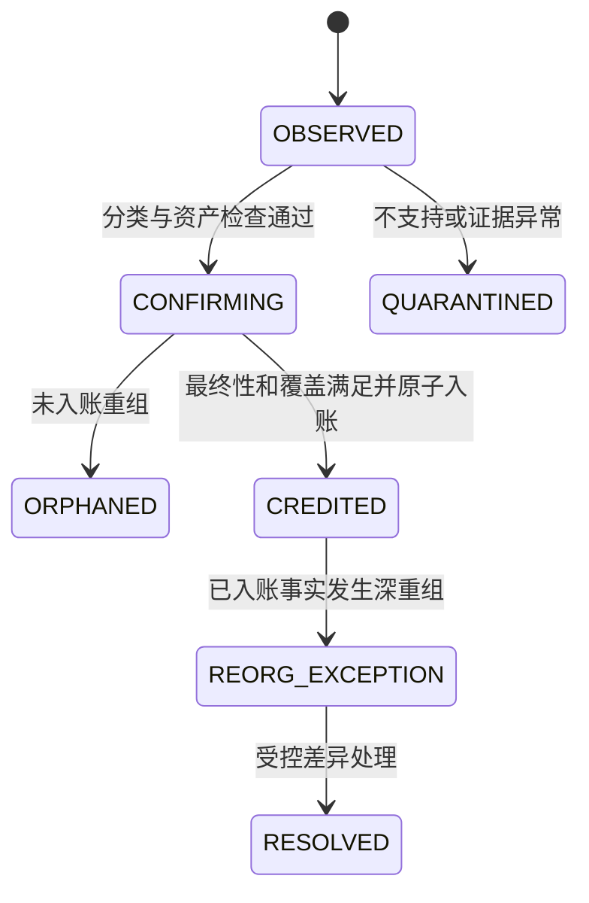

# M06：链索引、充值识别、最终性与重组

返回 [设计总览](README.md)。关联需求：EVM 原生币/ERC-20 准确充值、重复扫描防重、最终性和恢复。

## 1. 职责与数据来源

本模块记录链上事实、扫描覆盖和充值订单，并在证明到账条件后调用 M05 入账。地址/资产识别读取 M04 的历史有效注册表；自有出向交易与内部资金迁移读取 M07 的交易族和预期效果。

WebSocket 仅提示新块，持久化区块扫描是权威。至少配置两个独立 RPC 来源，核对链身份、区块 hash 和关键回执。两个来源一致不等同密码学最终性，生产可增加自有验证节点或可信检查点。

## 2. 数据与幂等键

| 表 | 字段与索引 |
|---|---|
| `chain_blocks` | `chain_id, height, hash, parent_hash, canonical, observed_at`；块 hash 唯一；规范块高度部分唯一 |
| `scan_coverages` | `chain_id, scanner_kind, shard_id, policy_version, height, block_hash, state` |
| `chain_movements` | `id, chain_id, block_hash, tx_hash, movement_locator, asset_id, from_bytes, to_bytes, amount, canonical_state, raw_ref` |
| `movement_classifications` | `movement_id, registry_version, intent_ref?, category, owner_tenant, user_id?, evidence_hash` |
| `deposit_orders` | `id, tenant_id, user_id, asset_id, logical_movement_ref, active_observation_id, state, credit_cycle, credited_journal_id` |
| `deposit_credit_cycles` | `deposit_id, cycle, observation_id, credit_journal_id, reversal_journal_id?, state` |

观测事实唯一键为 `(chain_id, block_hash, tx_hash, movement_locator, asset_id)`。`movement_locator` 对 ERC-20 为收据内日志位置，对原生币为归一化调用路径/协议转移位置，不把所有原生币入款伪装成 `log_index=0`。

另存节点的 block-wide `log_index` 用于诊断，不将它作为跨重组不变的业务身份。重入另一块时交易执行上下文可能变化，只有核对交易内位置、资产、来源、目标和金额后才能关联同一经济事件。

## 3. 扫描、覆盖与检查点

```text
1. 从持久覆盖水位读下一高度，RPC 获取块与 parent hash。
2. 发现 parent 不匹配则先回退到共同祖先，不继续顺推。
3. 获取完整交易、回执、白名单日志和要求的 trace/特殊转移。
4. 验证回执归属、页数/查询范围完整性、解析结果和块 hash。
5. 事务写 blocks、movements 和对应扫描分片覆盖，再提交。
6. 各必需 scanner/shard 完成后，才能提升该块完整覆盖水位。
7. 最终性引擎只处理已覆盖且规范的事件；账本处理后另推进 credited watermark。
```

RPC 返回部分日志、trace 超时或缺回执时，该块标为不完整，不可将充值扫描水位整体推进到 next。`observed`、`complete`、`finality_ready` 和 `ledger_applied` 水位分开，保证宕机可重扫而不漏账。

支持 RPC 日志范围自适应切分、失败退避和每来源容量上限。块事实/解析版本保留，避免下游为了恢复不断重复昂贵 trace。

### 3.1 原生币

普通转入检查 `to/value` 与成功回执；合约内部转入需要批准的 trace Profile。基于 callTracer 处理 `CALL/CREATE/CREATE2` 等真实 value 转移，忽略 `DELEGATECALL/STATICCALL` 中不代表余额迁移的 value 表示。任何祖先调用回滚，其后代转移不得入账。[Geth tracer 字段](https://geth.ethereum.org/docs/developers/evm-tracing/built-in-tracers)

顶层普通转账与 trace 根调用归一成同一个 locator，防止重复计数。SELFDESTRUCT、共识/协议提款、链特定系统转移等能力按网络单独声明；未知余额增加进入异常调查，不自动编造一个普通充值事件。

发布充值支持范围前，必须证明所承诺路径的覆盖。trace 缺失时暂停相关入账或进入明确的有限支持模式，不能静默把“完整原生币充值”降为只扫描外层交易。

### 3.2 ERC-20

匹配网络与白名单合约、事件签名、topics/data 长度、目标归属、成功回执和历史资产 Profile。零金额事件可记录但不创建零金额资金凭证。mint/burn 或兼容例外按审核过的行为 Profile 解释。

事件识别与余额滚动核验结合：在相同区块检查点比较 `balance_before + Σincoming - Σoutgoing` 与最终余额；包含归集、同块多次转入转出。不得把单次 balance delta 机械等同某一条 Transfer 金额。

未知合约、费税型、重基准型或行为变化先隔离原始证据，不根据 symbol 创建用户资产。资产升级/冻结导致差异时停止该 Profile 下自动入账，仍持续观测。

## 4. 资金移动分类：避免内部转账重复充值

| 链上移动 | 分类与账本责任 |
|---|---|
| 外部地址 → 已登记用户充值地址 | 用户充值；达到最终性后按实际金额贷记用户 |
| Gas 池 → 用户充值地址 | 已登记 `GAS_TOPUP`，内部资产迁移；不增加用户 ETH 余额 |
| 用户充值地址 → 本租户金库 | `DEPOSIT_SWEEP`，迁移托管资产；不减少用户余额 |
| 金库 → 热钱包/Gas 池 | `TREASURY_REBALANCE`，内部资金迁移 |
| 热钱包 → 外部地址 | M08 提现；M07/M08 接收执行事实并结算 |
| 外部地址 → 金库/热钱包 | 预登记资本投入才记资本；否则待分配负债/调查 |
| 登记托管地址发送未知交易 | 出向异常告警，不自动归类成正常归集 |

先核对 transaction hash/交易族、预期效果和来源角色，再处理接收地址。地址是否为 USER_DEPOSIT 不能单独决定增加用户余额。无法判断的托管域内转移进入 `CLASSIFICATION_PENDING`，资金暂不自动分配。

外部提现目标若属于本平台托管地址，提交阶段须明确拒绝或路由到受控内部转账产品；一期默认拒绝此类外部付款，防止重复资产迁移与归属歧义。

## 5. 最终性策略

| 网络能力 | 到账条件 |
|---|---|
| 有可靠 finalized 标记 | 块在最终规范链中、所有覆盖完成、事件核验通过 |
| 只有批准的确认深度 | 最新规范链高差满足策略；声明其概率风险与停机重组阈值 |
| L2 | 同时满足登记的 L2 包含、L1 锚定/结算条件，不仅看序列器返回成功 |
| RPC 分歧/最终性停滞 | 保持待确认，不自动降低要求 |

确认深度定义为 `head_height - inclusion_height + 1`，避免不同模块出现 off-by-one。按网络和金额等级保存 policy version，策略加强可影响未入账订单；不以费用/流动性压力降低最终性标准。

区块标签、回执和日志的基本查询由 JSON-RPC 提供，支持度需逐链验证。[Ethereum JSON-RPC](https://ethereum.org/developers/docs/apis/json-rpc/)

## 6. 充值状态与入账事务



```text
BEGIN
  锁定 deposit order，复查 observation 规范状态及最终性证据。
  确认没有同 cycle 的有效入账；读取用户限制与资产政策。
  M05：Dr 充值钱包资产，Cr 用户 AVAILABLE 或 RISK Hold。
  更新 credited journal、订单状态和 ledger-applied 记录。
  写 deposit.credited Outbox；COMMIT。
```

扫描入库不直接发最终到账通知。Webhook 失败不回滚入账。用户合法小额充值仍按实际金额入账，`min_deposit` 一期用于提示；Gas 优化通过归集阈值完成，不通过丢弃用户小额到账。

## 7. 重组与再次包含

未入账分叉：回退规范标记与扫描覆盖到共同祖先，孤立事件标记 ORPHANED，重扫新分支。旧事实保留，不能删除后丢失证据。

已入账深重组：暂停相关出款授权，创建 M12 差异工单；保留账本历史，不自动扣负用户余额。原交易重新包含时：

1. 未入账的旧观测关联新的规范观测，重新确认即可。
2. 已入账且尚未冲正的同一经济效果，不重复正向入账。
3. 已完成冲正/损失处理的订单，以新的 credit cycle 和恢复凭证重新建立有效净余额。
4. 重执行的金额/日志语义变化，先处理旧效果再审批新效果，不能只比较 tx hash。

自动流程只覆盖明确的浅重组。最终性已破坏的情况须由一致链检查点、账本效果和签名事实共同决定恢复方式。

## 8. 接口、指标与验收

| 内部接口 | 契约 |
|---|---|
| `IngestBlockFacts` | 事实、解析版本、分片覆盖一起提交 |
| `ClassifyMovement` | 返回 owner/资产/业务意图或隔离原因 |
| `ApplyFinalDeposit` | 幂等订单与凭证，同事务提交 |
| `GetCoverage(chain, address, policy)` | 供 M04 激活地址和 M12 对账 |
| `EmitFinalExecutionFact` | 供 M07 验证交易族，不能由 scanner 决定提现解冻 |

监控：完整扫描落后、trace 缺失、日志分页截断、RPC hash 分歧、待确认时长、finalized 停滞、分类悬而未决、重复事件、深重组与余额差异。

- 顶层转账被 block 与 trace 同时观察，仅一次有效用户入账。
- 多个内部转入、祖先回滚、失败交易、同块多次 token 进出分别正确处理。
- 重复扫块、入账提交后宕机、Webhook 重试均不重复增加余额。
- 补 Gas 到用户地址不产生用户原生币充值；归集接收不产生第二笔用户充值。
- 解析器失败/部分 RPC 响应不推进完整覆盖；新地址回填不漏缓存切换区间。
- 浅重组无资金凭证；深重组及重新包含保持有审计的有效净入账。
