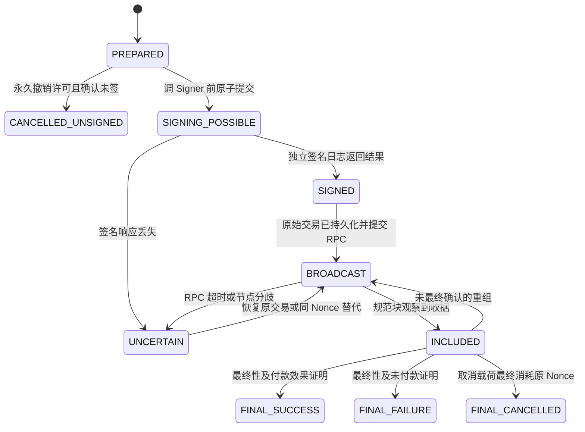

# M07：交易意图、Nonce、签名交接与链上执行

返回 [设计总览](README.md)。关联需求：安全提现/归集执行、Gas 调度、广播不确定性及防重复付款。

## 1. 职责与统一模型

本模块拥有链执行事实，接收 M08/M09/M10 批准的语义意图，准备交易、预留执行槽位、请求 M03 签名、持久化后广播并跟踪。它不决定用户余额、风控批准或服务费。

```text
业务 operation → semantic intent → execution attempt
→ 链执行槽位（EVM wallet+nonce）→ tx family
→ 一个或多个精确 signed transaction → 唯一最终生效结果
```

提现、归集、补 Gas、补仓共用执行器。EVM Nonce 是适配器的 execution slot；未来 Solana 的 blockhash 有效期、TRON 资源与引用块不放进链无关账本模型。

## 2. 数据模型

| 表 | 核心字段与约束 |
|---|---|
| `tx_intents` | `id, tenant_id, operation_id, kind, chain_id, asset_id, recipient, amount, semantic_hash, policy_version`；经济参数不可变 |
| `executions` | `id, intent_id, attempt_no, wallet_id, reservation_id, state, version, terminal_proof_ref`；同 intent 最多一个可生效尝试 |
| `nonce_lanes` | `chain_id, wallet_id, next_nonce, finalized_nonce, pause_state, version` |
| `nonce_slots` | `chain_id, wallet_id, nonce, execution_id, state`；发送钱包+链+Nonce 唯一 |
| `tx_families` | `id, execution_id, wallet_id, nonce, economic_hash, state, effective_tx_hash?` |
| `tx_variants` | `family_id, generation, purpose, unsigned_hash, grant_id, encrypted_raw_ref, local_tx_hash, fee_caps, sign_state` |
| `broadcast_attempts` | `variant_id, provider_id, attempted_at, returned_hash?, result_class` |
| `tx_observations` | `tx_hash, block_hash, receipt, effect_proof, canonical, finality_state` |

`purpose` 区分 `PAYMENT / FEE_REPLACEMENT / NONCE_BARRIER`。受控取消也属于同 Nonce 家族，但不是普通付款经济参数更新。任何 variant 创建前都要持久化授权与精确待签载荷。

## 3. 执行状态



`UNCERTAIN` 是可恢复状态，不是付款失败。任何 `SIGNING_POSSIBLE` 之后的状态都不允许只按超时释放资金。不同交易 hash 只是同一次执行的变体，不能自动创建新的付款尝试。

## 4. Nonce 分配与执行通道

```text
1. 检查当前钱包/链允许执行，已有持久流动性及 Gas 预留。
2. BEGIN；锁 nonce_lane，读取 next_nonce。
3. 校验没有未知链上 Nonce、无未处理空洞，队列未超上限。
4. 插入唯一 nonce_slot，绑定 execution；next_nonce +1。
5. 写精确交易模板、family 和 PREPARED；COMMIT。
6. 外部估价/模拟完成后，在短事务中固定费用计划和授权。
```

模拟与 RPC 不持有 nonce/余额长事务锁；模拟结果过期后先重新校验，再以预期版本提交模板。较高 Nonce 可以排队，但会被较低 Nonce 阻塞，pending 深度和队首年龄必须有限额。

新钱包初始化需核对最终链状态、已包含交易及平台历史。`pending nonce` 仅用于提示，不能直接作为任意跳跃到新 Nonce 的事实。恢复时出现链上已消费但 DB 未知的 Nonce，要找出实际交易，暂停通道并对账。

已预留 Nonce 一期不回收。如果从未签名的业务被安全取消造成空洞，由批准的 `NONCE_BARRIER` 或明确通道修复消耗该槽位，再推进后续执行。填洞也是链交易，需费用和审计；不能用新的用户付款悄悄复用取消槽位。

## 5. 交易构建与费用计划

原生币：固定网络、发起地址、目标、value、空 calldata 或批准的接收模板。ERC-20：to 为审核合约、value 为零，calldata 固定 transfer 目标和金额。发送钱包必须登记为本租户允许的用途，无未知代理/委托代码。

| 费用模型 | 预留与结算 |
|---|---|
| EIP-1559 | 预留 `gas_limit × max_fee_per_gas + extra_fee_cap` |
| Legacy | 预留 `gas_limit × gas_price + extra_fee_cap` |
| L2 | 由网络适配器提供额外 L1/数据成本、保守上界及实际收据解析 |

执行费用基于批准金额模拟、estimateGas 安全余量和总费用上限。实际 Ethereum 费用为 `gas_used × effective_gas_price`，链特定额外费用只在其未包含于该值时另加。[EIP-1559](https://eips.ethereum.org/EIPS/eip-1559)

若网络额外费不受交易中的费用字段硬限制，估计值不能当作保证上界。链准入必须确定可验证的保守总费用边界和资本缓冲；无法满足资金担保条件时，不启用该网络的自动签名。

费用计划带版本、过期时间、原生资产 ID 和预算。报价过期不自动提高批准上限；先重估、重新预留和申请许可。native 提现必须同时预留 `value + fee_cap`，token 提现分别预留 token 金额与原生 Gas。

## 6. 签名、持久化与广播

1. 短事务 CAS `PREPARED → SIGNING_POSSIBLE`；提交后才调用 Signer。
2. Signer 按 M03 永久登记许可、签名并保存结果；重试同 grant 恢复结果。
3. 执行器自行验证签名恢复地址、完整载荷与本地 tx hash，保存加密 raw transaction。
4. raw transaction 可靠落库后才调用 `eth_sendRawTransaction`。
5. RPC 返回 hash 与本地计算值必须一致；超时或 already-known 只改变广播观测。
6. 跟踪全部变体；最终收据驱动业务结算与实际费用凭证。

原始签名交易不是私钥，但具有可广播资金权限，存储与读取权限受控。暂停期间保留它，不能假设删除 raw bytes 会使网络中的副本无效。

### 6.1 最关键的竞态

取消请求必须和 `SIGNING_POSSIBLE` 的条件更新争夺同一执行状态锁。取消先成功时，永久撤销未消费许可；签名可能先发生时，取消转为有审批的链上撤销流程。不能仅检查“尚无 tx_hash”就释放 Hold。

## 7. 加速、取消与重新执行

| 操作 | 必须满足 |
|---|---|
| 重播 | 完全相同 raw bytes，不改变钱包/Nonce/经济效果 |
| 费用加速 | 同钱包、同 Nonce、同收款人/value/calldata；费用在独立许可内；遵守该网络替代规则 |
| 链上取消 | 高权限 NONCE_BARRIER；追踪取消与付款竞争，直到一个最终消耗原 Nonce |
| 新执行尝试 | 上一个尝试已有可靠最终未付款/未签证明，并永久结束；业务 Hold/批准仍有效 |

替代交易所需费用涨幅是节点/网络策略，不硬编码通用百分比。原付款和取消竞争时，若原付款最终成功，订单按成功结算；取消的 HTTP 请求不能保证成功。

最终失败后可在审批范围和重试预算内创建下一尝试；默认不因为技术失败无限自动重试。新尝试若换热钱包，也必须有“旧尝试不可能再付款”的证据。pending 超时、单个节点查不到、grant 已过期都不是此证据。

## 8. 成功证明不能只看 receipt.status

| 类型 | 最终效果证明 |
|---|---|
| 普通原生付款 | 规范最终成功收据、正确 to/value 和对应转移效果 |
| ERC-20 | 正确合约及预期 Transfer：from、to、金额一致；资产 Profile 的执行校验通过 |
| Gas 补充/归集/补仓 | 符合登记来源、目标与数额的内部移动；仅一次资产迁移入账 |
| 取消 | 原发送地址的同一 Nonce 被批准取消交易最终消费 |

ERC-20 可以返回 false；交易成功状态不自动证明付款完成。[ERC-20 规范](https://eips.ethereum.org/EIPS/eip-20) 如 status=1 但预期日志/效果不成立，进入 `EFFECT_ANOMALY`、暂停资产并对账，不自动成功结算，也不立即重付。

最终 status=0 一般证明业务转移回滚，但 Gas 已发生。适配器还需排除该网络特殊效果，之后才发最终未付款证明。

## 9. 崩溃恢复表

| 崩溃点 | 恢复动作 |
|---|---|
| 槽位已预留、尚未调 Signer | 复用原槽位/模板，或明确撤销许可并修复空洞 |
| Signer 请求可能发出、响应丢失 | 查询独立 grant 日志，保持资金预留，恢复同一载荷 |
| Signer 已保存结果、业务 DB 未保存 | 导入已签结果，不能分配第二个 Nonce |
| raw 已保存、广播结果丢失 | 查询全部变体、同 raw 重播 |
| 上链收据已观察、账本未提交 | 按最终业务记账键幂等重做结算 |
| DB 恢复到旧备份 | 暂停通道，核对独立签名日志与链 Nonce 后恢复 |
| 未最终收据被重组 | 同家族回到待包含，维持预留，不新建付款 |

## 10. 模块接口、性能与验收

| 内部接口 | 输入与结果 |
|---|---|
| `PrepareExecution` | 不可变 intent、批准/资金预留、attempt → 幂等 execution、Nonce slot 与 family |
| `RequestSignature` | execution、预期版本、grant → 先持久 SIGNING_POSSIBLE，再返回已签结果或 UNCERTAIN |
| `BroadcastVariant` | 已持久 variant/raw_ref → 广播观测；不直接判定业务成功/失败 |
| `ApplyReceiptProof` | family、规范收据、效果与最终性 → 最终执行事实/证明供业务结算 |
| `CreateFeeReplacement` | family、新费用计划/许可 → 同经济参数、同 Nonce 的新 variant |
| `RequestNonceBarrier` | family、高权限审批 → 同 Nonce 的取消变体，不直接解冻 |
| `RecoverExecution` | execution、独立许可/签名日志水位 → 复用原 family 的恢复动作或阻塞原因 |

上述指令校验租户、稳定业务操作键与预期版本；外部 HTTP/RPC 调用不会绕过数据库状态提交和独立许可消费。

钱包通道并行，单通道槽位分配串行；不以进程内 Mutex 代替跨实例唯一约束。RPC、模拟和 tracker 使用有界并发与队列背压，不在热路径反复复制 raw bytes。

监控队首停留时长、Nonce 空洞/未知消费、签名不确定数量、替代频率、原生费用预留、实际费用超差、效果异常与重复结算。

- 并发提现/归集/补 Gas 在同钱包上不分配重复 Nonce。
- 各崩溃点重启后仍使用原交易族，不能发生第二笔可生效付款。
- 取消与签名竞态、付款与取消竞争、浅重组、ERC-20 false/no-return Profile 均有确定处理。
- 原生金额与 Gas 不足时禁止签名；实际网络费只记最终生效变体一次。
- 仅最终未付款证据才允许新尝试，未知 Nonce 和恢复旧 DB 都触发安全屏障。
