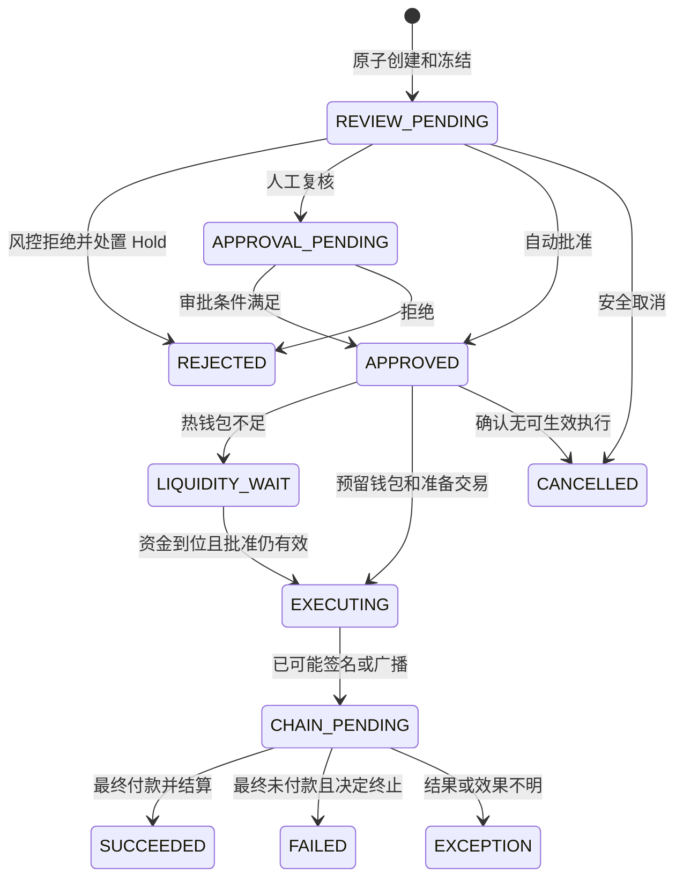

# M08：提现订单、风险规则与审批

返回 [设计总览](README.md)。关联需求：原生币/ERC-20 提现、冻结/释放、风险控制及提现优化。

> 工程位置：`wallet-core::withdrawal/risk`；订单、冻结、风控和额度在 core 内组合事务。

## 1. 职责与默认产品口径

本模块拥有报价、提现订单、风险决策、审批和业务结算。用户余额操作调用 M05，链流动性由 M10 预留，签名执行交给 M07/M03。业务终态与链执行结果是不同事实，但必须有唯一关联。

一期默认用户指定 `send_amount=P`，服务费 `F` 使用同一提现资产额外收取；总占用 `P+F`，外部预期收到 P。服务费只在最终成功时实现；平台承担实际原生 Gas。费用与失败处理不能在实现时临时决定。

## 2. 数据模型

| 表 | 关键字段与约束 |
|---|---|
| `withdrawal_quotes` | `id, tenant_id, user_id, asset_id, destination_bytes, send_amount, service_fee, total_debit, policy_version, expires_at, used_by` |
| `withdrawals` | `id, tenant_id, user_id, external_order_id, quote_id, hold_id, asset_id, destination, P, F, state, active_execution_id?, version` |
| `risk_decisions` | `withdrawal_id, decision_id, policy_version, rule_results, evidence_hash, action, assessed_at, expires_at`；不可变 |
| `risk_budget_counters` | `tenant/user, asset/valuation_basis, window_key, reserved_units, committed_units, version` |
| `risk_budget_reservations` | `withdrawal_id, counter_key, amount, state, origin_window`；订单+计数维度唯一 |
| `withdrawal_approvals` | `withdrawal_id, principal_id, decision, order_hash, policy_version, created_at`；批准者去重 |
| `withdrawal_settlements` | `withdrawal_id, outcome, execution_proof, principal_journal_id, fee_journal_ref, settled_at`；成功/终态结算唯一 |

`(tenant_id, external_order_id)` 长期唯一；相同订单号不同金额/地址/报价为冲突。报价只能绑定一笔业务订单，原幂等请求重试仍返回同订单。

## 3. 提现受理事务

```text
事务前：验签、scope、参数、网络/资产和目标地址基础校验。
BEGIN
  读取/创建 M02 幂等记录，检查 external_order_id 与报价绑定。
  锁租户控制、用户限制和有效报价，确认尚未过期/消费。
  检查来源余额、最低金额、全局/租户/用户暂停与基础额度。
  创建 withdrawal 与 M05 WITHDRAWAL Hold(P+F)。
  原子预留租户/用户金额与请求速率额度。
  消费报价，写 withdrawal.accepted/risk.requested Outbox。
COMMIT → 返回 202/REVIEW_PENDING。
```

本版在项目内运行限额、名单、地址历史/速度规则和人工审批，不依赖第三方风控服务；规则计算不放在资金长事务内。缺少必要事实或规则执行失败时保留待审状态，不能把“超时”当作低风险通过。经审批拒绝时，释放资金与额度，或在需要继续限制用户时转入风险 Hold。

## 4. 状态机与终态



状态图展示主要路径，实际转移通过 guard 校验执行记录。EXECUTING 中只要 M07 进入 SIGNING_POSSIBLE，就使用已签区间规则，即使订单尚未来得及显示 CHAIN_PENDING。订单查询带 `version, execution_status, cancel_requested`，不把技术 pending 当成业务失败。

### 4.1 取消与过期

人工审核/流动性等待可设置业务截止时间，过期只能在无可生效执行、许可永久撤销后释放。取消 API 可能返回 `202 cancel_requested`；付款已签时需批准 NONCE_BARRIER，最终是付款成功或取消成功之一。

报价过期检查发生在受理时；已受理报价金额不会因链拥堵改变。批准令牌过期影响新签名，已经签好的付款仍须跟踪。已签订单不因审批 TTL 到期自动解冻。

## 5. 风控阶段与规则

| 阶段 | 规则输入 | 结果 |
|---|---|---|
| 接入/基础检查 | 凭据、mTLS、scope、租户状态、用户限制、资产/目的地址 | 拒绝或允许受理 |
| 请求额度 | 用户/租户单笔、窗口金额、并发待审额、请求频率 | 原子预留或拒绝 |
| 行为评估 | 新凭据、集中目的地、异常时段、历史模式变化 | 自动批准、延迟、人工、拒绝 |
| 地址评估 | 目的地白名单、冷静期、风险数据和数据有效期 | 放行或提高审批等级 |
| 签名前复核 | 金额/地址未变、批准有效、最新暂停/限制、可用钱包 | 产生签名许可或继续等待 |
| 签名准入复核 | M03 钱包硬金额/速率、精确业务事实、用途白名单 | 本地精确许可或拒绝，非进程隔离 |

规则返回可解释的命中代码与证据 hash；对租户只提供可披露的状态/拒绝码，不暴露绕过策略所需细节。风险依赖不可用、价格过期、政策版本失效时进入待审或拒绝新授权。

风控金额门槛、白名单冷静期和风险源由批准的策略配置；本文不提供未经验证的生产额度。法币风险估值用定点整数、多源价格与异常检查，不能使用浮点进入账本，也不能因单一价格异常放大可提现额度。

### 5.1 并发限额

同一用户/租户的计数器行按固定顺序加锁；检查 `committed + reserved + requested <= limit` 后写 reservation。不得在缓存查询日额度再单独冻结资金。

金额额度以 P 为计量，费用和 Gas 另有预算。窗口默认 UTC 受理时间，记录 origin window；未完成的跨窗口订单还受总 pending exposure 限制。若产品要求按实际付款日计额，必须另建签名前/最终支付日计数规则，不能复用受理日口径。

待审/已签预留不能按缓存 TTL 自动过期；成功将预留转为已使用，安全失败释放金额预留。所有失败/取消仍保留请求与尝试速率计数，防止反复失败绕过风险控制。

## 6. 审批与不可变订单

订单一经冻结，其租户、用户、资产、P/F、收款地址与报价不可变。审批绑定该订单 hash 与策略版本。修改收款人必须安全终止原单，再由用户提交新的业务订单。

低风险自动放行，中风险延时/人工复核，高额或政策指定情形要求多个独立批准者。申请人不能批准自己发起的管理付款，双人审批不能由同一个身份重复点击完成。管理操作详情见 M13。

将风控结果写成一条 `approved=true` 不能代替 M03 对持久业务事实、精确载荷和预算的签名准入复核。签名前检查最新暂停、钱包用途、链 ID 和授权金额；历史批准不覆盖硬规则。本版策略和 Vault 同进程/同库，复核不是跨主机安全隔离，也不能抵御整个应用已被控制。

## 7. 钱包选择与提现优化

1. 用户明确请求同租户内部转账时，只做账本划转，不发链交易。
2. 外部提现使用专门热钱包；拒绝用户指定 from、任意 calldata 和平台托管目的地址。
3. M10 按已最终余额减尚未反映的资金/Gas 预留筛选候选，过滤硬限额和异常 Nonce 通道。
4. 合格钱包按队首等待、队列深度、Gas、资金余量及风险上限调度；用户维度公平排队，避免单租户/用户挤占全部通道。
5. EIP-1559/L2 费用由 M07 估算；不要为了便宜无限拖延，达到 SLA 阈值时升级费用审批或通知等待。

一期外部转账采用单笔原生币/单笔 ERC-20。批量支付合约只在真实样本成本比较、效果/部分失败设计和审计完成后启用，不能提前承诺一定节省 Gas。

## 8. 成功、失败与资金释放

成功事务锁定订单/Hold，验证 M07 最终付款证明，幂等调用 M05：`Dr WITHDRAWAL P+F / Cr HOT P / Cr FEE_REVENUE F`，消费 Hold、提交额度、关闭资金预留并写 webhook 事件。

失败或取消须具备以下之一：未发生签名且许可已永久撤销；原 Nonce 已被最终失败付款或批准取消消耗；经过独立证明的其他链特定未付款终态。此时释放 P+F，不收服务费。已发生的 Gas 独立记成本。

允许同订单重试时，旧尝试先永久终止，新执行按 M07 创建，继续保留同一业务 Hold；政策限制最大尝试数和累计 Gas。未知旧尝试不得跨钱包重试。

租户/用户在等待期间被风险限制，安全终止的资金可迁入 RISK Hold；不能直接释放到 AVAILABLE 绕过限制。深重组或效果不明进入 M12 差异流程，不把 SUCCEEDED 静默改成 FAILED 后再付款。

## 9. 接口、异常与验收

| 内部指令 | 约束 |
|---|---|
| `CreateQuote/CreateWithdrawal` | 固定计费口径与 DB 幂等 |
| `AssessRisk/Approve/Reject` | 决策版本及不可变订单 hash |
| `StartExecution` | 有有效批准、Hold 与钱包预留 |
| `SettleSuccess` | 最终效果证明、唯一结算、同事务账本/状态 |
| `TerminateWithoutPayment` | 安全证明及资金去向政策 |

监控待审时间、风险源超时、跨窗口 pending 敞口、批准过期、流动性等待、付款 SLA、Hold 孤儿、Gas 重试预算和取消竞争结果。

- 同时提现/冻结不能超提；并发请求不能突破窗口限额。
- 审批后修改任何付款参数不能签名；重复批准/消息不重复执行。
- 付款失败、业务拒绝、未签取消、已签取消分别按证明和费用规则处理。
- 报价过期、项目内风险事实/规则不可用、钱包不足都有明确等待/拒绝状态。
- 广播不确定、跨钱包调度和请求超时不能产生第二个可生效尝试。
- 成功 P/F、失败全额退款与实际 Gas 的账本结果符合 M05 模板。
