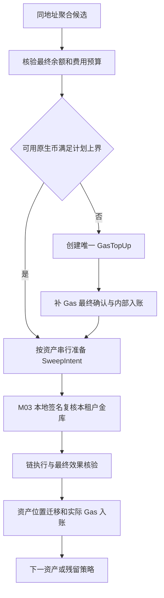

# M09：智能归集、补 Gas 与成本优化

返回 [设计总览](README.md)。关联需求：在资金安全与提现时效约束下减少不必要的 Gas 支出。

> 工程位置：`wallet-core::sweep`；归集与补 Gas 是同进程持久任务，通过 M07 执行。

## 1. 职责与优化边界

本模块决定何时、从哪个充值地址、归集哪些资产及允许多少 Gas。M06 提供最终充值/余额事实，M10 提供流动性需求和运营 Gas 预算，M07 执行，M03 检验用途。用户充值到账不等待归集。

一期 EOA 归集的主要节省来自多次充值合并发送、多个 token 共用一次合理补 Gas、低成本窗口和减少残留回收交易。跨地址“批量调度”仍是多笔 EOA 链交易，不能宣称一个任务就只消耗一次 Gas。

## 2. 数据模型

| 表 | 字段与约束 |
|---|---|
| `sweep_candidates` | `tenant, chain, source, asset, finalized_amount, oldest_uncollected_at, exposure, last_checkpoint` |
| `sweep_batches` | `id, tenant, chain, source, policy_version, checkpoint, trigger, fee_budget, state, version` |
| `sweep_items` | `batch_id, asset_id, reserved_amount, execution_id?, state` |
| `gas_topups` | `batch_id, generation, source_gas_wallet, target_address, amount, fee_cap, execution_id, state` |
| `sweep_cost_records` | `batch_id, planned_cost, actual_native_cost, valuation_version, amount_collected, residual_native` |

每个 `(tenant_id, chain_id, source_address)` 最多一个活跃 batch，用状态部分唯一索引实现；batch 内多个资产串行共享发起地址 Nonce 通道。执行不确定的 batch 仍视为活跃，不因任务租约过期释放该唯一性。

金额预留与 M10 的钱包预留一致，不能两个调度器各自读取同一余额后各扫一遍。`gas_topups(batch_id, generation)` 唯一；新 generation 需要明确旧补充结果和新预算，不用随机任务 ID 绕过防重。

## 3. 成本模型

使用同一有效估值版本计算资产价值与原生费价值：

```text
V = Σ（准备归集的各资产最小单位金额 × 有效价格）
C = 补 Gas 发送交易的费用（如果需要）
  + 各 token/native 归集交易的费用
  + 必要的额外链费用
  + 可选原生币残留回收费用

cost_ratio = C / V
```

估值用定点整数/有界有理数；金额和费用上界保守向上取整。补到用户地址的原生币 B 是内部资产迁移，**不是**补 Gas 交易本身的费用；只有消耗的 Gas 记成本。

当前地址已有 ETH 也不等于免费归集，源地址消耗的 Gas 仍记费用。M10 必须保证本租户原生资产运营资本能承担费用，不能因该用户充值地址恰好有 ETH 就无预算消耗用户资金担保。

## 4. 触发规则及硬约束

| 优先级 | 触发 | 处理 |
|---|---|---|
| P0 风险 | 单地址/租户/链未归集敞口超过批准上限 | 优先归集；高成本仍须费用授权与预算 |
| P1 流动性 | 本租户对应资产热钱包不足 | 选择可及时完成的归集，必要时优先金库补仓 |
| P2 驻留时间 | 最老余额超过 max dwell | 升级任务；小额不经济资产进入显式例外队列 |
| P3 成本 | 价值阈值、费用比例和低 Gas 窗口同时满足 | 聚合、限流执行 |

硬条件：资产/网络启用、最终余额证明有效、发起地址归属正确、目的金库在白名单、无未知 Nonce、费用预算与 M03 本地签名上限满足、当前 batch 不重复。任何触发优先级都不能越过这些条件。

价格缺失或异常时暂停依赖估值的自动经济筛选；以独立原生数量/资产数量敞口上限处理安全风险，或转人工审批。不能将“价格未知”解释成归集资产价值无限高。

本版估值快照在项目内按审批配置/导入，记录来源、有效期和版本，不以第三方行情/预言机服务作为资金执行前提。估值用于成本筛选，资金担保仍以同资产/原生最小单位核算；无法保证价格时使用数量硬规则或人工处理。

### 4.1 一期调度算法

```text
读取增量候选 → 合并到 source address → 按硬条件过滤。
先满足风险与关键流动性候选，再处理超时候选。
经济候选按可归集价值/总成本、候选年龄和队列公平性排序。
在每链并发、租户费用预算、RPC 容量内选取。
事务内创建唯一 batch 与资金/Gas 预留。
执行前重新检查最终余额、价格与费用计划，不直接相信旧候选。
```

这是可解释的启发式调度，不承诺实时全局最优解。保留“若逐笔即时归集”的估算基线，与实际费用/驻留时间对比，才能证明优化收益。

## 5. ERC-20 多资产归集流程



可发送 token 金额取确认检查点余额减尚未反映的出向预留。未确认新入款不纳入本批次，下一批次再处理；实际链状态变化时重新验证，避免发送旧快照金额。

### 5.1 补 Gas 计算

```text
required_native_cap = Σ（每个计划交易 gas_limit × fee_cap + 独立 extra_fee_cap）
                    + approved_residual_buffer
usable_native = 最终原生余额 - 现存未反映的 native 出向/Gas 预留
topup_amount = max(0, required_native_cap - usable_native)
```

此外 Gas 池要预留 `topup_amount + topup_transaction_fee_cap`。上式只是物理余额需求，仍需 M10 校验运营资本与客户负债担保。所有金额必须由同一资金预留模型维护，不能双重扣除或忽略已有 pending 费用。

补充上限按地址、租户、时间窗口和 batch 控制。不得固定给每个地址 0.01 ETH；也不得因为 estimateGas 一次失败无限补币。补 Gas 最终确认后再签 token 归集，一期优先确定性，后续低延迟优化单独评审。

### 5.2 补 Gas 防重复

若补充广播超时，保持 batch 与补充记录活跃，恢复原交易族；节点查不到不能创建另一笔补充。若最终失败，核销实际网络费，经预算批准后新 generation 重试。

补充成功后 token 被冻结/资产政策停用，停止后续扫币，原生币留在托管地址账上并纳入余额/预算；不把它记为用户充值。恢复或回收需新的明确计划。

## 6. 原生币归集与残留

原生归集在 token 归集之后或无 token 计划时执行，金额上界：

`send_amount <= confirmed_usable_balance - own_fee_cap - retained_buffer`。

对最终实际费用小于上界留下的余额，比较下一次回收费用与安全/流动性价值。通常保留有限缓冲用于未来 token 归集；只有达到价值或安全阈值才额外回收。不为极小残留连续生成清零交易。

地址状态变为历史并不停止归集。停止使用的根仍保留受限 DEPOSIT_SWEEP 能力；资金去向只允许所属租户金库。

## 7. 状态与恢复

batch 状态：`PLANNED → GAS_WAIT → SWEEPING → COMPLETED`，以及 `BUDGET_WAIT / POLICY_PAUSED / EXECUTION_UNCERTAIN / PARTIAL / FAILED_SAFE`。

| 场景 | 恢复方式 |
|---|---|
| Gas 突涨、计划过期 | 尚未签名则重新估价/授权；已签按原交易族处理 |
| 某个 token 归集失败 | 保存已完成项目，停止或继续经批准的其他项目，不重复扫已完成资产 |
| 用户又收到充值 | 更新候选，不修改已签归集 amount；后续批次处理 |
| source lane 有未知交易 | 暂停该地址，交 M07/M12 核对 |
| worker 租约丢失 | 新 worker 接管同 batch，CAS/唯一键阻止重复补 Gas |
| 小额长驻留且负收益 | 例外工单明确补贴预算或继续观察，不静默丢弃余额 |

取消仅能关闭无可生效执行的项目；可能已签的归集或补 Gas 仍保留资金预留与跟踪。账本按每笔最终交易事实处理，batch 完成状态不是唯一入账依据。

## 8. 模块接口、成本比较与升级条件

### 8.1 模块接口

| 指令 | 输入与结果 |
|---|---|
| `RefreshCandidates` | 检查点、地址范围 → 增量候选，不修改用户余额 |
| `PlanSweep` | 租户、网络、source、策略版本 → 唯一活跃 batch 或已有计划 |
| `PrepareGasTopup` | batch、generation、预期版本 → 在费用/资金预算内创建执行意图 |
| `ApplyExecutionFact` | batch/item、最终执行证明、已过账效果引用 → 幂等更新项目和成本状态 |
| `ReplanUnsignedItems` | 旧费用版本与新预算 → 只调整未签项目；已可能签名项目保持原家族 |

资产迁移/Gas 的正式凭证由 M10 CustodyFinalizer 处理；本模块消费其结果更新计划，避免和扫描器重复记费用。

### 8.2 成本比较与升级条件

同地址 10 次 token 充值，逐次补 Gas/归集可能需要约 20 笔交易；积累后一次补 Gas 加一次 transfer 可降到约 2 笔，前提是没有必须提前归集的风险/流动性要求。这是交易数量示例，不代表任意链固定费用。

批量合约、permit、账户抽象或交易赞助不属于一期前提。升级必须核实具体网络/代币支持、授权及部署成本、部分失败、资产恢复能力和合约审计，再比较相同数据样本的总成本。

## 9. 指标与验收

指标按租户/链/资产分层：总 Gas、每成功充值分摊成本、归集 cost ratio、未归集敞口、触发至完成时延、补 Gas 次数、地址原生残留、例外积压和热钱包覆盖度。

- 多次充值只聚合当前可发送资产，用户余额不会因归集改变。
- 同地址多 token 批次共享合理补充、串行 Nonce，无重复活跃 batch。
- 补 Gas 响应丢失、重启、部分失败不产生重复补充或重复迁移凭证。
- Gas 上涨、价格陈旧、token 冻结均进入明确可恢复状态，不无限重试。
- 原生币 Gas 预留与运营资本满足，未确认资金不被提前归集使用。
- 在同一充值样本上比较基线/新策略的费用、敞口与提现 SLA，而不是仅统计任务数。
