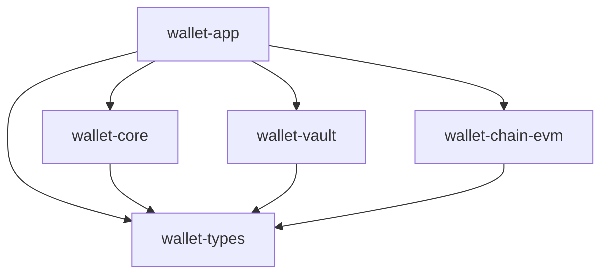

# M14：Rust 工程组织、单进程运行与实施验收

返回 [设计总览](README.md)。本模块把 M01–M13 契约映射到一个项目的 module/crate、运行编排和交付阶段。

## 1. 拆分原则与 5 个 crate

M01–M14 是文档中的逻辑模块，不是 14 个项目、crate 或进程。默认以 Rust module 组织紧密协作的业务；只有需要控制依赖方向、敏感接口可见性或链适配边界的部分独立为 crate。

| crate | 内容 | 独立理由 |
|---|---|---|
| `wallet-app` | 唯一二进制、Axum 路由、管理 HTTP、配置、任务运行、端口组装、本地维护模式 | 汇总依赖，隔离传输/运行代码；所有模块共同构建和部署 |
| `wallet-core` | 用户、地址、账本、充提、风控、归集、流动性、任务、对账、管理业务、SQLx 仓储 | 高频跨模块资金事务共享 UnitOfWork，避免无必要的业务 crate 拆分 |
| `wallet-vault` | 密文格式、解锁、私有派生、受限签名、结果证据、离线恢复 | 在编译边界隐藏秘密类型与解密入口，限制密码相关依赖及审查范围 |
| `wallet-chain-evm` | RPC、扫描解码、交易构建、费用/效果/最终性校验 | 将 EVM 和网络依赖留在适配器；二期增加其他链实现时不侵入账本 |
| `wallet-types` | 稳定 ID、精确金额、公开 DTO、链执行/派生/签名端口契约 | core/vault/适配器共用契约，防止双向 crate 依赖；不承载业务编排或秘密 |

5 个是本版建议的最小职责组合，不是数量指标。M05 账本、M08 风控、M09 归集各自保持 core 内受限 module 即可；不预拆 `wallet-domain/storage/api/risk/jobs/signer-protocol` 等 crate。以后只有实际复用或依赖约束证明有必要才新增 crate，仍属于同一应用。

## 2. 拟实施目录与 M01–M14 映射

当前仓库没有 Cargo workspace，以下是实施设计，不创建空项目来充当实现。

```text
Cargo.toml                    # 一个 workspace，统一 edition/dependencies/lints
crates/
  wallet-app/
    src/main.rs               # 唯一 wallet-platform 二进制
    src/http/                 # M02 开放 API
    src/admin_http/           # M13 管理路由
    src/runtime/              # M14 启停、任务、并发预算
    src/adapters/             # 端口实现与依赖组装
    src/commands/             # 本地初始化/备份/恢复/可选离线签名
  wallet-core/
    src/tenant/               # M01
    src/idempotency/          # M02 的持久业务幂等
    src/registry/             # M04
    src/ledger/               # M05：唯一资金写入口
    src/deposit/              # M06：覆盖、分类、充值业务
    src/execution/            # M07：意图、Nonce、状态/交易族
    src/withdrawal/           # M08
    src/risk/                 # M08
    src/sweep/                # M09
    src/treasury/             # M10
    src/events/               # M11：Outbox/Webhook 状态
    src/jobs/                 # M11：持久任务与租约
    src/reconciliation/      # M12
    src/admin/                # M13：权限、审批、暂停、审计
    src/storage/              # SQLx/UnitOfWork，不单独拆 crate
  wallet-vault/
    src/envelope/             # M03：KDF/AEAD/格式与轮换
    src/session/              # M03：解锁、锁定、秘密内存
    src/derivation/           # M03：私有硬化派生
    src/policy/               # M03：精确签名准入
    src/signing/              # M03：签名与结果持久化
    src/evidence/             # M03：本地加密证据/恢复包
    src/storage/              # 同一 PG 的 Vault 私有仓储
  wallet-chain-evm/
    src/rpc/                  # M06/M07：RPC 客户端与能力检查
    src/scan/                 # M06：block/log/trace 解码
    src/transaction/          # M07：编码、模拟、广播、收据效果
    src/fee/                  # M07/M09：EVM/L2 费用
    src/finality/             # M06/M07：链特定最终性
  wallet-types/src/           # 公开类型和窄端口，无 seed/xprv/VMK
migrations/                   # 同一 PG，一套按序迁移
config/examples/              # 非秘密参数和占位引用
ops/                          # 自管运行、备份与恢复说明
tests/                        # 实施后的跨模块验收
docs/multitenant-wallet-design/20261009-v2-detailed-design/
```

module 仓储、状态转换 helper 使用私有或 `pub(crate)` 可见性；只向 app 公开需要的 facade/命令。Vault 秘密永不进入 `wallet-types`。没有 `services/` 目录、独立 Worker/Signer 可执行程序、服务发现、内部 gRPC 或微服务配置。

## 3. 单向依赖与业务调用



core 通过 `AddressDeriver / RestrictedSigner / ChainAdapter / EvidenceWriter` 等窄端口调用实现，不依赖 vault/evm 的具体仓储或网络客户端；app 组装本地实现。Vault 通过只读事实端口核验 core 持久的订单/批准/预留；反向适配在 app 中组装，不引入 core↔vault 循环。

`wallet-vault` 自行用受审查的 EVM 编解码库复核精确交易模板；不依赖 RPC 客户端、不广播、不提供通用签名能力。`wallet-chain-evm` 不读私钥、不写账本，也不决定提现终态。core 内跨模块调用直接走 typed command，不经过 HTTP、报文签名或序列化队列。

单个核心 facade 编排 M05/M08/M10 等事务，模块不得各自隐式提交。Vault 结果持久化使用同库的另一个短事务；这是恢复步骤边界，不是独立服务事务。各 crate 共用进程权限，私有接口不能当作主机攻击隔离。

## 4. 单进程运行模型

仅一个 `wallet-platform run` 在线实例；同一个 Tokio runtime 运行开放 API、管理入口、任务轮询、索引、跟踪、归集、通知及对账。不同 HTTP listener/任务组不形成独立部署单元。

| 工作 | 执行方式 | 有界资源 |
|---|---|---|
| HTTP 认证/业务受理 | Axum/Tokio，短事务 | 请求体、并发、超时、PG 连接预算 |
| 扫链与历史回填 | 异步任务、分链游标/分片 | RPC 并发、响应大小、事件批量、回填配额 |
| Nonce/跟踪/广播 | 持久状态机 + 异步任务 | 钱包队列、family 深度、费用替代次数 |
| Argon2id | 专用受控阻塞池 | KDF 内存预算、profile 上限、极小解锁并发 |
| 私有派生/签名 | 受控密码线程池 | Vault/租户/根并发、最大批量、在途操作计数 |
| 证据 fsync | 单写者线程/阻塞任务 | frame/段大小、队列、落存等待与磁盘空间 |
| Webhook/对账 | 各自异步任务组 | 目标并发、响应大小、查询/快照批量 |

密码运算和文件同步不阻塞 Tokio reactor。PG 连接池至少保留资金受理/执行准入配额，扫描与后台任务不能占满；在一个总连接/内存预算内分组配额，不按模块建立无限连接池。内存 channel 是唤醒提示，PG job/Outbox 是可恢复事实。

### 4.1 启动与解锁

```text
启动 → 校验环境/非秘密配置 → 取得在线实例所有权
→ 打开 PG 与本地证据，验证水位/完整性 → 必要时 RECOVERY_LOCKED
→ 启动只读观察/恢复任务，各 Vault 初始 LOCKED
→ 本地解锁通信/证据 Vault，TLS/回调按依赖变为就绪
→ 按批准范围人工解锁资金 Vault，恢复检查通过后开放签名
```

在线实例所有权使用专用 PG 会话锁及启动互斥；失去该连接时关闭新资金/签名准入并告警。DB 唯一约束仍负责重复任务和重启安全；本版没有多应用实例自动容灾部署或按角色启动多个应用。

TLS、Webhook、JWE 私密材料由项目内通信 Vault 保护；证书、公钥等可在非秘密配置引用。资金解锁秘密不放入配置/env/CLI 参数或自动启动文件。首次启动/重启需要本地人工输入；不能用“无外部依赖”掩盖自启动解密所需的秘密来源。

### 4.2 停机、故障与维护

优雅停机关闭新受理和签名准入，等待在途操作完成持久交接、刷新证据、释放租约，再清零会话。强制退出后以 `SIGNING_POSSIBLE` 等状态恢复，不假设 Drop 已清除所有秘密。

任务失败可按分类重启；未知资金状态、Vault 完整性失败、实例所有权丢失触发作用域屏障。单进程崩溃会同时中断各任务，依靠持久游标/账本/签名结果恢复，不声称 crate 有故障隔离能力。

初始化、换封装、导出备份、恢复使用同一二进制的维护模式，执行时明确在线实例互斥。可选人工冷签名模式无网络、读取文件、输出文件，不是驻留服务或外部产品依赖。

## 5. 事务、锁顺序与持久性

业务资金事务：作用域控制/策略行 → 稳定业务聚合 → 按账户 ID 排序的账本投影 → 确定键额度/钱包预留。Nonce 准备使用独立短事务锁钱包通道；M03 准入锁 pause control → 稳定业务操作 → grant。可组合命令采用一致顺序，死锁有限重试。

RPC、Argon2id、BIP39/BIP32 派生、ECDSA、文件 fsync 不在持有用户资金行锁的事务执行。只读核验与预期版本在准入提交时确认；过期事实不能直接复用。

同一个 PostgreSQL 保存租户、账本、索引、订单、Vault 密文、许可及审计；schema/仓储所有权管理正常代码写入边界。运行 DB 用户不是 owner/superuser，RLS 为纵深防御；crate 不能获得独立操作系统身份。

本地证据文件与 PG 按 evidence outbox/event ID 协调，不宣称原子双写。同机文件和数据库也不形成独立灾难故障域。密钥、业务映射、签名证据、账本和配置按共同水位备份；具体 RPO/RTO 以 M12 的故障模型和演练证据确定。

## 6. Rust 类型、风格与性能

共享类型包含 `ChainId/AssetId/ChainAddress`、有界精确 `AssetAmount/LedgerUnits`、`TransferIntent/FeePlan/ExecutionSlot/MovementFact/FinalityEvidence` 和受限端口。EVM U256、nonce、费用字段不能侵入通用账本；二期另建链 adapter，并分别设计派生/签名方案。

Rust 2024、tabs、crate 级导入分组与排序；实施时配置 rustfmt/clippy。手写 `.rs` 不超过 500 行，函数不超过 120 行，使用明确领域名称，不使用 `foo/bar/tmp/data/obj`。增加模块文件即可控制长度，不因长度上限拆新 crate。

热点优先借用、原位解析、固定容量与 ownership 转移，避免无必要 clone/中间集合；公开 raw/事件 bytes 受控复用，秘密不得放进通用共享 buffer。`Cow` 只用于确有 owned fallback 的边界。金额禁止浮点、转换校验统一；扫描/分页/对账采用增量 cursor。

Rust 的执行效率满足本期实现方向；实际瓶颈通常需观察 PG 锁、RPC 配额、KDF 内存、历史回填及 fsync。先通过批量、连接预算、背压和 SQL/索引优化解决，不预设拆微服务。

## 7. 迁移与开发环境

一套迁移按顺序建立租户/注册表、账本/Hold、链事实/覆盖、订单/执行、Vault/许可、任务/审计。必须先落地唯一性、组合外键、已过账保护与账本平衡再开放资金写接口。大表分区不能破坏全局订单、地址、Nonce 和经济效果唯一性。

资金历史、根/scheme、地址映射、已签交易和暂停 epoch 向前兼容；代码回滚不回滚业务事实。配置只保存非秘密参数和引用，生产/测试完全分离。

实现后拟使用以下命令；当前没有源码，不执行这些命令或声称编译通过：

```bash
rtk cargo build --release -p wallet-app --bin wallet-platform
rtk cargo fmt --all -- --check
rtk cargo clippy --workspace --all-targets -- -D warnings
rtk cargo test --workspace
```

本地环境使用自管 PostgreSQL、本地 EVM 链、可故障注入的 RPC 和 Vault trait mock；密钥仅用公开测试向量。真机软件 Vault 校准 KDF/内存/清零/证据持久性，不依赖云 KMS 环境。代码影响分析先 codegraph；无索引按工具要求转仓库搜索，Rust 编译/类型/符号修复前先 rust-analyzer。

## 8. 实施顺序

| 阶段 | 成果 | 完成条件 |
|---|---|---|
| P0 契约验证 | 5-crate DAG、金额/地址/意图类型、软件 Vault 威胁模型、链/资产清单 | KDF/全硬化样本/恢复包、RPC trace/最终性/费用口径明确 |
| P1 核心账户 | M01–M05、M11/M13 基础、通信/证据 Vault | 安全接入、稳定地址、发行证据、平衡账本、并发 Hold |
| P2 受限执行 | M03/M07、暂停和崩溃恢复 | 精确许可、可能签名边界、持久结果、原 raw 重播/替代 |
| P3 充提闭环 | M06/M08/M10 基础、M12 联合对账 | 单链白名单资产最终充值/提现、Gas 运营资本担保 |
| P4 归集优化 | M09、多资产补 Gas、流动性调度 | 成本与基线比较，敞口/时效/预算均满足 |
| P5 整体交付 | 完整回调/审计/灾备、单进程升级和恢复手册 | 软件 Vault 安全验证、断电/旧备份演练、限额灰度 |

## 9. 核心验收矩阵

| 场景 | 预期结果 | 模块 |
|---|---|---|
| 跨租户、重放、同键不同参数 | 拒绝；无重复订单/Hold | M01/M02/M08 |
| 同用户并发开户、锁库/预派生池 | 原绑定或明确 provisioning；索引不回退 | M03/M04 |
| 全硬化叶泄露、父 xpub/旧 scheme 风险 | V2 无非硬化反推；旧根单独标记和迁移 | M03/M04 |
| 密文/AAD/KDF/用途篡改 | 拒绝；无明文输出；资源申请有上限 | M03 |
| 解锁/锁定与签名并发、进程重启 | 有明确准入点；保留可能付款预留；重启 LOCKED | M03/M07 |
| 文件未 fsync、ACK 丢失、整机毁损 | 不提前交付；按实测备份窗口恢复或保持屏障 | M03/M04/M12 |
| 发行与扫描缓存切换并发入款 | 回填完整，仅一次有效入账 | M04/M06 |
| 并发提现/冻结/部分释放 | 余额不负，Hold/限额合计一致 | M05/M08 |
| native 内部转入/祖先回滚、假币/异常 token | 正确分类；无错误充值/结算 | M04/M06/M07 |
| 签名落存后返回/广播中断、付款取消竞争 | 原族恢复，最多一个有效付款 | M03/M07/M08 |
| 同钱包任务竞争、旧链余额快照 | 原子预留；实际效果只扣一次 | M07/M10 |
| 补 Gas 不确定、多 token 部分失败、资本不足 | 无无限补币；不侵蚀客户担保 | M09/M10 |
| 浅/深重组、恢复旧数据库/地址清单 | 不重复净入账；发现未知状态即锁出款 | M06/M12 |
| Outbox 重启、租约过期旧任务继续 | 至少一次恢复；语义幂等且 fencing 生效 | M11 |
| Webhook 乱序/重复、SSRF、证据 Vault 未解锁 | 安全重试/积压，不回滚资金 | M11 |
| 单人绕审批、暂停竞态、全副本回退 | 拒绝或屏障；不做虚假防篡改承诺 | M13 |
| 单进程崩溃/升级/失去实例锁 | 全部任务可恢复；不开第二个在线执行实例 | M14 |

容量输入包含用户/地址数、请求峰值、每块事件、回填跨度、链交易、通知目标及保留期。测量整体 CPU/内存、KDF 峰值、PG 锁、RPC、证据 fsync 和任务延迟，确定配额。首网络/合约、手续费、SLA、在线资金上限、解锁值班流程、备份 RPO/RTO 和保留期在上线前按所属模块冻结。
