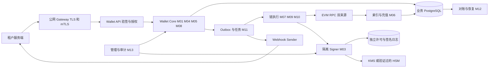

# Web3 多租户托管钱包平台：V2 模块详细设计

> 日期：2026-10-09；设计版本：V2.1。本文档集细化 V2 需求，作为一期工程拆分与评审基线。
> 当前仓库处于设计阶段；本文中的表、接口、进程和参数均为拟实施契约，不代表已有实现。

需求来源：[原始需求与讨论](../../20261009-v1-multi-wallet-design.md)、[V2 核心架构](../web3_multitenant_custodial_wallet_phase1_architecture_v2.md)。对于冻结时机、签名不确定性、充值识别和费用结算，采用本详细设计中的明确规则。

## 1. 一期范围与默认决策

一期提供第三方服务端接入、多租户用户账户、EVM 原生币及审核后 ERC-20 的充值、提现、冻结、解冻、归集和对账。Rust 2024、Axum/Tokio、PostgreSQL/SQLx、EVM 适配器作为基础；Redis 只承担缓存、限流等非资金权威状态。

| 决策 | 一期默认 | 产品或部署确认点 |
|---|---|---|
| 服务形态 | 模块化 Wallet Core，加独立链 Worker、隔离 Signer | 不把每个逻辑模块都部署成微服务 |
| 租户隔离 | 每租户独立充值根、金库、热钱包、Gas 预算 | 禁止调度器跨租户借用资金 |
| 用户身份 | DB 映射 `(tenant_id, external_user_id)` | 用户外部 ID 的长度、字符集与注销规则 |
| EVM 地址 | 一个用户一个稳定索引，允许在已启用 EVM 网络复用 | 网络隔离模式必须在发地址前确定 |
| 权威余额 | PostgreSQL 不可变双重记账账本 | 链上位置变化不改变用户余额所有权 |
| 充值到账 | 完成覆盖扫描、资产校验与链特定最终性后入账 | 首条网络、代币合同地址、最终性配置 |
| 提现受理 | 基础校验后原子冻结，再异步风控与审批 | 限额、时效、白名单及审批阈值 |
| 提现费用 | 用户额外支付同提现资产服务费；平台承担链上 Gas | 收费数额及拥堵时的 SLA |
| 签名安全 | KMS 信封加密 + 独立策略校验 + 持久签名日志 | HSM/MPC 必须单独验证 HD 能力 |
| 通信 | TLS + Ed25519 请求签名；资金写接口要求 mTLS | JWE 为需要报文保密的租户启用 |
| 异步任务 | PostgreSQL Outbox、租约、幂等消费 | 量级验证后再决定独立消息系统 |
| 多链扩展 | 核心资金模型链无关，EVM 执行细节在适配器内 | TRON/Solana 二期实施 |

网络、容量、法币估值、限额和费用参数尚无实测输入；各模块给出的公式与示例是配置方法，不能直接当作生产默认值。

## 2. 模块目录与所有权

| 模块 | 详细设计 | 唯一负责的业务事实 |
|---|---|---|
| M01 租户与用户 | [租户、用户、隔离上下文](01-tenant-and-user.md) | 租户生命周期、外部用户映射、访问作用域 |
| M02 开放 API | [安全通信与 API 契约](02-open-api-and-communication.md) | 请求身份、防重放、幂等入口与协议 |
| M03 密钥与签名 | [Key Vault 与 Signer](03-key-vault-and-signer.md) | 密钥版本、签名许可、签名结果与独立额度 |
| M04 地址与资产 | [地址派生及链/资产注册](04-address-and-asset-registry.md) | 地址归属、分配索引、网络和代币策略版本 |
| M05 账本与冻结 | [双重记账及 Hold](05-ledger-and-holds.md) | 资金分录、余额投影、冻结与释放 |
| M06 充值与索引 | [扫链、最终性及充值](06-chain-indexer-and-deposits.md) | 区块事实、覆盖游标、事件分类与充值订单 |
| M07 交易执行 | [交易意图、Nonce 与恢复](07-transaction-execution.md) | 钱包执行通道、交易族、签名交接和上链结果 |
| M08 提现与风控 | [提现状态机及风险策略](08-withdrawals-and-risk.md) | 提现订单、审批、业务终态与资金结算指令 |
| M09 归集与 Gas | [成本策略、归集及补 Gas](09-sweep-and-gas.md) | 归集计划、Gas 补充关联与执行预算 |
| M10 金库与流动性 | [冷热钱包及资金调拨](10-treasury-and-liquidity.md) | 钱包角色、链上流动性预留与补仓 |
| M11 事件与任务 | [Outbox、Webhook、任务执行](11-events-webhooks-and-jobs.md) | 任务租约、事件投递与回调重试 |
| M12 对账与恢复 | [账链对账、灾备与异常处理](12-reconciliation-and-recovery.md) | 对账检查点、差异工单、恢复屏障 |
| M13 管理与审计 | [管理操作、审批及审计](13-admin-and-audit.md) | 操作授权、配置变更、熔断与审计证据 |
| M14 工程与验收 | [工程边界、实施顺序及验收](14-engineering-and-acceptance.md) | 工程依赖、交付阶段与端到端验收矩阵 |

各模块可以读取其他模块公开的视图和接口；修改资金、签名、订单状态时必须调用拥有该事实的模块。共享数据库允许一个业务事务组合多个模块，禁止绕过模块执行任意 SQL 修改余额。

## 3. 需求到设计的对应关系

| V2 需求 | 主模块 | 必须协同的模块 | 完整闭环 |
|---|---|---|---|
| 0 安全集成和通信 | M02 | M01、M11、M13 | 接入、验签、加密、防重放、幂等、回调 |
| 1 助记词安全存储 | M03 | M04、M12、M13 | 生成、加密、授权签名、轮换、离线恢复 |
| 2 唯一账户 | M01、M04 | M05、M06 | 用户映射、索引预留、稳定地址、监听激活 |
| 3 充提冻解 | M05、M06、M08 | M02、M03、M07 | 最终性入账、冻结、审批、付款、结算 |
| 4 节约 Gas 的归集 | M09 | M06、M07、M10 | 聚合充值、成本筛选、补 Gas、归集、费用入账 |
| 5 提现风控及优化 | M08、M10 | M03、M07、M12、M13 | 限额预留、独立签名控制、钱包选择、故障恢复 |

## 4. 部署与信任边界

| 部署单元 | 允许的访问 | 不允许的能力 |
|---|---|---|
| API/Core | 专用 PG 角色、认证材料、内部事件 | 读取种子、KMS 解密、调用万能签名 RPC |
| Indexer | RPC 查询、索引表、充值模块入口 | 签名、直接修改已过账分录 |
| 执行 Worker | 执行表、限额视图、Signer 内部接口 | 任意目标签名、改变已授权付款经济参数 |
| Signer | 隔离密钥材料、KMS、独立许可日志 | 公网入口、租户 API、任意公网出站 |
| Webhook Sender | 事件视图、回调签名能力、受限出站 | 链上签名、访问云元数据及内网地址 |
| 管理后台 | 经过审批的管理命令 | 明文私钥导出、直接 SQL 修余额 |

Signer 的 KMS 私有端点与审计出站属于显式白名单。其签名许可日志须有持久化与独立备份；它不是 Redis 缓存。

## 5. 全平台不变量

1. 所有资金按 `tenant_id + chain_id + asset_id` 独立计量，资产最小单位以十进制整数字符串传输。
2. 每张资金凭证在每个资产内借贷平衡；已过账分录不可删除或修改。
3. 可用用户余额不为负；待确认充值、风控冻结和提现冻结不可用于新提现。
4. 一笔提现任何时刻最多有一个仍可能付款的执行尝试；同一尝试的加速交易使用相同发送钱包和 Nonce。
5. 请求签名一旦可能生成，就进入不可自动解冻区间；签名授权过期不等于已签名交易失效。
6. 归集、补 Gas、补仓不作为用户新充值入账；费用与内部资产迁移分别记账。
7. 充值可用不等待归集；是否及时归集由风险、流动性和成本共同约束。
8. 熔断暂停新资金授权，仍继续监听、跟踪已签交易、对账和记录审计证据。
9. DB 提交是业务原子边界；RPC、KMS、Signer 调用不得放在持有资金行锁的长事务内。
10. 备份恢复必须核对外部链上执行与独立签名日志；不能仅恢复数据库后立即恢复出款。

## 6. 三条主流程与事务边界

| 流程 | 同一数据库事务 | 外部调用与后续事务 |
|---|---|---|
| 开户 | 用户映射 + 索引分配 + allocation 预留 + Outbox | 公钥派生、网络监听覆盖、激活地址 |
| 充值 | 观测事实和扫描覆盖；另一事务处理订单 + 入账 + Outbox | RPC 查询、最终性证明、Webhook 投递 |
| 提现 | 幂等记录 + 订单 + Hold + 限额预留 + Outbox | 异步风控、流动性选择、签名、广播、最终结算 |
| 归集 | 唯一活跃计划 + 钱包预留 + 执行任务 | 补 Gas、签名、归集；最终交易事实驱动资产迁移和 Gas 分录 |

跨进程采用至少一次调度、条件更新、唯一约束和可恢复状态机。Webhook 或消息 ACK 不参与资金事务提交。

## 7. 全局标识与术语

| 名称 | 含义 |
|---|---|
| `wallet_user_id` | 平台用户 UUID，属于单一租户 |
| `asset_id` | 网络和合约/原生资产的稳定标识；symbol 不参与唯一性 |
| `allocation_id` | 永久 HD 索引预留记录 |
| `hold_id` | 特定资金占用，带发行者、原因和剩余金额 |
| `withdrawal_id` | 业务提现订单，跟踪用户的一次提现指令 |
| `execution_id` | 一次可能消耗特定链执行槽位的尝试 |
| `tx_family_id` | EVM 同发送地址、同 Nonce 的交易族，包括加速和受控取消 |
| `grant_id` | 对某个精确待签名载荷的一次授权；重试返回同一结果 |
| `checkpoint` | 已验证链哈希、扫描覆盖与账本处理序号的联合检查点 |

`operation_id` 用于跨模块关联开户、充值、提现、归集和补仓；不把 EVM Nonce 当成全平台通用订单号。

## 8. 阅读与开发顺序

先阅读 M01–M05，确定权限、地址、密钥和账本契约；随后完成 M07 的签名交接及恢复，再贯通 M06/M08 的充提闭环。M09/M10 在资金流程可验证后实施；M11–M13 从第一阶段提供基础能力。阶段门槛见 [M14](14-engineering-and-acceptance.md)。
