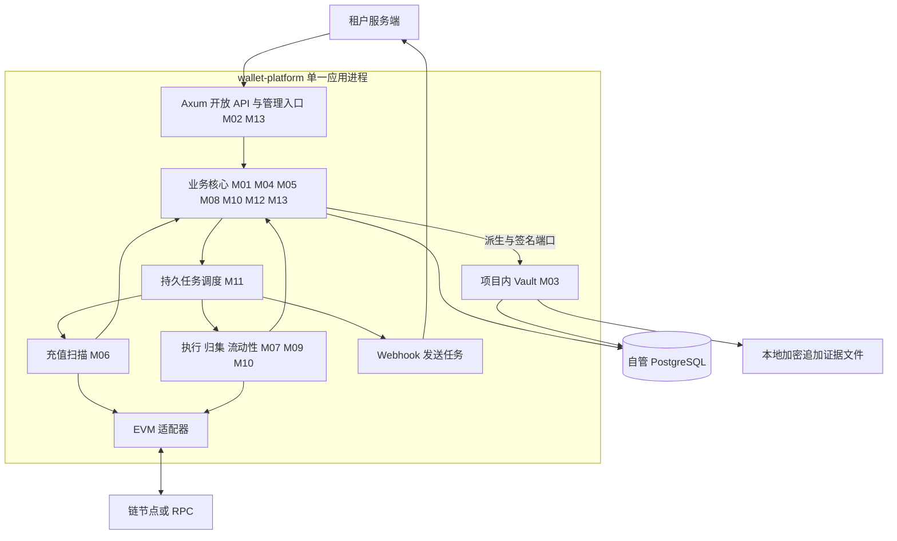

# Web3 多租户托管钱包平台：V2 模块详细设计

> 日期：2026-10-09；设计版本：V2.2。M01–M14 是逻辑模块编号，按职责选择 Rust module 或 crate。
> 当前仓库处于设计阶段；本文中的目录、表、接口和参数均为拟实施契约。

需求来源：[原始需求与讨论](../../20261009-v1-multi-wallet-design.md)、[V2 核心架构](../web3_multitenant_custodial_wallet_phase1_architecture_v2.md)。本次修订统一单项目、单进程、项目内软件密钥保护及派生泄露防护要求。

## 1. 一期范围与确定约束

一期提供服务端 HTTP 接入、多租户用户账户、EVM 原生币及审核后 ERC-20 的充值、提现、冻结、解冻、归集和对账。采用 Rust 2024、Axum/Tokio、PostgreSQL/SQLx；链上行为由 EVM 适配器实现。

| 决策 | V2.2 约定 |
|---|---|
| 应用形态 | 一个 Cargo workspace、一个在线应用二进制、一个应用进程；后台能力通过任务/线程执行 |
| 工程拆分 | 建议 5 个 crate；M01–M14 不逐一对应 crate，具体映射见 M14 |
| 部署 | 整体构建、升级和回滚；本版没有微服务、Signer 守护进程或内部 RPC |
| 外部基础设施 | 自管 PostgreSQL、链节点/RPC、租户回调目标；无需 Redis 或消息中间件作为启动前提 |
| 密钥保护 | 项目内 Vault：Argon2id、分层 AEAD 封装、人工解锁、短时派生、持久签名证据 |
| 密钥依赖 | 本版不接入 KMS/HSM/MPC、云 Secret 服务或外部签名/托管平台；使用现成密码库在本进程执行 |
| HD 派生 | 独立租户根；充值路径所有层级硬化；业务侧只取得叶公钥和地址，不分发 xpub/chain code |
| 租户资金 | 各租户独立充值根、热钱包、金库、Gas 预算与核算，不跨租户借款 |
| 用户身份 | 永久映射 `(tenant_id, external_user_id)`；用户、地址、资金账户分开建模 |
| 资金权威 | PostgreSQL 不可变双重记账账本；归集只改变资产位置 |
| 提现 | 基础校验后原子冻结与额度预留，再异步风控、批准、受限签名和最终结算 |
| 费用 | 用户额外支付同提现资产的服务费；网络 Gas 由平台原生运营资本承担 |
| 通信 | TLS、Ed25519 请求签名、防重放、业务幂等；资金写接口 mTLS，按需启用 JWE |
| 任务 | 同进程任务池 + PostgreSQL Outbox/job + 租约与语义幂等；内存队列仅用于唤醒 |
| 冷保管 | 可选本项目同一二进制的人工离线模式；在线数据库只有冷地址，不持有可解密冷私钥 |

单进程内不同 crate 共享地址空间、操作系统身份和故障域。Rust 可见性与受限接口用于约束正常代码行为，不能宣称主机或整个应用被控制后密钥仍隔离。在线资产上限、人工审批、最小解锁范围与离线备份共同控制风险。

## 2. 模块目录与事实所有权

| 模块 | 详细设计 | 唯一负责的业务事实 | 工程位置 |
|---|---|---|---|
| M01 租户与用户 | [租户、用户、访问上下文](01-tenant-and-user.md) | 生命周期、外部身份映射、租户作用域 | `wallet-core::tenant` |
| M02 开放 API | [通信与 API 契约](02-open-api-and-communication.md) | 身份、重放、幂等入口、HTTP 协议 | `wallet-app::http`；持久幂等在 core |
| M03 密钥与签名 | [项目内 Vault 与签名](03-key-vault-and-signer.md) | 密文、解锁会话、派生、精确签名许可/结果 | `wallet-vault` |
| M04 地址与资产 | [地址及链/资产注册](04-address-and-asset-registry.md) | 永久索引、归属、发行、链/资产版本 | `wallet-core::registry` |
| M05 账本与冻结 | [双重记账及 Hold](05-ledger-and-holds.md) | 不可变分录、投影、冻结/释放 | `wallet-core::ledger` |
| M06 充值与索引 | [扫链与充值](06-chain-indexer-and-deposits.md) | 覆盖水位、分类、充值订单与入账 | `wallet-core::deposit` + `wallet-chain-evm::scan` |
| M07 交易执行 | [意图、Nonce 与恢复](07-transaction-execution.md) | 执行状态、交易族、签名交接与证明 | `wallet-core::execution` + `wallet-chain-evm::transaction` |
| M08 提现与风控 | [提现与风险策略](08-withdrawals-and-risk.md) | 订单、Hold/额度编排、审批与结算 | `wallet-core::withdrawal/risk` |
| M09 归集与 Gas | [归集策略与补 Gas](09-sweep-and-gas.md) | 归集计划、成本策略、补 Gas 关联 | `wallet-core::sweep` |
| M10 金库与流动性 | [钱包与资金调拨](10-treasury-and-liquidity.md) | 角色、物理预留、补仓、链效果过账 | `wallet-core::treasury` |
| M11 事件与任务 | [Outbox、Webhook、job](11-events-webhooks-and-jobs.md) | 事件、租约、投递与重试 | `wallet-core::events/jobs`；运行在 app |
| M12 对账与恢复 | [账链对账与灾备](12-reconciliation-and-recovery.md) | 检查点、差异、恢复屏障 | `wallet-core::reconciliation` |
| M13 管理与审计 | [管理、审批与熔断](13-admin-and-audit.md) | 管理授权、配置版本、暂停、审计 | `wallet-core::admin` + `wallet-app::admin_http` |
| M14 工程与验收 | [crate 边界及交付](14-engineering-and-acceptance.md) | 依赖、运行编排、实施顺序与验收 | `wallet-app` 与 workspace 约定 |

共享类型放在 `wallet-types`，没有独立部署含义。核心内各 Rust module 保持私有仓储与受限命令；账本只通过 M05 修改。跨模块资金操作组合在同一 UnitOfWork，不能因 module 或 crate 边界拆成多个提交。

## 3. 需求到设计的对应关系

| V2 需求 | 主模块 | 协同模块 | 完整闭环 |
|---|---|---|---|
| 0 安全集成和通信 | M02 | M01、M11、M13 | 接入、验签、加密、防重放、幂等、回调 |
| 1 助记词安全存储 | M03 | M04、M12、M13 | 加密、解锁、硬化派生、签名、轮换、离线恢复 |
| 2 唯一账户 | M01、M04 | M05、M06 | 身份映射、永久索引、稳定地址、监听激活 |
| 3 充提冻解 | M05、M06、M08 | M02、M03、M07 | 最终性到账、Hold、批准、付款与结算 |
| 4 节约 Gas 的归集 | M09 | M06、M07、M10 | 聚合充值、成本过滤、补 Gas、归集和费用入账 |
| 5 提现风控及优化 | M08、M10 | M03、M07、M12、M13 | 限额、签名复核、钱包选择、恢复与对账 |

## 4. 单进程运行与调用边界

图中箭头表示函数调用或任务编排，不表示网络服务。HTTP、扫描、交易跟踪、通知与密钥操作各有有界并发；阻塞密码计算在受控线程池执行。外部租户通信验证不会被复用于项目内部调用。

资金密钥仅在 M03 私有类型内出现。M04 获取地址结果，M07 获取受限签名结果；其他模块没有原始密钥读取 API。所有程序代码仍处于同一安全主体，本地证据文件也与进程共享主机风险。离线检查点/备份补充恢复证据，不形成在线第三方服务。

## 5. 全平台不变量

1. 资金按 `tenant_id + chain_id + asset_id` 独立计量，API 使用最小单位整数字符串。
2. 凭证每资产借贷平衡；已过账不可修改；可用余额不为负。
3. 待确认充值、提现/业务/风险 Hold 不可用于新提现。
4. 一笔提现最多有一个仍可能付款的执行；替代交易保持同钱包、同 Nonce。
5. 调用签名函数前先提交 `SIGNING_POSSIBLE`；崩溃、锁库或许可过期均不等于未付款。
6. 归集、补 Gas、补仓只迁移托管资产；实际网络费由 M10 统一过账。
7. 充值到账不等待归集；归集受成本、敞口、时效和流动性共同约束。
8. Vault 锁定阻止新私钥派生/签名；已有地址查询、扫链和已签交易观察继续。
9. 资金行锁只跨短 DB 事务；RPC、Argon2id、派生、签名和文件 fsync 不持有这些锁。
10. 地址公开及签名结果交付前，PG 记录与本地恢复证据均须持久确认；二者不是原子提交。
11. 全部可靠副本缺失或整体回退时，进入恢复屏障，不能声称仅靠种子/链扫描可恢复全部业务事实。
12. 全硬化派生阻断非硬化子私钥与父 xpub 的反推路径；不保护已泄露根、VMK 或被完全控制的解锁进程。

## 6. 关键事务与异步步骤

| 流程 | 同一 PostgreSQL 事务 | 后续步骤 |
|---|---|---|
| 开户 | 用户映射 + 永久索引 + allocation + Outbox | M03 私有硬化派生、监听覆盖、发行证据确认、激活 |
| 充值 | 订单 + 唯一经济效果 + 账本凭证 + Outbox | 基于已持久覆盖与最终性；通知异步发送 |
| 提现受理 | 幂等 + 订单 + Hold + 限额预留 + Outbox | 风控、物理钱包预留、准备意图 |
| 签名准入 | 可能签名状态；M03 另一个短事务固定 grant/载荷/硬额度 | 私钥操作、结果落库、追加证据 fsync、结果交付、广播 |
| 提现结算 | 付款/安全退款 + 实际 Gas + Hold/额度/预留 + Outbox | M08 同事务组合 M10/M05 |
| 归集 | 唯一活跃计划 + 钱包预留 + job | 补 Gas、签名和归集；最终链事实驱动迁移/Gas 分录 |

任务至少一次执行；进程内 channel 丢失通过 PG job 恢复。M06 负责用户充值过账，M08 负责提现本金/服务费，M10 CustodyFinalizer 负责内部迁移及所有网络费；扫描和 Tracker 不各自重复记账。

## 7. 标识与阅读顺序

`wallet_user_id` 是租户内用户身份；`allocation_id` 是永久路径预留；`withdrawal_id` 是业务订单；`execution_id` 是执行尝试；`tx_family_id` 是同钱包同 Nonce 交易族；`grant_id` 是精确载荷许可。`operation_id` 跨模块关联；稳定 `business_operation_key` 防止恢复后生成新 UUID 重复付款。

先阅读 M01–M05，固定权限、密钥、地址和账本；再实现 M07 与 M06/M08 的充提闭环，最后完善 M09/M10。M11–M13 的幂等、证据、熔断和恢复能力从第一阶段落地。工程拆分理由、依赖图和阶段验收见 [M14](14-engineering-and-acceptance.md)。
