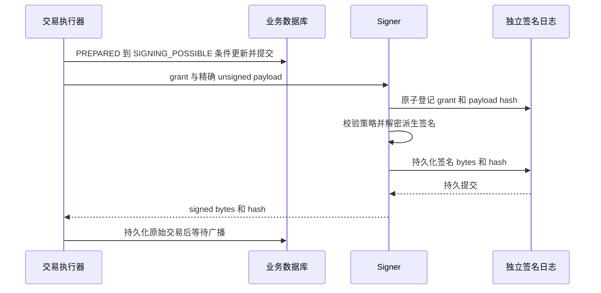

# M03：密钥托管、签名授权与 Signer

返回 [设计总览](README.md)。关联需求：助记词安全存储、受限资金签名、密钥恢复与轮换。

## 1. 职责与安全域

本模块拥有密钥生成/封装、密钥版本、受控公钥材料、独立签名许可和签名结果。部署成隔离服务，API/Core/链 Worker 均没有种子读取和 KMS 解密权限。签名请求来自 [M07](07-transaction-execution.md)，派生请求来自 [M04](04-address-and-asset-registry.md)。

```text
普通业务域：订单、余额、交易意图、地址归属
隔离策略域：许可审批、硬额度、白名单、暂停版本、签名授权密钥
隔离私钥域：密文种子、受控解密、子密钥派生、精确载荷签名
独立证据域：许可消费日志、签名结果、审计检查点与恢复副本
```

策略域可作为一期 Signer 的独立组件，但其持久记录、权限和授权密钥不得由 Wallet Core 任意写入。独立硬限额和目的地址政策是第二道边界；来自同一业务 DB 的“审批通过”字段不能单独证明 Core 未被攻陷。

## 2. 密钥类别与数据模型

| 类别 | 粒度 | 允许用途 |
|---|---|---|
| `DEPOSIT_HD` | 租户 + EVM 地址域 + 根版本 | 地址派生、向该租户金库归集 |
| `HOT` | 租户 + 热钱包 | 已审批提现与受控资金调拨 |
| `GAS_POOL` | 租户 + 网络 + Gas 钱包 | 向登记充值地址补原生币 |
| `TREASURY` | 租户 + 金库 | 向已登记热钱包/Gas 池补仓 |
| `COLD` | 租户 + 冷钱包 | 离线/多方批准的调拨，不能自动在线出款 |
| `SIGNING_GRANT` | 平台隔离策略域 | 签发精确载荷许可，不做链上签名 |
| `WEBHOOK/HTTP_ENCRYPTION` | 平台/租户和用途 | 通信认证/保密，不可替代链私钥 |

关键表分布如下：

| 记录 | 保存位置 | 字段与约束 |
|---|---|---|
| `key_roots` | 业务 PG，只有元数据 | `id, tenant_id, purpose, key_version, vault_ref, public_descriptor_hash, state` |
| `vault_key_materials` | 隔离 Vault | `key_id, tenant_id, purpose, ciphertext, wrapped_dek, kek_id, iv, tag, aad_version, cipher_version` |
| `signing_grants` | 独立策略存储 | `grant_id, business_operation_key, operation_id, execution_id, unsigned_hash, allowed_fee_caps, policy_version, expiry, state` |
| `signer_business_operations` | 独立策略存储 | `tenant_id, business_operation_key, active_execution_id, attempt_no, terminal_proof_ref`；稳定业务键唯一 |
| `signer_requests` | 独立签名存储 | `grant_id, unsigned_hash, state, signed_bytes_ref, tx_hash, audit_seq`；grant 唯一 |
| `signer_budget_reservations` | 独立策略存储 | `tenant/wallet/window, execution_id, amount, native_fee_cap, state` |

AAD 将 `environment, tenant_id, key_id, key_version, purpose, derivation_scheme` 以版本化确定编码绑定。业务库和 Vault 对相同 key ID 的租户/用途必须一致；禁止复制密文改成其他租户元数据。

## 3. 生成与封装

1. 在隔离建钥流程使用密码学安全随机数生成 256-bit 熵；需要助记词时形成 24 词 BIP39。
2. 将熵按登记的语言、BIP39 passphrase 规则转换为 HD 种子。256-bit 熵和 64-byte BIP39 种子是不同材料。[BIP39](https://github.com/bitcoin/bips/blob/master/bip-0039.mediawiki)
3. 每份密钥材料使用独立随机 256-bit DEK 和唯一 AES-GCM IV 封装；DEK 被指定 KMS KEK 包裹。
4. 保存密文、AAD、算法版本和恢复元数据，不向 Core 或普通 HTTP 返回明文助记词。
5. 在隔离环境验证固定索引样本地址，建立恢复包并通过双人复核后激活根版本。
6. 清理临时明文；助记词如需离线输出，仅在受控建钥仪式中处理，不能写日志/CI artifacts。

一期默认不启用额外 BIP39 passphrase，减少恢复歧义；启用时必须独立保管并通过恢复验证。备份可以封装熵及生成参数或直接封装种子，但必须明确哪种材料是恢复权威，不能只记录“有一份助记词备份”。

KMS KEK 用于封装，解密后的 DEK/种子仍会出现在授权进程内存中；KMS 不自动提供 BIP32 派生隔离。[AWS KMS 密钥与数据密钥说明](https://docs.aws.amazon.com/kms/latest/developerguide/concepts.html)

## 4. 派生规则与公钥材料

EVM 充值默认路径为 `m/44'/60'/0'/0/address_index`，`address_index` 由 M04 原子分配，范围 `[0, 2^31)`。只发布该租户 account-level 公钥描述符给受控派生模块，不导出 xprv。[BIP44](https://github.com/bitcoin/bips/blob/master/bip-0044.mediawiki)

父扩展公钥与其非硬化后代私钥同时泄露，可危及该公钥分支；公钥描述符也要控制访问。[BIP32 安全说明](https://github.com/bitcoin/bips/blob/master/bip-0032.mediawiki)

Signer 签名前按 `key_root_id + 完整路径` 自行重建发起地址，对照永久分配记录。校验使用完整公钥描述符 hash，4 字节 BIP32 fingerprint 仅辅助诊断，不能作为防冲突身份凭据。

## 5. 允许的交易意图

| 意图 | 可签内容 | 独立策略检查 |
|---|---|---|
| `DEPOSIT_SWEEP` | 原生币发送或白名单 token transfer | 发起地址归属；目标为本租户金库；金额/Gas 上限 |
| `GAS_TOPUP` | 原生币转账 | Gas 池来源；目标为登记充值地址；关联归集计划与补充上限 |
| `APPROVED_WITHDRAWAL` | 固定收款人、金额、资产 | 已冻结与批准证明；租户/钱包硬额度；最新熔断版本 |
| `TREASURY_REBALANCE` | 本租户登记钱包之间调拨 | 角色、目标白名单、审批、资产和费用预算 |
| `NONCE_BARRIER` | 原发送钱包同 Nonce 的受控取消载荷 | 高权限审批；关联原交易族；不产生外部付款 |

没有 `sign_hash(anything)`、任意 `approve` 或任意 calldata 接口。对于 ERC-20，Signer 自行解码合约、函数选择器、收款人和金额，拒绝模板外调用。原生转账的 calldata 默认必须为空；特殊收款合约是否允许由网络/目的地政策明确决定。

## 6. 许可协议

许可使用固定版本的编码和独立授权密钥签名，绑定下列字段：

```text
grant_id, environment, tenant_id, key_id, key_version
business_operation_key, operation_id, execution_id, attempt_no, tx_family_id, intent_kind
chain_id, from_address, execution_slot（EVM 为 nonce）
asset_id, to_address, send_amount, calldata_hash, unsigned_payload_hash
fee_plan_generation, gas_limit_cap, native_total_fee_cap
funding_reservation_id, approval_digest, policy_version, pause_epoch
issued_at, expires_at
```

“精确载荷”包含完整交易类型、chain ID、to/value/data、Nonce、费用字段和必要扩展。`send_amount` 和原生交易 value 分开建模，ERC-20 transfer 的 value 通常为零。

策略组件校验业务事实、冻结、批准状态和独立硬规则，并在自己的事务中预留执行额度、创建许可。同一执行的经济金额只预留一次；费用替代申请新 generation/新 grant，绑定同一交易族且只能提高费用到批准上限。

提现的稳定业务操作键由租户、业务类型和 external_order_id 规范生成，不能只使用可在数据库恢复后重建的随机 UUID。独立业务操作记录拒绝同键第二个仍可能付款的执行；新 attempt 必须核验旧 attempt 的永久撤销或最终未付款证据，调用方不能靠递增 attempt_no 绕过。恢复所需批准事实和业务身份随许可加密留存。

Core 控制的风控规则不能覆盖 Signer 的硬规则。若所有审批证据仅来自已被攻陷的同一 DB，仍可能伪造有效业务意图；高额操作必须有独立人工凭据/策略存储支持。这个边界不能由软件架构声明消除。

## 7. 签名交接与幂等状态机



Signer 状态为 `RESERVED → SIGNING → SIGNED` 或 `REJECTED`。第一次占用 grant 固定 unsigned hash；重试同 grant 同 hash 返回已有结果，不重新消费经济额度；同 grant 不同 hash 拒绝。

签名响应必须在独立结果日志可靠提交后返回。签名可能已生成但结果未知时保留 `SIGNING` 并按相同精确载荷恢复；不得签另一笔不同 Nonce 的付款。即使重建得到不同签名字节，同一 Nonce 仍只能执行一次，但必须保存并跟踪所有可能 hash。

Worker 在调用 Signer 前已进入 `SIGNING_POSSIBLE`，因此请求尚未返回、Core 进程崩溃或 KMS 超时都不能触发自动释放资金。只有明确、持久的“许可从未消费且已永久撤销”证据才能证明未签名；否则按已可能签名处理。

## 8. 轮换、禁用与恢复

| 操作 | 影响 |
|---|---|
| KMS KEK 轮换/DEK 重新包裹 | 不改变链地址；验证旧材料仍可解密 |
| DEK/密文格式轮换 | 保持同一 HD 种子；先验证后替换封装版本 |
| HD 根版本轮换 | 新用户或显式迁移使用新地址；旧地址保留归属、监听和受限归集能力 |
| 热钱包轮换 | 停止该钱包新增许可，继续追踪旧 Nonce 与已签交易，再调拨余额 |
| 怀疑私钥泄露 | 硬暂停新许可、隔离身份、批准应急转移；不能假设换 KEK 可废止已泄露私钥 |

许可的过期只限制新签名；已签 EVM 交易可在以后进入链。根版本 `ACTIVE / DRAINING / RECOVERY_ONLY / QUARANTINED` 分别控制新地址和允许签名用途；不得通过删除旧根“完成轮换”。

恢复包包括密钥材料、passphrase 信息（若有）、完整路径规则、租户/版本映射、索引上界及样本公钥。恢复流程见 [M12](12-reconciliation-and-recovery.md)。

## 9. 部署、性能与验收

限制进程调试、core dump、敏感诊断和 swap，使用受控锁页及清零措施降低暴露；这些措施不保证完全抵御主机被控制。默认不长期缓存明文根种子，确需短时缓存时限定 TTL、数量、租户和硬额度。KMS 故障只暂停新签名，不切换到明文配置。

HSM/MPC 升级须验证 secp256k1、HD 派生或预派生密钥管理、签名格式和许可策略，而不是仅替换一个库名称。二期 Ed25519/Solana 另有派生与签名方案。

- 将 A 租户密文/路径/目的地址替换为 B 租户，签名必须拒绝。
- 修改批准付款的 value、合约、calldata、Nonce、网络或费用上限，签名必须拒绝。
- 同 grant 重试、签名后响应丢失、进程在持久化边界崩溃，不能造成新 Nonce 付款或额度重复消耗。
- Core 被模拟控制时，仍不能突破独立钱包硬额度、金库白名单和高额多方审批。
- 从离线恢复包重建至少首尾及抽样索引地址，和历史完整公钥描述符一致。
