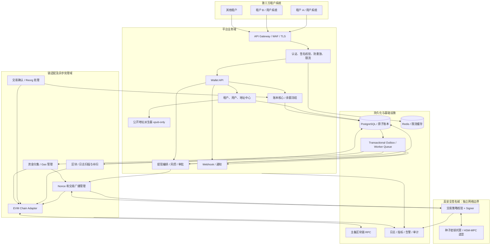
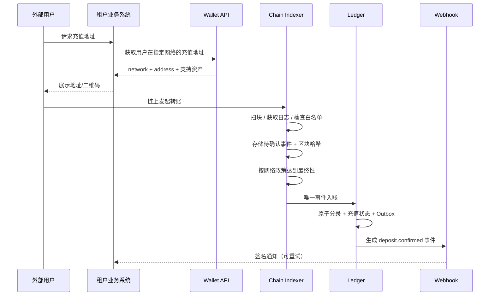
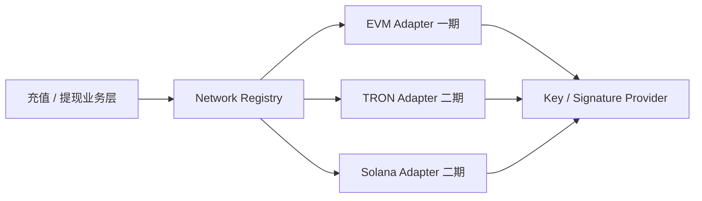

# Web3 多租户中心化托管钱包平台——一期技术架构方案

> 版本：V1.0  
> 日期：2026-10-09  
> 定位：面向第三方项目提供多租户、API 化、平台托管私钥的加密资产基础设施  
> 状态：可行性方案；实施前需完成安全、合规和资金运营评审

## 1. 总体结论

本项目应定义为 **多租户中心化托管钱包平台（Multi-Tenant Custodial Wallet Platform）**，兼具交易所式托管钱包与支付宝式账本账户能力。**一期推荐“模块化单体业务核心 + 独立密钥签名安全域 + EVM 链处理 Worker”**，先做好准确记账、安全签名、充值/提现和运营闭环，再按负载演进为微服务。

**六项核心决策：**

1. **链上钱包与内部账户分离**：用户的充值地址是链上收款入口；用户可用余额的权威来源是内部不可变账本，而不是充值地址的实时链上余额。
2. **资产由平台托管**：平台持有 HD 根密钥/签名权；互联网 API 层及普通数据库绝不接触助记词或明文私钥。
3. **多租户逻辑隔离且资金可核算**：所有业务对象强制绑定 `tenant_id`；支持独立租户资产核算、策略、费率及交易限额。安全预算允许时使用每租户独立根密钥。
4. **一期聚焦 EVM**：支持明确白名单内的 EVM 网络、原生币和标准 ERC-20；不在一期实现 Solana/TRON 的链上逻辑，但在核心模型与接口中保留接入空间。
5. **充值以确定性事件入账，提现以状态机执行**：做到可幂等、可重试、可恢复、可审计，不能因为网络超时而重复付款。
6. **REST 开放接口使用多层保护**：TLS + 租户级身份验证与签名 + 时间戳/随机数防重放 + 资金接口业务幂等；可选应用层 AEAD 加密和 mTLS。

## 2. 一期范围与假设

### 2.1 交付范围

| 模块 | 一期能力 |
|---|---|
| 租户中心 | 租户注册/审核、API Key、权限、配额、策略、冻结/启停 |
| 终端用户映射 | 租户内 `external_user_id` 映射，不要求用户直接登录钱包平台 |
| 充值地址 | HD 分配每用户每网络一个稳定地址；同一地址接收该网络原生币和支持的 ERC-20 |
| 充值识别 | EVM 原生币、白名单 ERC-20 `Transfer` 事件、确认、去重、重组检查、补扫 |
| 资金账本 | 多租户、多用户、多链、多资产，余额、冻结、分录、审计、对账 |
| 资金归集 | 充值地址 -> 归集钱包，原生币归集和 ERC-20 Gas 补充/归集 |
| 提现 | 申请、幂等、冻结、限额风控、审批、签名、广播、确认、失败处理 |
| 内部划转 | 同租户内部余额划转，无需链上交易；跨租户划转默认不支持 |
| 开放平台 | REST API、API Key/HMAC、可选报文加密、Webhook、查询和回调重试 |
| 管理后台 | 租户/资产/链配置、交易查账、提现审核、异常处理、对账和告警 |
| 运维安全 | 审计日志、密钥备份和恢复演练、RPC 双供应商、应急暂停 |

### 2.2 明确不在一期范围

- 去中心化、自托管钱包、向用户导出私钥或助记词。
- 现货撮合、订单簿、币币兑换、法币出入金、信用透支、跨链桥。
- Solana/TRON 真实充提、NFT、任意代币自动上架、DeFi 合约交互。
- 对任意 EVM 合约执行、未知代币、重基数代币（rebase）、有转账税/回调特性的代币自动承诺支持。
- 通过 `trace` 识别的合约内部原生币转账：如果一期不能可靠覆盖，须明确对外披露“不保证自动入账”，并提供人工核对机制。

> 上线前需要明确：业务司法辖区、支持网络/资产、日交易量、活跃地址规模、是否要求资金独立保管、热钱包最大敞口、提现审批等级。本文的容量和进度均为建议基线，不代替上述约束的最终设计。

## 3. 总体架构



### 3.1 部署边界而非过早拆微服务

推荐单一 Rust Workspace，按领域分 crate，初始部署为以下 **5 类进程**：

| 部署进程 | 职责 | 核心约束 |
|---|---|---|
| `wallet-api` | 外部 API、租户、地址、只读查询、提现受理 | 不持私钥；无直接广播权限 |
| `wallet-core-worker` | 账本、审批状态机、Outbox/Webhook | 所有余额变化必须进入账本事务 |
| `chain-indexer` | 链扫描、事件标准化、确认/reorg/补扫 | 链上事件不得直接修改用户余额 |
| `wallet-tx-worker` | 归集、提现编排、Gas、Nonce、广播/跟踪 | 只通过受控 signer 申请签名 |
| `wallet-signer` | 派生、签名、签名策略、根密钥访问 | 私有网络、最小权限、严格审计 |

早期使用 PostgreSQL + 事务 Outbox 就足以实现可靠任务投递。规模增长后，可让 Outbox Relay 投递到 Redpanda/Kafka 或 NATS JetStream，保持核心业务与队列中间件解耦。Redis 不作为余额、订单、Nonce 的唯一持久化事实来源。

## 4. 核心业务与多租户模型

### 4.1 领域对象

- **Tenant**：租户，拥有独立认证凭证、风险配置、资产范围和用户命名空间。
- **ExternalUser**：租户业务用户映射，`(tenant_id, external_user_id)` 全局唯一。
- **Network**：具体区块链网络；EVM 使用稳定的 `chain_id` 作为属性，如 Ethereum mainnet `1`。
- **Asset**：网络上的可记账资产，例如 `(network_id, native)` 或 `(network_id, ERC20 合约地址)`；不要只用 `USDT` 名称作唯一键。
- **DepositAddress**：链上收款地址，永久映射一个租户用户和一个网络（按产品策略）。
- **LedgerAccount**：用户负债、平台托管资产、手续费收入/支出、待处理资金等账本账户。
- **Withdrawal**：提现业务申请，独立于链上交易。
- **ChainTransaction**：链上交易记录；一次业务提现可能对应多次替换交易哈希，但通常共享一个发送账户的 nonce。
- **SweepJob**：归集任务；与用户提现区别对待。
- **WebhookEvent**：对外可靠通知事件。

### 4.2 多租户隔离策略

1. **身份隔离**：租户由 API 凭证绑定，后端从验证结果解析 `tenant_id`，绝不信任调用方传入的 `tenant_id`。
2. **数据隔离**：所有业务表带 `tenant_id`；所有 SQL 使用显式租户条件，关键表可叠加 PostgreSQL RLS；数据库只读/读写角色分权。
3. **账户隔离**：余额和负债按 `tenant_id + user_id + network_id + asset_id` 分账；强制唯一索引及复合外键避免跨租户引用。
4. **资金隔离**：一期至少按租户分别核算链上资产与负债；是否每租户独立归集地址、热钱包/密钥根由风险和法律要求决定。共享热钱包并不等于链上物理隔离。
5. **策略隔离**：每租户提现费率、风控规则、额度、每日限额、Webhook 密钥、IP 白名单独立配置。
6. **操作隔离**：后台区分平台管理员、租户管理员、财务审核员、只读审计员；敏感动作双人审批且留不可抵赖审计记录。

**推荐路线**：逻辑多租户是强制要求；上线时优先选择“每租户独立充值派生账户（account'），平台按角色分离热/冷密钥”，对高价值/合规隔离租户升级为“每租户独立根密钥与归集钱包”。

## 5. HD 钱包设计与密钥安全

### 5.1 地址派生策略

符合 BIP39（助记词转换种子）、BIP32（HD 派生）、BIP44（路径约定）。一期 EVM 可以采用以下标准格式：

```text
m / 44' / 60' / account' / 0 / address_index
```

此处 `60'` 为以太坊的 coin type；`account'` 由平台注册的唯一 `account_id` 映射到某个 **(密钥域, 租户, 网络, 密钥版本)**，而不是直接把任意字符串 `tenant_id` 写入派生路径。

例如：

```text
keyring: evm-deposit-root-v1
network: ethereum-mainnet
owner: tenant-A
account_id: 17
address_index: 1032
path: m/44'/60'/17'/0/1032
```

> 若租户在多个 EVM 网络需要不同地址，给每个 `(tenant, network)` 分配不同的 `account'`。即使用户地址碰巧一致，也必须以 `(network_id, address)` 联合识别资产；用户充值时始终显示网络并校验 `chain_id`。该 `account'` 分配是项目自行建立的映射规则，不是 BIP44 自动规定的“租户语义”。

### 5.2 分配流程

1. 注册租户及其允许的网络，创建/选择密钥域、密钥版本和唯一派生账户索引。
2. 在安全域内从根密钥派生账号级 `xpub`，将 xpub 提供给只读地址派生服务；**不暴露根 xprv、seed、助记词或任何子私钥**。
3. 使用数据库原子序列/行锁为该 `(keyring, account)` 分配 `address_index`，计算 EVM 地址并写入不可复用的地址映射表。
4. 对同一个 `(tenant, external_user_id, network)` 重复申请返回既有地址，地址一经分配不得改派其他用户。
5. 记录 `key_version、account_id、derivation_path、address、created_at、status`，以便灾难恢复时完整重建。

**注意**：xpub 不是私钥但会暴露对应派生地址集合，应限制访问与日志外泄；设计必须避免 xpub 与非硬化子私钥同时泄露，且租户账户层使用硬化派生。

### 5.3 钱包职能分层

| 钱包类型 | 是否 HD 派生 | 职责 | 管控级别 |
|---|---:|---|---|
| Deposit | 是 | 给终端用户充值，主要收款 | 独立派生账户、受限支出 |
| Gas Station | 可选 | 为 ERC-20 充值地址发放原生 Gas | 限额、只向登记地址资助 |
| Hot Wallet | 是或独立托管密钥 | 日常提现，维持有限余额 | 全自动但严格风控和预算 |
| Treasury / Warm | 建议独立密钥域 | 归集与热钱包补充 | 审批及额外安全策略 |
| Cold Wallet | 独立离线密钥 | 大额长期储备 | 离线、多签或 MPC、多角色审批 |

### 5.4 密钥托管的可行性边界

生产级推荐外部 HSM/MPC 或经过安全评估的专用签名基础设施，但**不能直接假定普通云 KMS 支持“任意 BIP32 子密钥在 KMS/HSM 内派生并签名”**。选型前必须验证：`secp256k1`、BIP32 硬化/非硬化派生、子私钥不出安全边界、吞吐量、恢复能力及供应商故障退出能力。

最小可行实现可以使用隔离的 `wallet-signer`，通过 KMS 包装加密保存根种子，只在受限进程内解密并派生签名，但这**不等同于硬件级不可导出托管**：进程被攻破仍可能泄露明文根密钥，不能据此宣称达到高安全资金托管标准。

强制规则：

- 正式根种子离线生成（建议 256-bit 熵/24 词等价方案），分人分权备份，定期恢复演练。
- 根种子、助记词、私钥绝不进入 PostgreSQL 明文、Redis、Webhook、程序日志或工单系统。
- Signer 不接受任意签名请求，只接受来源受认证的内部任务，并**重新验证链 ID、目标地址、资产、交易金额、手续费上限、租户策略、审批结果、业务关联单号**。
- Signer 网络出口默认禁止，KMS/HSM 凭证独立、mTLS + 服务身份认证；签名请求全量结构化审计（不记密钥）。
- 引入紧急暂停、热钱包单笔/日额上限、目的地址白名单策略、关键操作双人审批、根密钥版本管理。
- 根密钥轮换仅影响新地址；历史地址及历史签名能力必须在明确生命周期内保留，不能简单换种子使旧资产不可动用。

## 6. 内部资金账本：系统最重要的业务核心

**原则：用户余额以账本为准；链上资金是平台资产实存，二者通过会计账户、充值/提现流水及周期对账关联。**

### 6.1 余额口径

```text
available    可用余额（允许提现 / 划转）
held         提现冻结余额
pending      已识别但尚未达到入账确认条件的充值（仅展示，不可支用）

用户可支配余额 = available
用户已确认的总权益 = available + held
```

不要把未确认的链上充值直接纳入可提现余额；`pending` 可以作为业务侧观察状态，不必提前记入正式负债账本。

**金额统一使用资产最小单位的整数**，例如 USDT 根据该网络已审定的 `decimals` 换算；API 返回十进制整数字符串。数据库 `NUMERIC(78,0)` 或经过约束的定长高精度整数，严禁以 `float/double` 运算资金。资产的 `decimals` 必须经审核后固定并版本化，不可信任每次 RPC 动态取值。

### 6.2 双重记账

以用户充值 100 USDT 为例，完成最终确认后同一数据库事务写分录：

| 借方（Dr） | 贷方（Cr） | 数量 | 含义 |
|---|---|---:|---|
| 链上托管资产账户 | 用户可用余额负债账户 | 100 USDT | 链上托管资产增加，同时形成对用户的偿付义务 |

用户申请提现 30 USDT：

| 借方（Dr） | 贷方（Cr） | 数量 | 含义 |
|---|---|---:|---|
| 用户可用余额负债账户 | 用户冻结余额负债账户 | 30 USDT | 冻结提现余额，资产总负债不变 |

链上实际成功转出 30 USDT 且满足确认要求：

| 借方（Dr） | 贷方（Cr） | 数量 | 含义 |
|---|---|---:|---|
| 用户冻结余额负债账户 | 链上托管资产账户 | 30 USDT | 用户权益减少，托管资产减少 |

归集地址转移资产只是**平台内部托管资产子账户之间划转**，绝不能因此扣减终端用户余额。Gas 消耗是单独的原生币支出/费用分录；服务手续费收入与网络 Gas 成本分币种分别核算。若用户承担提现手续费，需显式定义 `gross_amount / network_amount / service_fee / fee_asset`，避免扣款含义不一致。

### 6.3 账本约束

- 分录只追加，不编辑、不删除；发现错误以**冲正和补记**修复。
- 同一日记账凭证内必须满足 **同一资产、同一网络借贷平衡**。
- 同步事务完成可用余额检查、余额冻结、状态更新、凭证写入、Outbox 记录。
- 对同一 `(tenant, asset, user)` 使用数据库行锁或串行化控制，保证并发提现不导致超额花费。
- `business_type + business_id + posting_stage` 全局幂等唯一。
- 后台展示的加速余额表是账本投影，若发现不一致，以不可变分录重放验证。
- 每日校验：用户负债总额、链上托管实存、处理中资产、Gas/手续费差异、已知业务应收应付，不以“地址余额简单相加 = 用户余额”作为唯一判定。

## 7. EVM 充值业务设计

### 7.1 核心流程



### 7.2 扫链策略

**原生币**：按网络高度扫描区块交易，读取 `to/value`，映射到已分配充值地址，验证交易执行结果（需要时核验 receipt）。标准块级扫描覆盖直接原生币转账；合约内部转移不在该基础能力内。

**ERC-20**：按白名单代币合约查询 `Transfer(address,address,uint256)` 事件日志，通过 `topics` 与地址表确认 `to` 为充值地址，核对 receipt 成功、代币合约地址、网络和真实金额。对于 fee-on-transfer/rebase/异常事件代币，需要定制余额增量核验或禁止上架；不能对所有 Token 仅凭 `Transfer.value` 盲目记账。

**扫码性能**：用 `(network, block_height)` 持久化游标；使用 `eth_getLogs` 区间分片、RPC 限流、退避、双节点交叉核验和故障补扫。不要为百万地址逐个请求余额/日志。扫描原始事件与游标推进在可恢复流程中提交；独立去重和最终性入账 Worker。

### 7.3 唯一事件和重组

- 事件索引包含 `network_id, tx_hash, log_index`（ERC-20）或 `network_id, tx_hash, transfer_kind`（已支持的直接原生币交易）。区块位置/哈希也要保存用于追踪 canonical chain 变化。
- 充值状态：`DETECTED -> CONFIRMING -> CREDITED`；分叉失效的事件可转为 `ORPHANED`。
- 每个新区块核查父哈希连续性；分叉时向共同祖先回退并重扫；已经收到但未最终入账的事件可撤销。
- 对极端情况下“已经记账后仍发生重组”的情况启动紧急暂停、冻结相关账户、审计冲正/追索流程，不允许默默删除分录。
- **确认标准按网络配置**：Ethereum 主网可使用经验证的 `finalized` 信号；其他 EVM/L2 网络需要独立的 finality 政策，不能简单共用固定的 12 区块规则。
- 即使回调网络重试 100 次，充值到账凭证也只能产生一次。

## 8. 资金归集与 Gas 运维

典型路径：

```text
用户链上转账 -> 用户充值地址（Deposit）
                   |
                   | 充值识别、确认后
                   v
              Sweep Planner
                   |
        +----------+------------+
        |                       |
    原生币直接归集          ERC-20 需要 Gas
        |                       |
        |                 Gas Station 补 Gas
        |                       |
        +------------+----------+
                     v
              Treasury / Hot
```

**关键规则：**

1. 归集是托管资产转移，不是再次给用户入账。
2. ERC-20 归集地址必须有原生币支付 Gas，因此需要 Gas 补充策略、资助上限、异动告警和失败重试。
3. 为避免小额充值造成 Gas 成本超额，设置最小归集额度、归集批次间隔、动态 Gas 预算和 Dust 策略。
4. 一期可以使用外部 EOA 归集，不强制部署归集合约；若将来引入代付/批量合约，应单独审核链上安全和 Token 兼容性。
5. 充值地址、Gas 地址、提现热钱包的签名授权必须区分，避免签名端接到任意资金转移请求。
6. 大部分资产最终停留于温/冷钱包，热钱包保留可控日常提现头寸，按审批策略从 Treasury 补充。
7. 钱包链上余额和用户账本余额不能混为一谈；归集失败不影响已经满足规则的充值权益，但会增加运营及流动性风险。

## 9. 提现业务设计

### 9.1 状态机

```text
REQUESTED
   |
   v
HELD (余额冻结成功)
   |
   v
RISK_REVIEW -> [拒绝] -> REJECTED / UNHELD
   |
   v
APPROVED
   |
   v
TX_PREPARED -> SIGNED -> BROADCAST_UNKNOWN / BROADCASTED
   |                                  |
   |                                  v
   |                               PENDING
   |                                  |
   |                     +------------+----------+
   |                     |                       |
   v                     v                       v
MANUAL_REVIEW       CONFIRMED              FAILED / REVERTED
                         |                       |
                         v                       v
                 结算用户冻结余额          已证实终态后解冻/扣 Gas
```

**关键警示**：出现 RPC 超时、广播返回未知、长时间 pending，不能直接判定失败并重新生成一笔新 nonce 的交易。系统必须保存原始签名交易、计算得到的 tx hash，优先**重播同一原始交易**；确需加速则用同一个 `(network, sender, nonce)` 构建受控替换交易。只有证明原交易及所有替换均不可能继续成交，才能安全释放冻结余额。

### 9.2 分步执行

1. 租户提交 `Idempotency-Key`、`user_id`、`network`、`asset`、`to_address`、提现数量/手续费模式。
2. 验证账户、资产、网络、目标地址、提现白名单/黑名单、租户额度、链上目标风险、余额。
3. 原子事务：用户可用余额减少、冻结余额增加、创建提现订单及 Outbox。
4. 风控及审批：金额分级、频率、设备/IP、异常目的地址、人工二次审批（阈值配置）。
5. 交易编排：选择授权热钱包、估算 Gas、校验 Gas 上限、保留发送账户 Nonce。
6. `wallet-signer` 独立二次校验业务权限与交易参数，返回已签名交易；在广播前持久化 raw signed tx 及本地 hash。
7. 多 RPC 广播；监视链上交易、receipt、确认深度、替换交易和异常状态。
8. 确认成功后冲销冻结余额，记账网络费用/平台费，发布 `withdrawal.confirmed`；明确失败后释放可用余额，账本记录所有修正动作。

### 9.3 Nonce 管理

- Nonce 唯一域：`(network_id, sender_address)`，与租户订单 ID 不是同一个概念。
- 数据库持久保留 `reserved_nonce -> signed_hash -> broadcast_hashes -> mined_receipt`，并使用行锁/唯一约束处理同钱包并发。
- 启动恢复时同时检查 DB、RPC `pending` / `latest` nonce、已签名交易库与 receipt；不能简单以 RPC 返回值覆盖 DB 状态。
- 加速交易可以替换 `maxFeePerGas` / `maxPriorityFeePerGas`，但同 nonce 的业务意义必须固定，任何改变目标或金额均重新审批。
- 交易 `receipt.status = 0` 表示执行失败，Gas 可能已被扣除，用户 Token 提现应按结果释放冻结，同时单独记录 Gas 成本。
- Gas 估计需支持网络相关 fee model，Ethereum 可用 EIP-1559，链适配器也应支持采用 legacy gasPrice 的 EVM 网络。

## 10. 开放 API 与加密通信方案

### 10.1 安全等级

**必选层：** TLS 1.3（兼容性需要时受控支持 TLS 1.2）+ 租户独立凭证 + 请求 HMAC/非对称签名 + 时效/防重放 + 幂等 + WAF/限流 + 最小权限。

**增强层：** 对高价值租户启用 mTLS、固定出口 IP、审批密钥、报文级 AEAD 加密或标准 HPKE；签名与加密是两种不同安全目标，不可互相替代。

### 10.2 请求签名（推荐简单协议）

```http
POST /v1/withdrawals HTTP/1.1
Authorization: WalletKey <public_key_id>
X-Timestamp: 2026-10-09T10:00:00Z
X-Nonce: <client_secure_random_nonce>
X-Idempotency-Key: <merchant_withdrawal_order_id>
X-Signature: v1=<base64_hmac_sha256>
Content-Type: application/json
```

```text
canonical_message =
  UPPERCASE(method) + "\n" +
  canonical_path_and_query + "\n" +
  timestamp + "\n" +
  nonce + "\n" +
  SHA256(exact_http_body_bytes)

signature = Base64(HMAC-SHA256(tenant_api_secret, canonical_message))
```

必须发布多语言 SDK 和官方签名测试向量。请求签名应覆盖**原始字节**，避免不同语言 JSON 序列化产生歧义。时间偏差建议限制约 ±5 分钟；`nonce` 在时间窗内唯一（Redis 带 TTL + 故障策略），提现等资金类接口再以 PostgreSQL 唯一约束提供**持久业务幂等**。HMAC 密钥保存在 KMS/凭证管理服务，可轮换、有 `key_id` 和独立权限。更高要求可将签名替换为租户 Ed25519 公私钥签名。

### 10.3 报文级加密

若租户明确要求“除 HTTPS 外业务体也加密”，优先采用经过审计的标准 **HPKE（RFC 9180）** 来实现公钥混合加密，或采用版本化租户共享密钥 + **AES-256-GCM** 封装（需要严格保证每把密钥下 nonce 唯一、密钥轮换和 AAD 绑定）。不要自行拼接 AES-CBC、固定 IV 或非标准 RSA 分段加密。

报文至少携带 `version, key_id, nonce/encapsulated_key, ciphertext, auth_tag`；将 `tenant_id、method、path、timestamp、request_id` 作为认证关联数据的一部分，并明确请求与响应的密钥方向。**即使使用应用层加密，TLS、请求认证和持久业务幂等仍然必需。**

### 10.4 核心 REST API（示意）

| Method | Path | 作用 |
|---|---|---|
| POST | `/v1/users` | 在租户内登记/映射业务用户 |
| POST | `/v1/deposit-addresses` | 获取或幂等分配充值地址 |
| GET | `/v1/balances?external_user_id=...` | 查询余额，按网络/资产区分 |
| GET | `/v1/deposits/{deposit_id}` | 充值订单详情、确认状态 |
| GET | `/v1/deposits` | 分页查询充值流水 |
| POST | `/v1/withdrawals` | 发起提现，必须携带幂等键 |
| GET | `/v1/withdrawals/{withdrawal_id}` | 查询提现及链上交易状态 |
| POST | `/v1/transfers/internal` | 同租户内部划转 |
| GET | `/v1/assets` | 当前租户开放的网络和资产清单 |
| GET | `/v1/webhook-events` | 补查、对账和恢复回调 |

**提现请求示例：**

```json
{
  "external_user_id": "user_10086",
  "network": "eip155:1",
  "asset_id": "eip155:1/erc20:0x0000000000000000000000000000000000000001",
  "to_address": "0x1111111111111111111111111111111111111111",
  "amount_base_units": "1000000",
  "fee_mode": "exclusive",
  "merchant_order_id": "wd_20261009_0001"
}
```

> 上例的合约地址纯属格式占位符，**不是 USDT 真正合约地址**；生产 API 必须从服务端白名单返回真实 `asset_id`，不得由租户随意提交未知合约地址。`network` 使用 CAIP-2 风格仅作统一命名建议；不同链的 `asset_id` 解析应由链插件负责。

**响应建议**：`request_id、code、message、data`；货币数量返回字符串；创建交易返回业务订单 ID 和初始状态，不承诺同步完成链上提现。

**Webhook**：使用独立密钥和签名、`event_id`、递增/版本字段、`occurred_at`、可重试投递、指数退避、死信/人工重发；租户需以 `event_id` 幂等消费。至少提供 `deposit.confirmed / withdrawal.processing / withdrawal.confirmed / withdrawal.failed`。

## 11. 为二期 TRON / Solana 预留的链架构

一期不应把 `nonce、gasPrice、hex address、EVM transaction` 硬编码成钱包平台的公共领域模型。将“业务意图”与“链实现细节”分开：



| 通用业务抽象 | EVM 一期实现 | 二期扩展点 |
|---|---|---|
| AddressCodec | `0x` 地址、EIP-55 校验 | TRON Base58Check、Solana Base58 |
| DepositObserver | 区块交易 + ERC-20 Log | TRC-20 事件、SPL Token Account |
| FinalityPolicy | 安全/最终确认 + 网络配置 | TRON/Solana 各自确认语义 |
| FeeEstimator | Gas/EIP-1559/legacy | Energy/Bandwidth、compute fee/rent |
| TransactionBuilder | EVM transaction + nonce | TRON transaction、Solana message + blockhash |
| SignatureProvider | secp256k1 | Solana Ed25519 等 |
| AssetResolver | Native + ERC-20 | Native + TRC-20、SPL Mint |
| BalanceReconciler | 账户余额/Token balanceOf | 各链账户/资产模型 |

**不推荐强行定义一个“所有链通用 nonce 接口”**：Solana 主要依赖 recent blockhash/有效期等语义，而 TRON 有不同的资源和确认模型。核心接口应接收 `TransferIntent`，由具体链适配器负责费用、交易构造、有效期、重试以及状态解释。

数据模型中应将 `network_id` 统一为链无关字符串（如 `eip155:1`），`chain_family = evm | tron | solana`，并允许链特有的 `metadata_json`，但金额、状态、账本依然保持强类型。

## 12. PostgreSQL 核心数据模型

下表为领域结构，不代表最终一比一建表，后续需明确主键、约束、外键、索引、分区、归档及 RLS 策略。

| 表 | 关键字段 / 唯一约束 |
|---|---|
| `tenants` | `id, status, risk_profile_id` |
| `tenant_api_keys` | `tenant_id, key_id(unique), secret_ref, permissions, expires_at, status` |
| `tenant_users` | `tenant_id, external_user_id` 唯一 |
| `networks` | `id(unique), chain_family, chain_id, finality_policy, status` |
| `assets` | `network_id, kind, contract_address, decimals, status` 联合唯一 |
| `keyrings` | `keyring_id, key_version, role, custody_provider, lifecycle_state` |
| `derivation_accounts` | `keyring_id, tenant_id, network_id, account_index`；账户 index 全局按 keyring 唯一 |
| `deposit_addresses` | `network_id + normalized_address` 全局唯一；租户用户网络稳定映射 |
| `ledger_accounts` | `tenant_id, owner_type, owner_id, network_id, asset_id, account_type` |
| `ledger_journals` | `id, business_id, posting_stage, status, created_at`；幂等唯一 |
| `ledger_entries` | `journal_id, account_id, side, amount_base_units`；不可变 |
| `balance_snapshots` | `ledger_account_id, balance, version`；作为高效投影 |
| `chain_blocks` | `network_id, height, hash, parent_hash, canonical, finality` |
| `chain_events` | `network_id, tx_hash, event_index, event_type, block_hash, status` |
| `deposits` | `tenant_id, user_id, chain_event_id(unique), amount, state` |
| `withdrawals` | `tenant_id, merchant_order_id` 唯一；`held_amount, state, approval` |
| `tx_intents` | `business_id, network_id, source_wallet, nonce_or_chain_specific_ref, state` |
| `signed_transactions` | `tx_intent_id, raw_tx_encrypted_or_restricted, tx_hash, nonce, replaced_by` |
| `sweep_jobs` | `network_id, source_address, asset_id, plan_id, status` |
| `outbox_events` | `aggregate_id, event_id(unique), type, payload, published_at` |
| `webhook_deliveries` | `event_id, tenant_id, attempts, next_retry_at, state` |
| `audit_logs` | `actor, tenant_id, resource, action, before_hash, after_hash, timestamp` |

数据库约束优先于业务代码保证唯一性。可将链原始事件、交易分区按网络和时间/高度扩容；账本分区方案必须保证唯一约束和审计查询不会失效。

## 13. 技术选型与部署

| 层级 | 建议栈 | 原因 |
|---|---|---|
| 主后端 | **Rust + Tokio + Axum** | 高并发异步、强类型、服务边界清晰 |
| SQL | **PostgreSQL + SQLx** | 资金事务、唯一约束、行锁、可靠一致性 |
| EVM SDK | **alloy-rs** | Rust EVM RPC、交易构造、ABI 生态 |
| HTTP Client | `reqwest` / RPC provider | 调用链服务、Webhook 客户端 |
| Redis | 缓存、限流、防重放、非关键临时状态 | 不作为账本及签名 nonce 唯一事实来源 |
| 消息 | 一期 PostgreSQL Transactional Outbox + Worker | 简化部署，保证“业务提交与事件生成”原子性 |
| 消息升级 | Redpanda/Kafka 或 NATS JetStream | 扫链、风控、Webhook、审计负载增长时采用 |
| 凭证/密钥 | KMS + 隔离 Signer；高等级 HSM/MPC | 密钥职责隔离；需验证 HD 支持边界 |
| 运维观测 | OpenTelemetry + Prometheus + Grafana + Loki/日志平台 | 指标、追踪、审计告警 |
| 容器 | Docker；达到 HA 需求再 Kubernetes | 一期先保障稳定性、备份与演练 |

### 13.1 推荐工程结构

```text
wallet-platform/
├── apps/
│   ├── wallet-api/
│   ├── wallet-core-worker/
│   ├── wallet-chain-indexer/
│   ├── wallet-tx-worker/
│   └── wallet-signer/
├── crates/
│   ├── wallet-domain/          # Tenant, User, Asset, TransferIntent
│   ├── wallet-ledger/          # 原子账本、冻结、冲正、对账
│   ├── wallet-custody/         # 密钥域、钱包角色、派生策略
│   ├── wallet-chains/          # 链无关抽象
│   ├── wallet-chain-evm/       # 一期 EVM 插件
│   ├── wallet-deposit/         # 充值发现、确认、事件处理
│   ├── wallet-withdrawal/      # 提现状态机、审批
│   ├── wallet-sweep/           # 归集与 Gas 补充
│   ├── wallet-api-protocol/    # 认证、签名、加密、DTO
│   └── wallet-persistence/     # SQLx、迁移、Outbox
├── migrations/
├── docs/
└── deploy/
```

### 13.2 生产网络拓扑

- DMZ：WAF / Gateway，仅暴露 API；后台管理走独立身份网关。
- 业务网：API、Core、Worker；RPC 凭证及网络出口按进程隔离。
- 数据网：PostgreSQL 主备、备份加密、Redis、只允许授权服务访问。
- 签名网：Signer/KMS/HSM/MPC，不接受公网入站，最小出入站网络规则；签名接口与 API 无直接连通或经明确授权的服务身份通信。
- 运维：生产/测试密钥与数据库物理或账户隔离；生产环境禁止热调试并强制行为审计。

## 14. 可靠性、风控与可观测性

### 14.1 失败模型及应对

| 故障 | 处理规则 |
|---|---|
| Webhook 投递失败 | Outbox + 退避重试 + 手动重放，租户幂等消费 |
| RPC 暂时不可用 | 双供应商切换、记录扫描游标、暂停关键处理不乱确认 |
| 区块分叉 | 回退扫描、隔离已孤立事件、未达最终性禁止确认入账 |
| 提现 API 重试 | PostgreSQL 商户订单幂等；同请求返回原订单 |
| 广播超时 | 查询已签名原交易 hash，重发相同 raw tx，不立即释放资金 |
| 提现长期 Pending | 分析 nonce、链状态、受控同 nonce 替换交易 |
| 归集 Gas 不足 | 自动估算和有限补 Gas，超限触发人工审核 |
| Postgres 中断 | 资金相关写操作停止；恢复后重放 Outbox/工作流 |
| Redis 丢失 | 允许缓存重建，不能影响余额正确性和提现幂等 |
| Signer 被隔离/不可用 | 暂停提现及归集，充值扫描/查询可继续；启用应急响应 |
| 用户资产不足但链上已处理 | 对账告警、冻结异常账户、差错单与人工处理 |

### 14.2 必须监控

- 每网络 `indexed_height / safe_height / finalized_height / scan_lag / rpc_error_rate`。
- 充值 `detected_pending / credit_delay / duplicate_event / reorg_count / gap_recovery`。
- 提现 `held_count / approval_delay / signer_reject / pending_nonce_age / confirmed_delay / failure_ratio`。
- 归集 `unswept_token_amount / gas_topup_count / dust_value / hot_wallet_burn_rate`。
- 账本 `journal_imbalance = 0 / negative_available = 0 / unreconciled_delta / outbox_backlog`。
- 密钥 `signer_call_volume / signing_policy_denial / emergency_pause / kms_errors`。

### 14.3 资金风控和合规

- 租户级余额/单笔/单日提现限额、频率、反洗钱与异常链上地址筛查、审批阈值、地址白名单及冷却期。
- 根据运营司法辖区评估虚拟资产托管、支付、资金转移、旅行规则、KYC/KYB、AML/制裁筛查、隐私与数据留存要求。**技术上的“多租户隔离”不自动代表法律上的客户资产隔离或合规。**
- 高风险目的地址及超预算支出强制挂起；拒绝不明合约/代币，留完整工单和审批证据。
- 正式上线前执行独立渗透测试、密钥恢复演练、双 RPC 故障演练、灾备切换和账本资金审计。

## 15. 一期分阶段实施

以 **5～7 人**（2～3 Rust、1 链上/安全、1 前端/后台、1 测试/运维、兼职产品或合规）为例，初步预计 **12～16 周达到受控试运营**，不是商业大额托管上线承诺；安全基础设施及外部审计可能显著增加周期。

| 阶段 | 建议时间 | 重点产出 | 验收关注 |
|---|---|---|---|
| M0 方案冻结 | 1～2 周 | 网络/币种清单、账本口径、安全与合规边界、威胁模型 | 关键资金路径和密钥托管选型确认 |
| M1 基础核心 | 2～3 周 | 租户、用户、地址 HD 派生、API 认证、双重账本 | 派生测试向量、一致性、隔离测试 |
| M2 充值与归集 | 3～4 周 | EVM Indexer、ERC-20、Finality/Reorg、Sweep/Gas | 断点恢复、重复事件、链分叉、漏扫 |
| M3 提现闭环 | 3～4 周 | 余额冻结、风控、审批、Nonce、Signer、广播 | 重试不多付、冲正准确、签名策略 |
| M4 开放与上线 | 2～3 周 | Webhook、控制台、可观测、对账、压测、灾备 | 端到端资金审计、安全评审、灰度上线 |

### 15.1 强制验收场景

1. 同一用户重复获取充值地址不产生不同归属；百万级派生不碰撞、索引无并发重复（依算法测试和索引约束验证）。
2. 同一充值事件重复消费、服务重启、Webhook 重试，**用户只能入账一次**。
3. RPC 长时间断线、扫描从旧高度回退、网络分叉、ERC-20 Log 重排，都不会漏记/重记。
4. 同一用户 1000 个并发提现请求，总冻结不超过其可用余额。
5. 同一提现订单重复调用/超时重试、交易广播超时、交易替换、RPC 返回相互矛盾，不会因系统重试多付。
6. 非法租户凭证无法访问另一租户的订单、余额或地址；伪造 `tenant_id` 无效。
7. Key/seed 泄漏模拟、Signer 策略拒绝、紧急停机、冷备恢复流程均验证。
8. 跨币种、小数精度、Gas 费用、内部划转、归集、提现失败与账本冲正均对平。
9. 故障恢复后，从账本+链上事实重建 API 查询投影和待处理任务，保证可审计恢复。
10. 灰度网络先用 Sepolia 等测试网验证，再使用小额真实资产试运营；每增加新网络/代币均执行专项准入测试。

## 16. 一期推荐最终落地形态

**首发建议：**

- EVM 适配器统一开发，但生产先选择 **1 个网络、1 个原生币和 1～2 个审核通过的标准 ERC-20** 跑通，随后再上第二条 EVM 链。
- 用户链上地址由 HD 派生（`xpub-only` 地址分配），资产通常归集至受控 Treasury，日常提现从受限 Hot Wallet 发出。
- 逻辑多租户 + 账本级租户权益隔离为必须；租户专属密钥根、归集地址及链上资金隔离作为较高安全级别选项。
- 以账本一致性为底座；任何余额写入都来自业务凭证/分录，异步消费只产生事件和意图。
- API 使用 HMAC 请求签名和 TLS 为默认协议；租户需要更高保密时启用标准加密封装和 mTLS。
- 部署 5 类进程而非十几项独立微服务，以降低一期交付和维护风险。
- 上线门槛以**签名安全、绝不重复付款、账本正确、链上确认/reorg 可恢复、资金对账与异常暂停**为优先，不以吞吐指标单独决定是否可发布。

## 17. 待产品负责人确认的架构决策

1. **一期网络**：Ethereum、BNB Smart Chain、Polygon、Arbitrum 等中选哪些；主网/L2 最终性并不相同。
2. **币种**：原生币、USDT、USDC 等具体网络和合约白名单。
3. **资金隔离级别**：共享平台金库 + 独立租户账本，还是每租户独立链上 Treasury/密钥根。
4. **签名等级**：隔离软件 Signer + KMS 还是上线即采购 MPC/HSM 托管产品。
5. **租户业务模型**：只充值提现，还是一期就要同租户用户间转账、商户结算、分账。
6. **提现政策**：自动/人工审批门槛、手续费从谁收、热钱包日限额、AML 实施边界。
7. **容量与 SLA**：租户数、总用户地址数、峰值充值/提现 TPS、最大可承受资金敞口、恢复时间目标。

这些决策影响部署成本与安全模型，但**不影响本方案以“多租户账本 + 托管密钥 + EVM 适配器 + 充值/提现状态机”为核心的架构方向**。

## 18. 参考标准与资料

- [BIP-32 — Hierarchical Deterministic Wallets](https://github.com/bitcoin/bips/blob/master/bip-0032.mediawiki)
- [BIP-39 — Mnemonic code for generating deterministic keys](https://github.com/bitcoin/bips/blob/master/bip-0039.mediawiki)
- [BIP-44 — Multi-Account Hierarchy](https://github.com/bitcoin/bips/blob/master/bip-0044.mediawiki)
- [ERC-20 / EIP-20](https://eips.ethereum.org/EIPS/eip-20)
- [EIP-155 — Chain ID Replay Protection](https://eips.ethereum.org/EIPS/eip-155)
- [EIP-1559 — Transaction Fee Mechanism](https://eips.ethereum.org/EIPS/eip-1559)
- [Ethereum JSON-RPC API](https://ethereum.org/developers/docs/apis/json-rpc/)
- [Ethereum Proof of Stake and Finality](https://ethereum.org/developers/docs/consensus-mechanisms/pos/)
- [OWASP REST Security Cheat Sheet](https://cheatsheetseries.owasp.org/cheatsheets/REST_Security_Cheat_Sheet.html)
- [NIST SP 800-57 Part 1 Rev 5 — Key Management](https://www.nist.gov/publications/recommendation-key-management-part-1-general-1)
- [RFC 9180 — Hybrid Public Key Encryption (HPKE)](https://www.rfc-editor.org/rfc/rfc9180)

---

**核心结论：** 这是一套资金托管与清算系统，关键不是批量生成 EVM 地址，而是建立“可信密钥域 + 可审计账本 + 链上事件最终性 + 提现防重复支付 + 多租户隔离”的完整闭环。将该闭环做好，二期增加 TRON/Solana 主要是在链适配、地址/签名和资源模型层扩展，不需要推倒重建租户、开放 API 和核心账本。
