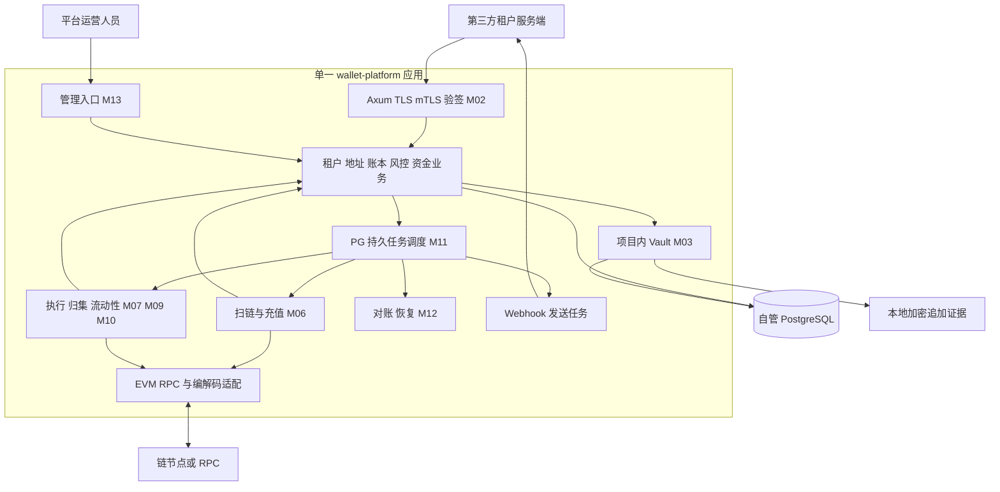

# Web3 多租户托管钱包平台——一期核心架构 V2.2

> 日期：2026-10-09；状态：设计基线，尚未实现。
> 本次修订：单项目、单在线应用进程、必要才拆 crate；项目内软件 Vault；全硬化充值派生。

完整模块设计见 [V2.2 总览与 M01–M14 目录](20261009-v2-detailed-design/README.md)，工程映射见 [M14](20261009-v2-detailed-design/14-engineering-and-acceptance.md)。M 编号表示逻辑职责，不能据此生成 14 个 crate 或微服务。本文汇总决策，具体数据/接口/恢复契约以各模块详细设计为准。

## 0. 架构决策

平台向第三方业务提供用户账户、充值地址、充提冻解及通知，平台托管链上资金私钥。用户余额来自内部双重记账；充值地址和归集后资金位置不是余额权威。

| ADR | V2.2 决策 | 约束/代价 |
|---|---|---|
| ADR-001 应用形态 | 一个 Rust workspace、一个 `wallet-platform` 在线进程 | 统一构建/部署/恢复，无内部 RPC、服务发现或独立 Signer/Worker |
| ADR-002 工程边界 | 建议 app/core/vault/chain-evm/types 共 5 个 crate | 普通业务在 core 内分 module，不机械按 M 编号拆 crate |
| ADR-003 租户资产 | 独立充值根、热钱包、金库、Gas 池与资金核算 | 不跨租户混池或借用运营资本 |
| ADR-004 软件密钥 | 本地 Argon2id + AEAD + 人工解锁 + 受限签名 | 本版不接 KMS/HSM/MPC、外部签名或 Secret/托管服务 |
| ADR-005 派生 | 独立随机根，`m/44'/60'/0'/0'/index'` 全硬化 | 无 xpub 公共派生；明确自定义 EVM scheme 和完整恢复路径 |
| ADR-006 多网络地址 | 默认同用户在批准 EVM 网络复用地址，各网络独立记账 | 同私钥有跨网络暴露；独立网络根模式须发行前确定 |
| ADR-007 链/资产 | 一期 EVM 原生币、审核后 ERC-20 | 未知、费税、rebase 资产不准入；二期再实现 TRON/Solana |
| ADR-008 资金权威 | PostgreSQL 不可变双重记账，精确整数 | 已过账不改；以冲正/纠错凭证修复 |
| ADR-009 提现 | 校验→原子 Hold/额度→异步审批→精确签名→最终结算 | 可能签名后不按超时退款；用户付同资产服务费、平台付网络 Gas |
| ADR-010 归集 | 成本/时效/敞口/流动性驱动；补 Gas 与归集关联 | 客户负债不因 Gas 消耗自动减少，运营原生资本须覆盖 |
| ADR-011 异步 | PG Outbox/job + 同进程有界任务 | 无必需 Redis/消息中间件；内存 channel 不能承载资金事实 |
| ADR-012 安全边界 | 私有 crate/类型、软件策略、离线备份和在线敞口控制 | 同进程共享权限和内存，不宣称对完整主机控制有隔离能力 |

## 1. 单进程总体架构



所有框均为同一应用内 module/crate 或 task。crate 通过本地 typed command/trait port 协作；app 组装依赖。Argon2id、密钥派生、签名和文件 fsync 使用受控阻塞池；HTTP、RPC、通知、扫描/跟踪使用有界异步任务。

PG 保存业务、Vault 密文、许可/结果、任务及审计。链节点/RPC 属于基础设施，可自建；本版不把业务模块拆成独立进程。Webhook client 进行 SSRF/DNS 校验，整机网络只允许登记基础设施和必要出站；各 task 不具备独立网络安全身份。

## 2. 重点 0：安全接入与通信

详细契约见 [M01](20261009-v2-detailed-design/01-tenant-and-user.md)、[M02](20261009-v2-detailed-design/02-open-api-and-communication.md)、[M11](20261009-v2-detailed-design/11-events-webhooks-and-jobs.md)。

- Axum/rustls 处理 TLS；资金写请求要求 mTLS 客户端身份与租户 API 公钥一致。
- Ed25519/RFC 9421 固定 Profile 绑定 method、完整 URI、Content-Digest、关键头、created/expires/nonce；不信任外部内部上下文头。
- PG 唯一 `(kid, nonce)` 防重放；业务幂等按 `(tenant, operation, key)` 和规范业务 hash，外部订单号长期唯一。
- 提现受理的幂等、订单、Hold、额度和 Outbox 一次提交；超时重试同订单，不生成新商户单号。
- 需要报文加密时用固定 JWE Profile；TLS/JWE/Webhook 平台私密材料由本项目通信 Vault 管理。
- Webhook 使用稳定 event ID、平台通信签名、公钥轮换、至少一次投递；接收端事务去重，通知失败不改变资金终态。

内部模块调用不做 HTTP/mTLS 跳转。协议标准参考 [RFC 9421](https://www.rfc-editor.org/rfc/rfc9421.html)、[RFC 9530](https://www.rfc-editor.org/rfc/rfc9530.html)；验签和幂等是不同约束。

## 3. 重点 1：助记词、加解密与派生泄露

完整威胁模型、封装数据、状态、签名与恢复见 [M03](20261009-v2-detailed-design/03-key-vault-and-signer.md)。

### 3.1 软件 Vault

每租户资金 Vault 独立随机 VMK/解锁秘密，充值/热/Gas/金库根互不派生；通信与证据 Vault 分开。根载荷以加密 BIP39 熵和参数为恢复权威，默认 256-bit 熵、24 词、空额外 BIP39 passphrase；seed 在 M03 内短时生成。[BIP39](https://github.com/bitcoin/bips/blob/master/bip-0039.mediawiki)

```text
离线解锁秘密 → Argon2id → Unlock KEK
→ 解封 VMK → 解封每条记录的随机 DEK → 解密熵/私密材料
→ 短时派生/签名 → 清理受控敏感缓冲
```

使用 XChaCha20-Poly1305、24-byte 随机 nonce、认证 AAD 绑定环境/租户/用途/版本/scheme；使用本地现成密码库，不自实现密码学。KDF profile、有界内存/并发、封装格式和轮换见 M03。[Argon2id 参数依据](https://www.rfc-editor.org/rfc/rfc9106.html#section-4)、[AEAD nonce 依据](https://doc.libsodium.org/secret-key_cryptography/aead/chacha20-poly1305/xchacha20-poly1305_construction)

启动默认 LOCKED，本地无回显输入/继承匿名 FD 人工解锁；秘密不入数据库、env、CLI 参数、镜像或自动启动文件。锁定停止新私钥操作，已有地址和链事实观察继续；证据 Vault 可独立支持旧 raw 重播和预派生池发行。

### 3.2 全硬化方案

新根 `EVM_HARDENED_V2`：`m/44'/60'/0'/0'/address_index'`。逻辑索引小于 `2^31`，转换为明确 Hardened 子序号；所有派生在 M03 内执行。只返回叶公钥/地址，业务不保存 xpub/xprv/chain code。

父 xpub 与相应非硬化子私钥可恢复父扩展私钥；全硬化路径移除这个反推条件。[BIP32](https://github.com/bitcoin/bips/blob/master/bip-0032.mediawiki) 叶泄露仍控制该地址；根/VMK/整个解锁进程泄露仍可能危及其全部可访问材料。

这是自定义 EVM 路径，不是标准 BIP44 默认发现路径。历史非硬化地址保留 `EVM_LEGACY_V1` 的精确路径和永久归属，迁移新地址不取消旧私钥风险。

### 3.3 签名边界

仅允许充值归集、补 Gas、批准提现、同租户补仓和受控 Nonce barrier。M03 重载持久业务事实，解码精确 EVM 载荷，检查用途/目标/额度/预算/最新 pause epoch；许可为本地私有能力和持久记录，没有跨服务授权 token。

调用前提交 `SIGNING_POSSIBLE`；签名结果密文先落 PG、本地加密证据 fsync/ACK，再返回 M07。证据/调用交接失败保留可能付款状态，不退款、不新 Nonce 重付。

## 4. 重点 2：唯一租户用户与稳定地址

详细规则见 [M04](20261009-v2-detailed-design/04-address-and-asset-registry.md)。

```text
认证 TenantContext → 幂等用户映射 → 永久根/index allocation
→ M03 私有硬化派生 → 登记每网络归属与出生高度
→ 完成监听/回填覆盖 → 加密发行证据 ACK → ACTIVE 后公开地址
```

用户身份、地址和资金账户分别建模；索引永久单调、跳过无效子索引且不回收，轮换保留全部历史归属。已绑定地址不转给另一用户。资金 Vault 锁定时新派生等待；可用预派生池通过原子绑定和新用户映射证据继续开户，耗尽返回 provisioning。

链/资产以精确网络、原生资产或完整合约地址识别，symbol 只展示。默认同 EVM 地址可在批准网络复用，账本/最终性/余额绝不跨网络合并；网络隔离根模式在发行前确定。

## 5. 重点 3：充值、提现、冻结与解冻

见 [M05 账本](20261009-v2-detailed-design/05-ledger-and-holds.md)、[M06 充值](20261009-v2-detailed-design/06-chain-indexer-and-deposits.md)、[M08 提现](20261009-v2-detailed-design/08-withdrawals-and-risk.md)。

| 动作 | 资金规则 |
|---|---|
| 充值 | block/log/trace 覆盖完整、资产 Profile 正确、链特定最终性满足后唯一入账 |
| 冻结 | 可用负债转到指定 Hold，发行者/原因/剩余金额可审计 |
| 解冻 | 只释放授权 Hold 未释放部分；不能释放可能付款的提现 Hold |
| 提现受理 | 原子冻结本金 P+同资产服务费 F，预留额度，异步审批 |
| 最终成功 | 消耗用户 P+F，减少托管资产 P，确认服务费收入 F，网络 Gas 另记运营成本 |
| 安全失败/取消 | 有永久未签或最终未付款证明才退 P+F；已经发生的 Gas 仍记成本 |
| 内部转账 | 同租户、网络、资产内原子借贷，无链上交易 |

金额使用最小单位精确整数；链单笔服从 U256 上限，账本汇总另有有界整数规则。待确认充值不计可用，借贷必须平衡，历史分录只通过冲正/纠错改变净效果。

原生内部转入只统计成功 CALL 路径，顶层/trace 去重；token 精确合约和 Transfer/行为校验。归集、补 Gas、补仓不计用户新充值。深重组按工单处理已花费余额，不制造负可用。

## 6. 重点 4：归集、Gas 与流动性

见 [M09](20261009-v2-detailed-design/09-sweep-and-gas.md)、[M10](20261009-v2-detailed-design/10-treasury-and-liquidity.md)。

- 充值到账不等待归集。按未归集敞口、年龄、流动性缺口及成本收益选择计划，保持硬上限。
- 同源地址最多一项活跃计划，多 token 依 Nonce 排队；补 Gas 不确定时恢复原族，不重复无界补币。
- Gas 金额属于内部资产迁移；补币/归集交易网络费才是成本。token 服务费收入不能直接变成 ETH 费用资本。
- 原生运营盈余＝最终托管原生资产−用户原生负债（含 Hold）−待分配/其他保留义务；新增费用预算需再扣费用预留和缓冲。
- 钱包可用量以一致高度快照减未反映支出/安全缓冲计算；已最终付款在快照追上前仍计实际支出，避免旧快照超提。
- HOT、GAS_POOL、TREASURY 独立用途；可在线解密的金库属于在线资产。可选冷材料只在同二进制人工离线模式使用，不进在线 Vault。

M10 CustodyFinalizer 唯一负责内部托管迁移与所有网络 Gas；M08 同 UnitOfWork 组合提现/退款、Gas、Hold、限额和物理预留结算。

## 7. 重点 5：风控与唯一付款执行

完整执行恢复见 [M07](20261009-v2-detailed-design/07-transaction-execution.md)。

```text
基础校验 → 原子冻结/额度 → 异步风险批准 → 同租户 HOT 选择/物理预留
→ 不可变 intent → 固定 wallet/nonce/tx family → SIGNING_POSSIBLE
→ 本地 Vault 精确签名/证据 → raw 落存 → 广播/跟踪 → 最终效果结算
```

同业务最多一个仍可能付款的 execution；fee replacement 保持钱包/Nonce/经济参数，只调整批准范围内费用。pending 超时、单 RPC 查不到、许可过期都不能证明原付款无效。已签取消和原付款竞争，以最终消耗 Nonce 的成员判定。

校验 ERC-20 最终 Transfer 和真实效果，receipt.status=1 不是充分成功证据。钱包通道异常/未知 Nonce 触发对账屏障，不跳过旧订单重付。

风控包含用户/租户/资产限额、并发待付款额度、白名单、异常地址/速度及多人业务批准；M03 再复核软件硬规则。多人批准不等同于链上多签，也不改变同进程故障域。

## 8. 对账、灾备与管理

见 [M12](20261009-v2-detailed-design/12-reconciliation-and-recovery.md)、[M13](20261009-v2-detailed-design/13-admin-and-audit.md)。

联合检查点绑定链高度/hash、扫描覆盖、registry version 和 ledger seq，同高度查询余额/比对资产。投影/Hold/账链差异只能通过有明确工单与批准的模块命令修复，不能直接改余额。

管理使用项目内账号、密码哈希/MFA/短会话，敏感变更绑定不可变 payload hash、资源版本和不同人员批准。暂停 gate 先关闭，PG 单事务提升 scope epoch；M03 准入锁相同控制行。已准入/已签交易仍可能付款，暂停不触发自动退款。

备份包括完整 PG、密钥封装、解锁恢复材料引用、发行/签名加密证据和版本化配置。PG 与本地文件不是原子双写，同机文件不提供整机毁损隔离；周期离线备份不默认承诺 RPO=0。全部可靠副本回退或事实不完整时保持 RECOVERY_LOCKED。

## 9. 工程交付与待定配置

[M14](20261009-v2-detailed-design/14-engineering-and-acceptance.md) 提供 5-crate 目录、单向依赖图、M01–M14 映射、线程/任务预算、事务锁序、启动解锁/停机恢复与阶段验收矩阵。

当前只更新设计文档，不生成 Cargo 空骨架、不声称已有编译或安全测试通过。首网络/合约、用户规模、费用/SLA、风险阈值、在线资金敞口、解锁值班、RPO/RTO 和保留期需要在对应模块实施前确定。

