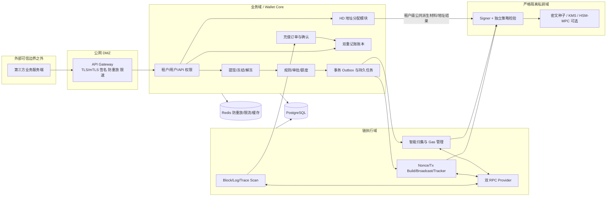
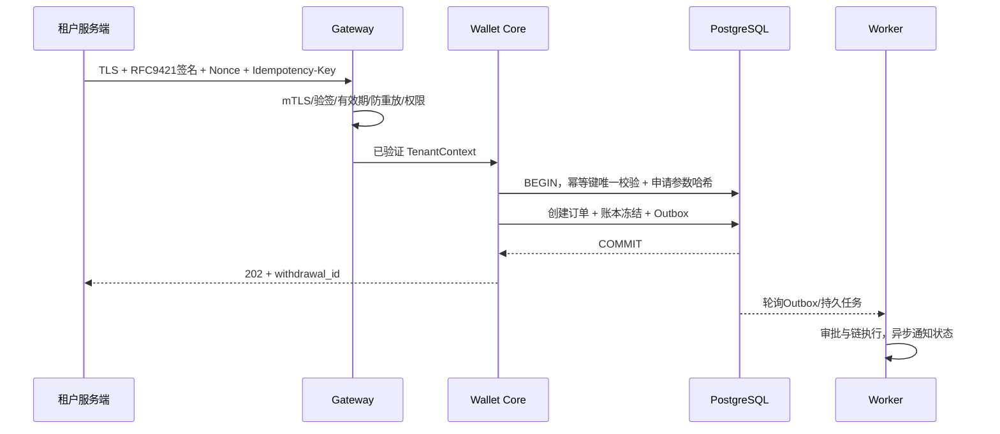
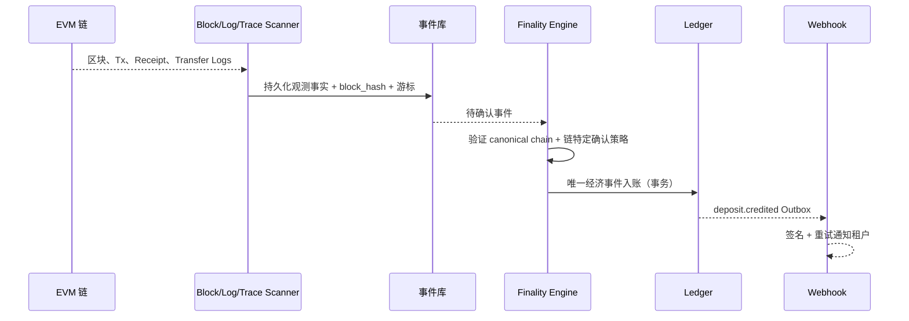
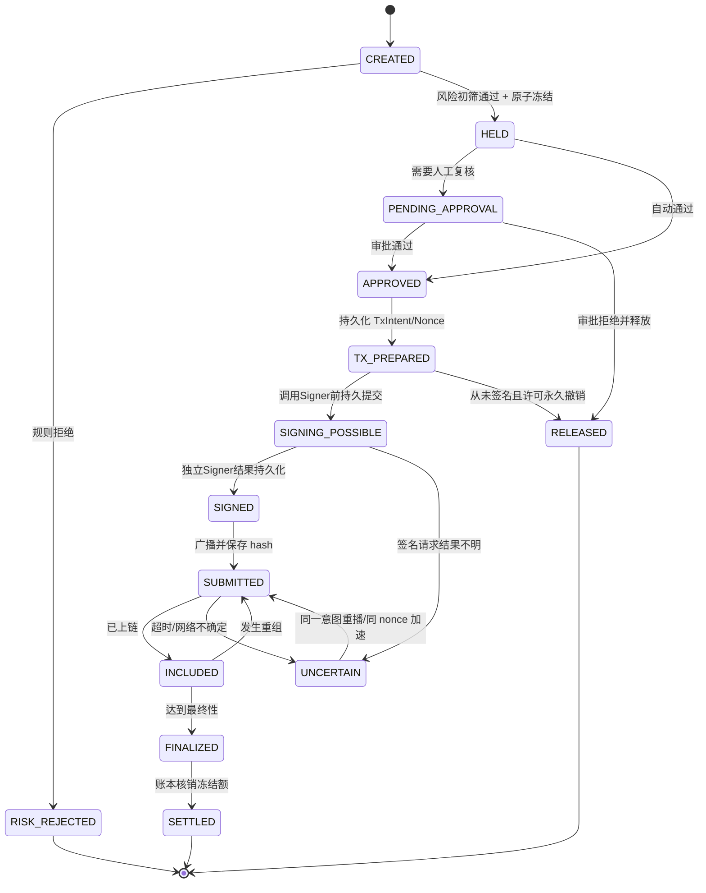
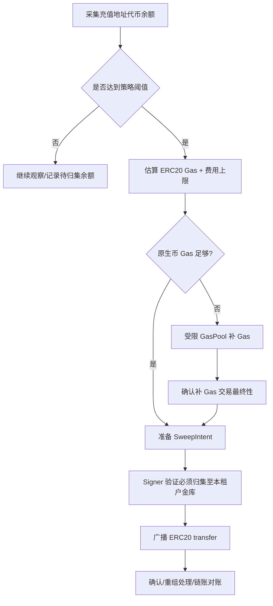

# Web3 多租户中心化托管钱包平台——一期核心架构设计 V2.0

> 日期：2026-10-09  
> 状态：架构建议 / 可行性设计，不替代生产安全审计与当地合规评估  
> 优先级：0 第三方安全接入；1 助记词存储；2 租户用户唯一账户；3 原生币/ERC-20 充提冻解；4 低 Gas 归集；5 风控与智能提现  
> 技术首选：Rust / Axum / PostgreSQL / Redis / alloy-rs / 独立 Signer；一期仅落地 EVM

## V2 模块详细设计（V2.1）

已按六项需求拆分为 14 个模块，见 [模块总览与详细设计目录](20261009-v2-detailed-design/README.md)。每个模块包括职责边界、数据模型、接口、流程、异常恢复、性能约束和验收条件。开发时采用详细设计中对资金占用、签名交接、费用结算、地址发行和联合对账检查点的明确契约。

## 0. 执行摘要与核心 ADR（架构决策记录）

**产品定位**：面向业务平台的多租户托管钱包（Wallet-as-a-Service）。第三方只持有租户 API 凭证、用户外部 ID、内部资金账户和订单号，平台控制链上签名密钥与资产。

**强约束**：用户的链上充值地址 **不是** 用户资金余额的权威数据源；用户余额来自不可变双重记账账本。归集改变链上资金位置，不改变用户资产所有权。

| ADR | 结论 | 原因与代价 |
|---|---|---|
| ADR-001 服务形态 | 模块化单体 Wallet Core + 链适配/索引 Worker + 独立隔离 Signer | 一期减少分布式事务，但把高危私钥执行域隔离出来 |
| ADR-002 租户资产 | 一期默认每租户独立资金金库和热钱包，统一共享调度软件；不跨租户混池 | 便于对账、限额与隔离，代价是 Gas 和资金周转效率有所下降 |
| ADR-003 密钥体系 | 每租户独立 HD 充值种子；热钱包/冷钱包与充值种子分离 | 控制爆炸半径，避免一份种子掌控全部资产；增加密钥管理量 |
| ADR-004 EVM 用户地址 | 每租户每用户分配稳定派生索引；默认在多个 EVM 网络复用该 EOA 地址，但记账按网络独立 | 简化开户与恢复；用户可能向错误网络转币，需严格网络白名单与提示 |
| ADR-005 原生币和 ERC-20 | 原生币通过交易/trace 识别；ERC-20 仅支持经过审核的标准代币，按事件且核对实际可归集金额 | 限制不标准代币，换取安全性和可对账性 |
| ADR-006 交易账本 | 资金操作原子化入双重记账分录，禁止浮点数和直接改余额 | 增强一致性和审计能力 |
| ADR-007 充值终态 | 观察到交易≠到账，达到链特定最终性后才转可用；深度重组单独异常流程 | 减少因重组产生的资产亏空 |
| ADR-008 提现 | 基础校验→原子冻结/额度预留→异步风控批准→不可变交易意图→独立签名→广播→最终结算 | 控制私钥调用，避免超提和重发 |
| ADR-009 归集 | 阈值/时间/流动性驱动，ERC-20 Gas 补充与归集成对执行 | 避免每笔小额充值都付两次链上 Gas |
| ADR-010 开放 API | TLS、Ed25519/RFC 9421 报文签名、防重放、DB 级幂等；资金写接口 mTLS | 消除请求伪造、跨租户、重放和并发重复提交 |

**非目标**：一期不自研 MPC 密码学协议、不开发跨链桥、不接入 DEX、不做任意智能合约交易、不支持未知或费税型/重基准 ERC-20、不实现 TRON/Solana 的链上执行逻辑。多链能力仅抽象核心模型及接口。

---

## 1. 总体系统、部署和信任边界



**网络边界要求**：
- 网关暴露公网 HTTPS；Wallet Core 无直接公网入口；链 Worker 只访问允许的 RPC；Signer 无公网入口且原则上无公网出站权限。
- Signer 独立部署、独立身份与 KMS 权限；只接受内部相互认证的签名调用，记录不可篡改审计事件。
- Webhook 由独立队列发送器出站发往租户配置并验证过的回调目标，防 SSRF 和 DNS 重绑定，禁止回调内网/元数据地址。
- PostgreSQL 核心账本与索引共享单集群但业务 schema/角色分离，账本操作由专用权限执行；生产上备份、PITR 与审计隔离。
- 初期 **Outbox + PostgreSQL job** 即可满足持久异步；若后续量级上升，再增 JetStream/Kafka/Redpanda，不把消息队列当资金权威账本。

### 1.1 钱包资产与账户分层

```text
Tenant A
  User 1 --内部资金账户(ETH/USDT等)--> 唯一链上充值地址 A1
  User 2 --内部资金账户(ETH/USDT等)--> 唯一链上充值地址 A2
  充值地址 A1/A2 --定期归集--> Tenant A Treasury
  Tenant A Treasury --按限额调拨--> Tenant A Hot Wallet Pool
  Tenant A Hot Wallet Pool --统一批次调度--> 外部提现地址
Tenant B
  独立充值根密钥、金库、热钱包与资金核算
```

**风险控制边界**：热钱包仅维持短期提现流动性；大量资产停留在受更严格审批和离线管理控制的金库/冷钱包。不把所有资产长期存在热钱包，也不把热钱包与用户充值根密钥混用。

---

## 2. 重点 0：第三方安全集成与通信

### 2.1 鉴权与链路方案

| 防护目标 | V1 做法 | 说明 |
|---|---|---|
| 服务端身份验证 | `kid` 定位租户 API 公钥；Ed25519 验证请求签名 | 第三方私钥仅第三方保管，平台仅保存公钥与权限 |
| 传输保密 | 全站 TLS 1.3；提现类高风险租户强制 mTLS | TLS 终止网关须做严格可信转发 |
| 消息完整性 | RFC 9421 HTTP Message Signatures，覆盖 method、path、query、Content-Digest、关键头、创建/过期时间 | 避免临时发明自定义 JSON 规范化方式；签名绑定实际传输字节 |
| 防重放 | `created/expires` + 一次性 nonce + (kid, nonce) 唯一记录 | 推荐有效窗口 3–5 分钟，配置内时钟偏差校验；存储故障对资金接口 fail closed |
| 业务幂等 | `Idempotency-Key` + 请求内容摘要 DB 唯一约束 | 业务幂等≠抗重放；同键不同参数拒绝 409 |
| 权限最小化 | `accounts:read`、`deposit:read`、`withdraw:create`、`freeze:manage` 等 | 密钥可分角色、来源 IP 白名单为补充而非身份验证 |
| 数据保密加强 | 需要时 JWE/HPKE 对特定字段/报文加密；敏感响应支持签名 | 不是替代 TLS；密钥与签名密钥分离，管理轮换版本 |
| 租户权限隔离 | 从已验签凭证生成 `TenantContext`，业务/SQL 强制作用域 | 不能信任 Body 自带 tenant_id；严防 BOLA/IDOR |
| 回调安全 | webhook 独立密钥签名 + 事件 ID + 重试 + 订阅范围 | 接收端验证原始字节签名和时效；不得通过未验证 URL 回调 |

参考 RFC 9421 与 OWASP API Security Top 10。签名认证不能代替订单级授权，租户自身系统被盗用后仍可能发出形式有效的提现请求。

### 2.2 API 契约建议

```
POST /v1/users                                # 创建/获取用户映射
GET  /v1/users/{external_user_id}/addresses  # 查询用户地址，按 chain_id
GET  /v1/balances?external_user_id=...        # 可用/冻结/待确认余额
GET  /v1/deposits?external_user_id=...        # 充值记录
POST /v1/holds                                # 非提现业务冻结（仅获授权租户）
POST /v1/holds/{hold_id}/release              # 解冻（按来源/权限策略）
POST /v1/withdrawals                          # 发起提现
GET  /v1/withdrawals/{withdrawal_id}          # 查询提现状态
POST /v1/transfers/internal                   # 同租户内部转账（若启用）
GET  /v1/assets                               # 支持资产和网络
POST /v1/webhooks/test                        # 经过授权的测试回调
```

```json
{
  "external_order_id": "merchant-order-20261009-00001",
  "external_user_id": "customer_8272",
  "chain_id": "eip155:1",
  "asset_id": "eip155:1/erc20:0x...",
  "amount": "10000000",
  "destination_address": "0x...",
  "memo": "merchant settlement"
}
```

- `amount` 是资产最小单位整数的 **十进制字符串**（示例为 6 位精度的 10 单位代币）；服务端也可提供人类可读转换接口，但不能用浮点值进入账本。
- `chain_id` 使用 CAIP-2（如 `eip155:1`）；资产 ID 可采用 CAIP-19 类似格式，内部必须额外保留 `contract_address`、`native` 类型、资产白名单 ID 和元数据版本。示例中的 `0x...` 只是占位符，不是合法合约地址。
- 租户无法指定 `from_address`、内部资金钱包或任意合约 `data`；这些由平台策略推导，拒绝任意 `eth_sendTransaction` 型接口。
- 资金 API 返回 `202 + platform_order_id` 只表示**已接受指令**，绝非链上完成。
- 撤销、超时和失败须提供明确终态；同步接口不要等待链上最终确认。

### 2.3 HTTP API 时序与幂等原子性



关键操作的 **唯一提交点是 PostgreSQL 的业务事务**，不能先调链、后入库；`(tenant_id, operation, idempotency_key)` 唯一，同 key 同参数重放返回原订单结果，同 key 不同参数拒绝。

---

## 3. 重点 1：助记词、种子和签名密钥安全

### 3.1 密钥分类，不允许一种根密钥控制全部用途

| 密钥类型 | 使用范围 | 存储与操作 |
|---|---|---|
| 租户 HD 充值根种子 | 大量用户地址，归集签名 | 每租户独立，加密存储，Signer 专用 |
| 租户热钱包密钥 | 日常链上提现 | 与 HD 充值根隔离，更严额度/速度限制；优先专用 HSM/MPC |
| 金库/冷钱包密钥 | 补充热钱包与大额资产保管 | 严格双人/多方审批，优先离线或 HSM/MPC |
| API 签名公钥 | 对第三方发起的业务请求验签 | 只存公钥，绑定租户、权限、有效期和轮换版本 |
| Webhook 签名密钥 | 对租户消息进行认证 | 与开放 API 凭证分离，独立轮换 |
| KMS KEK | 包裹数据密钥 | 不导出 KEK，限定 Signer IAM/身份权限 |

**关于 BIP39**：如采用助记词，使用经审计实现与密码学安全随机数生成，推荐 256-bit 熵（对应 24 个词）；运行时可以直接管理对应 HD 种子，并不需要在日常服务中重复出现明文助记词。任何 BIP39 passphrase 都属于恢复必需的秘密，必须单独备份、校验并纳入灾备演练。

### 3.2 V1 可行的密钥存储与高安全升级路线

**V1 最低可落地**：
1. 在隔离环境创建/导入每租户 HD 根种子。
2. 每份种子使用独立随机 DEK，通过 AES-256-GCM 加密；AAD 绑定 `tenant_id`、`key_version`、`purpose` 和 `environment`。
3. DEK 用 KMS KEK 包裹；数据库只持有加密种子、加密 DEK、密钥元数据。
4. 只有 Signer 身份有 KMS 解密权限；Signer 内短时派生子私钥并签名，不返回种子/私钥。
5. 禁用敏感信息日志、core dump、swap（按部署能力）、普通诊断导出；使用 `zeroize` 等措施尽力清理内存。
6. 独立加密离线备份，双人授权恢复，并在隔离环境定期验证能恢复出既有地址。

**安全限制**：KMS 信封加密只保护静态密文；**拥有解密权限的 Signer 若被完全控制，攻击者仍可能取得种子**。因此资产规模增加后必须升级经过审计的 HSM 或 MPC 实现，确认支持所需 secp256k1 + BIP32 派生/签名流程。普通 KMS 签名 API 不自动等同于支持 BIP32 多级 HD 派生。

### 3.3 xpub 风险、派生路径与密钥轮换

建议每租户独立根种子，EVM 使用：

```text
m / 44' / 60' / 0' / 0 / address_index
```

- `m/44'/60'/0'` 属于硬化父路径；普通地址服务可以保管受控的该租户 account-level **xpub**，用于无私钥派生；更高安全等级下通过专门 Address Derivation Service 代理，不直接分发 xpub。
- BIP32 **父 xpub + 对应非硬化子私钥** 可能恢复父私钥，因此 xpub 也必须隔离访问；不能在日志/API 向租户返回 xpub。
- `address_index` 是数据库原子单调分配值，不使用 `hash(user_id)`；派生索引的硬限制、近满告警与根密钥迁移必须管理。
- 派生规则一经上线不可随意更改。任何 `key_version` 轮换均产生新地址，旧地址仍须继续监控、可恢复签名和完成余额归集，不得直接删除旧根密钥。

### 3.4 Signer 不应该是万能私钥 RPC

Signer 仅允许明确的 **交易意图类型**：`DepositSweep`、`GasTopUp`、`ApprovedWithdrawal`、`TreasuryRebalance`。建议签名请求携带经过独立验证的授权证明、订单哈希和到期时间。

每次签名前必须二次验证：
- 租户、资产、链 ID、发起地址、派生路径与交易意图一致；
- `ApprovedWithdrawal` 的目的地址、金额、token 合约、目标 Nonce 不允许被链执行器篡改；
- `DepositSweep` 仅允许转到该租户经过配置的 Treasury，不允许任意第三方地址；
- 禁止未授权的 `approve(unlimited)`、任意合约调用或任意高额原生币转账；
- 该签名授权只能消费一次，过期拒绝；高额操作执行双人或多方审批；
- Signer 和业务 Core 使用不同的部署、KMS 权限、机器身份、审计通道。

---

## 4. 重点 2：租户 ID + 用户 ID -> 唯一账户与地址

### 4.1 建模原则

**身份键**：`(tenant_id, external_user_id)`；`external_user_id` 类型可选 UTF-8 字符串，但应明确区分大小写、长度上限、禁止自动 trim/Unicode 规范化导致歧义，第三方业务系统不允许复用已注销用户 ID。

**内部主键**：新生成 `wallet_user_id`（UUID/ULID）。身份证明是映射表，不是区块链私钥派生函数。

**钱包地址**：由 `key_root_id + derivation_path` 确定；链与资产余额归属由 `chain_id + asset_id + wallet_user_id` 确定。

### 4.2 地址分配事务

```text
输入：经认证的 TenantContext + external_user_id
1. BEGIN
2. INSERT tenant_user ... ON CONFLICT 返回已有 wallet_user_id
3. 检查该用户在指定 key_root 上是否已有 address allocation
4. 若无：SELECT key_root_allocator FOR UPDATE，取得 next_index，+1
5. INSERT wallet_allocation(key_root_id, path, index, wallet_user_id, status=RESERVED)
6. COMMIT
7. 经受控地址派生模块生成地址，验证派生路径及根密钥指纹
8. UPDATE allocation -> ACTIVE（幂等）
9. 返回同一用户稳定地址
```

- 派生失败时记录 `RESERVED/ERROR`，**不回收 index**；重试相同 `allocation_id`，不会为同一用户另分配一个地址。
- 如果多个应用节点同时创建同一用户，DB 的唯一约束与行锁保证地址最终只有一个；业务端重复创建返回原账户。
- 同一 EVM 地址可用于同一租户用户在多个 EVM 网络的充值，**链识别和资产识别仍必须精确**。对于极高安全/隐私要求的租户，可启用每网络隔离的 HD 根版本或硬化 account 分支，但必须在首次发行地址前确定，不可随意切换。

### 4.3 地址与资产粒度

```text
TenantUser (tenant_id, external_user_id)
  ├── LedgerAccount(chain_id=eip155:1, asset=ETH, AVAILABLE/HELD)
  ├── LedgerAccount(chain_id=eip155:1, asset=USDT, AVAILABLE/HELD)
  ├── LedgerAccount(chain_id=eip155:56, asset=BNB, AVAILABLE/HELD)
  └── DepositAddress(key_root, derivation_path, address)
```

地址复用 **不等于** 资产混用；`USDT@Ethereum` 和 `USDT@BSC` 是两项不同资产，不自动作为同一余额，除非未来上线明确的跨链资产兑换或结算产品。

---

## 5. 重点 3：原生币和 ERC-20 充值、提现、冻结、解冻

### 5.1 账户与资金总账

每项余额使用链上最小单位整数。链上单笔金额做 `U256` 边界检查，API 使用十进制整数字符串；账本汇总可能超过单笔链金额上界，应采用有界大整数和对应 PostgreSQL 精确 `NUMERIC`，不能通过固定 scale 隐式舍入小数。具体约束见 [M05 账本设计](20261009-v2-detailed-design/05-ledger-and-holds.md)。禁止 float/`f64` 进入资金运算。

**业务余额分区**：`AVAILABLE`、`HELD_WITHDRAWAL`、`HELD_RISK`、`PENDING_DEPOSIT`（待确认可属于链事件视图或独立暂记科目，不算可用余额）。系统不应直接执行 `balance = balance + x`，而应创建不可变、借贷平衡的分录和由其计算/维护的投影。

**主要总账账户**（每个 tenant、chain、asset 独立）：
- 资产侧：`CUSTODY_DEPOSIT`、`CUSTODY_TREASURY`、`CUSTODY_HOT`、`CUSTODY_IN_TRANSIT`。
- 负债侧：`USER_AVAILABLE`、`USER_HELD_WITHDRAWAL`、`USER_HELD_RISK`。
- 收支侧：`FEE_REVENUE`、`GAS_EXPENSE`、`SUSPENSE_UNASSIGNED`、`LOSS_RESERVE` 等。

**举例：用户充入 100 USDT，并达到确认条件**（下述借贷为会计方向概念）：

```text
借：链上托管资产 / 充值钱包    100 USDT
贷：用户可用余额负债         100 USDT
```

**提现申请 40 USDT**：

```text
借：用户可用余额负债          40 USDT
贷：用户提现冻结负债          40 USDT
```

**链上最终确认支付 40 USDT**：

```text
借：用户提现冻结负债          40 USDT
贷：链上托管资产 / 热钱包     40 USDT
```

**风险冻结/解冻** 只在 `USER_AVAILABLE` ↔ `USER_HELD_RISK` 内部迁移，不影响托管资产总额。提现手续费要另做会计分录；如果 Gas 用 ETH 而提现资产是 USDT，必须分别记录币种的支出、向用户收取的费用和必要的估值/兑换，不允许跨资产分录直接相加。

### 5.2 冻结和解冻权限

区分至少三类 hold：
1. **提现占用**：提交提现后创建，只能由提现状态机结算或安全释放。
2. **业务冻结**：租户基于自身合规业务或运营操作冻结，按该租户授权规则释放。
3. **平台风控冻结**：平台风险规则或人工控制创建；租户不能通过开放 API 直接解冻。

每笔冻结具有 `hold_id、tenant_id、wallet_user_id、asset_id、amount、reason、issuer、state、expiry_policy、linked_order_id`。多次冻结可并存，任何释放必须引用特定 `hold_id`，不能简单 `unfreeze(user, amount)` 以免绕开另一条风险冻结。金额增加/减少在同一 DB 事务中检查投影余额与凭证来源。

### 5.3 充值监听



原生币：
- **EOA 普通转入** 可通过交易 `to` + `value` + receipt 成功状态识别。
- **智能合约内部转账** 可能不存在外层交易 `to=user_deposit_address`，如果产品承诺支持所有原生币转入，必须接入可靠的 trace/indexing 能力并对区块级原生币余额变化进行核验；只有普通 JSON-RPC 交易列表可能漏账。
- 内部转账、矿工/协议特殊转移、智能合约自毁等边缘路径需要网络级适配；不具备可核验数据时，不得声称完整覆盖所有原生币充值。

ERC-20：
- 以白名单 `chain_id + contract_address` 匹配有效 `Transfer(from,to,value)` log；检查 receipt `status=1`、地址归属、log 索引及区块规范性。
- 不只按 token symbol 识别 USDT/USDC：同名恶意合约可伪造资产名称与事件。
- 拒绝或专门适配 fee-on-transfer、rebasing、黑名单、暂停、代理升级后行为变化等特殊代币；不能把任意 Transfer 日志直接当作可用托管资产。

**充值确认策略**：按 chain 配置 `safe/finalized` 支持度、最小确认深度、金额分级策略以及异常深重组处理。所有监听事实保存 `block_number、block_hash、tx_hash、tx_index、log_index、observed_at`。同一事件唯一约束 + 入账分录键保证重复扫块只入账一次。

**重组处理**：
- 未入账事件：回退到共同祖先，标记旧分叉事件失效并重扫。
- 已终态事件发生异常深重组：用**冲正分录**和风险冻结/异常处理，不删除原账本分录；若用户已提现，产生风险敞口，应立即停该资产/链并升级人工审计。

### 5.4 提现状态机



**最重要的不可违反规则**：只要交易**可能已签名/传播**，不能因为 RPC 超时、节点查不到 hash、交易处于 pending，就直接解冻并重新以新的 nonce 创建付款。这会引发双花式重复付款（两个不同 nonce 的交易都成功）。

对 `UNCERTAIN` 状态：继续追踪完整交易族（同 nonce 的所有替代 hash）、查询多个节点、仅在确认相同 nonce 已被另一笔交易最终消耗且原付款不会执行时才允许安全补偿。普通 Gas 加速（replacement）原则上保持同一目的地址、金额、calldata 和业务意图，仅调整费用。撤销需要单独更高权限与最终性核验。

### 5.5 存储一致性

资金创建、冻结、状态变迁、outbox 必须在同一 DB 事务写入；扫描游标与区块事实必须可靠持久化；链上广播不能放进数据库事务。使用 **至少一次任务投递 + 唯一键幂等 + 状态机 + 对账** 达成业务层效果上的恰好一次，而不是声称分布式系统天然 exactly-once。

---

## 6. 重点 4：智能资金归集与 Gas 成本优化

### 6.1 归集的真正成本

- 原生币从充值 EOA 归集到金库：通常需要一笔本地址出站交易的 Gas，原生币可直接从该 EOA 支付。
- ERC-20 从充值 EOA 归集：该地址必须持有该链原生币作为 Gas。没有 Gas 时先从 Gas 池充值一笔原生币，再由该地址转出 ERC-20，**通常至少两笔链上交易**。
- 大量小额余额若逐笔立即归集，链上 Gas 支出会吞噬业务收益；但完全不归集又造成风险敞口和提现流动性不足。

### 6.2 策略优先级

按照 **安全资金敞口 > 热钱包流动性 > 充值到账体验 > Gas 成本** 排序。提醒：内部充值一经最终性确认和成功入账，通常不需等待归集完成才显示可用余额；平台承担归集/流动性风险。

**每个归集地址与资产的候选条件**：

```text
risk_override = 单地址/租户/链未归集资产超过安全上限
liquidity_need = 租户热钱包未来提现流动性跌破警戒线
value_ok       = 当前可归集资产法币估值 >= 动态最低归集价值
fee_ok         = 预计总 Gas 费用 / 可归集资产价值 <= 可配置成本率
age_due        = 最老待归集资产已超过最大驻留时间

sweep_now = risk_override
         OR liquidity_need
         OR age_due
         OR (value_ok AND fee_ok AND 处于适宜 Gas 时窗)
```

动态阈值依据 `链 Gas 价格分布、代币价格与流动性、pending 余额、到账频率、租户余额、热点充值地址、代币转账实测 Gas` 调节。所有金额估值依赖多来源价格/异常值保护，风控上限不由单一链上价格喂价操纵。

### 6.3 两种归集模式

| 模式 | 适合对象 | 策略 |
|---|---|---|
| 原生币直接归集 | ETH/BNB/MATIC 等原生币 | `可发送余额 = 链上余额 - 保守 Gas 上限 - 最低保留值`，余额小时等待合并 |
| ERC-20 成本感知归集 | USDT/USDC 等 | 先聚合地址多次充值，仅在满足归集触发条件时补 Gas，再一次性转出该地址可归集的代币 |

**ERC-20 最重要的优化**：一个用户地址积累多次 USDT 充值后合并成一次 ERC-20 Transfer；只在确实需要扫币时给该地址补 Gas。可以给平台一个参数化的 `sweep_ratio / max_dwell_time / uncollected_exposure_limit` 策略，而不是一充值就扫。

### 6.4 ERC-20 归集执行链路



Gas 补充需按当前链实际估算并限制多余补充金额，避免每个充值地址长期遗留大量 ETH。**不要机械地给每个地址固定补 0.01 ETH**。补 Gas 失败、链拥堵、代币冻结、Gas 飞涨时进入可恢复队列而非无限重试。

### 6.5 可能的优化升级，不应伪装为首期必需

1. **智能合约批量归集/代币 permit**：只有在目标代币真正支持相应授权机制并经过审计时考虑，不是所有 ERC-20 都有 permit；部署和授权本身也有 Gas/安全成本。
2. **账户抽象/交易赞助（如 4337、7702 类能力）**：不同 EVM/L2 链支持度与实现不同，必须做独立 PoC 与安全审计，不以此作为一期归集前提。
3. **共享跨租户热资金池**：可能提升资金利用率，但显著增加所有权核算、挪用控制和监管复杂度，一期默认禁止。

### 6.6 评估指标

- `gas_cost_per_deposit_usd`：每单位充值对应归集 Gas，按资产和链分层。
- `sweep_gas_cost_ratio`：归集 Gas 美元成本 / 已归集资产美元价值。
- `uncollected_exposure`：链、租户、账户维度未归集风险敞口。
- `sweep_p95_latency`：达到归集策略后至完成的时延。
- `hot_wallet_liquidity_coverage`：热钱包可支付资产 / 预测短期提现需求。

优化目标不是极端减少链上笔数，而是在 **安全、提现履约能力、资金成本** 约束下最小化 Gas。

---

## 7. 重点 5：提现风控与最优提现

### 7.1 提现分层风控

| 阶段 | 输入数据 | 动作 |
|---|---|---|
| 请求前鉴权 | 租户 API key、mTLS、IP、权限、签名时效、幂等订单 | 不合法直接拒绝 |
| 账户风控 | 租户状态、用户账户状态、风险冻结、KYC/KYB 标记（视适用法律） | 不满足规则拒绝/暂停 |
| 金额风控 | 单笔/小时/天限额，租户热钱余额，提现速率，异常百分位 | 放行、限额、审批 |
| 地址风控 | 提现地址白名单、地址变更冷静期、链上风险评分、制裁筛查 | 允许、拦截、人工审核 |
| 设备/行为 | 来源系统 IP、API 凭证新建/旋转、异常时段、多账户同向提现 | 升级风险等级 |
| 签名前检查 | 授权订单、实际代币、链 ID、Nonce、金额、目的地址、风控令牌 TTL | Signer 独立拒绝越权交易 |
| 链执行控制 | Gas 上限、余额、Nonce 排序、未确认交易数量、热钱包单日支出上限 | 排队、调拨、暂停 |
| 事后监测 | 重复收款地址、失败率、用户争议、账链不平、异常回滚 | 暂停资产/网络/租户并告警 |

对外付款尤其应提供 **平台全局熔断**：暂停某条链、某资产、某租户或全部提现；同时不中断账本与链监听，避免暂停期间发生漏账。

### 7.2 提现费用与智能调度

建议“**平台池化提现执行 + 用户按申请锁定提款金额和服务费**”：
- 用户提交提现时明确 `send_amount`、`service_fee`、`receive_amount`、`fee_quote_expires_at`，可按产品选择额外扣费或从金额内扣，不能模糊不清。
- 平台热钱包承担网络原生币 Gas，并按策略收取对应服务费；用户的 USDT 与 Gas ETH 是两种不同资产，分别记账。
- 风控低风险、金额小：自动批准；中风险：延时或二次验证；高风险：人工双人审批。金额门槛仅示例，必须按安全预算、币价与合规要求配置。
- 正常采用 `EIP-1559` 动态费估计（支持该机制的 EVM）；对 L2 链考虑额外 L1 数据费等网络特性，使用具体链报价适配器。
- 对外支付尽量从热钱包池按可用资产、Nonce 队列深度、Gas 预算、日限额和链负载选择发送 EOA。

### 7.3 批量提现是否真的节省 Gas？

**不是一定。** 一个 EOA 原生币转账通常只消耗约 21,000 gas，改用批量支付智能合约不保证比 N 笔普通转账更便宜，还会增加合约风险。标准 ERC-20 的单笔转账包含交易基本 Gas 和 token 状态更新，经过审计的批量分发合约在特定网络、资产和批量规模下**可能**节约，但必须做实测盈亏平衡，而不是预先承诺。

一期推荐：
- **内部同租户用户转账**：优先内部账本划转，无链上 Gas。
- **外部原生币转账**：普通 EOA 单笔发送 + Gas/Nonce 队列优化。
- **外部 ERC-20 转账**：先采用普通 ERC-20 `transfer`；当累计交易足够大后，通过独立审计的 batch-pay 合约 PoC 测算成本，再决定是否启用。
- 不因 Gas 价格升高长期拖欠用户提款；结合产品提现 SLA、报价有效期与用户授权模型处理拥堵。

### 7.4 Nonce、Gas bump、防重复支付

每个 `(chain_id, hot_wallet_address)` 单独维护顺序 Nonce 分配器，数据库行锁/唯一约束分配 `(wallet, nonce)`，保存绑定不可变 `tx_intent_id`；同一 Nonce 可以允许 fee bump 衍生多个交易 hash，但**业务目的地与付款金额不可改变**。

**广播前持久化**：订单、Nonce、无歧义交易模板、签名授权、原始签名交易 bytes/hash（敏感但非私钥，受控加密存储）必须落库。广播超时使用**同一原始交易重播**；网络拥堵时受控同 Nonce fee bump。

**绝不可**：RPC 未返回结果就重新从其他热钱包生成同一提现订单的新交易；单一交易 hash 不在 mempool 也不能视为已取消。

### 7.5 流动性模型

每租户/链/资产维持：

```text
available_hot_liquidity = hot_onchain_balance - 已批准未最终支付保留额
required_hot_liquidity  = 未来窗口预测提现需求 + 风险安全垫

若 available_hot_liquidity < required_hot_liquidity:
    调度 Treasury -> Hot 补仓（受授权审批）；
    同时提高同租户待归集充值余额的归集优先级。
```

初期可用简单滑动窗口模型，按租户历史提款 P95、日高峰和异常增长倍数配置热钱包上限；资产波动性、价格异常和网络拥堵期间提高风险缓冲。

---

## 8. 核心数据库结构与唯一约束（建议）

| 表 | 核心字段 | 关键约束 |
|---|---|---|
| `tenants` | id,status,policy_version | tenant 唯一 |
| `tenant_api_keys` | id,tenant_id,public_key,scopes,status,not_before,expires_at | key ID 唯一；权限审计 |
| `api_replay_nonces` | key_id,nonce,expires_at | `(key_id,nonce)` unique，过期清理 |
| `tenant_users` | id,tenant_id,external_user_id,status | `(tenant_id,external_user_id)` unique |
| `key_roots` | id,tenant_id,purpose,key_version,encrypted_seed_ref,xpub_ref | 不可变 purpose/version，访问严格受控 |
| `derivation_allocators` | key_root_id,next_index | 行锁序号分配 |
| `wallet_allocations` | id,tenant_id,user_id,key_root_id,derivation_path,index,address,status | `(key_root_id,derivation_path)` unique；`(tenant_id,user_id,key_root_id)` unique |
| `deposit_addresses` | tenant_id,user_id,chain_id,address,allocation_id,status | `(chain_id,address)` 对应唯一业务归属 |
| `supported_assets` | chain_id,asset_id,contract,decimals,enabled,policy | 链 + 合约唯一；资产白名单 |
| `ledger_accounts` | id,tenant_id,user_id,chain_id,asset_id,type | 账户身份唯一 |
| `journal_transactions` | id,tenant_id,business_type,business_id,status | `(tenant_id,business_type,business_id)` 幂等 |
| `journal_entries` | journal_id,account_id,debit,credit,asset_id | 每事务每资产借贷平衡，禁止修改已过账分录 |
| `balance_projections` | account_id,available/held...,version | CAS 或 `FOR UPDATE` 并发保护 |
| `holds` | id,tenant_id,user_id,asset_id,amount,issuer,reason,state,order_id | 特定 hold 的唯一释放与审计 |
| `chain_blocks` | chain_id,height,block_hash,parent_hash,canonical | `(chain_id,height,hash)` |
| `chain_deposit_events` | chain_id,tx_hash,log_index,block_hash,asset_id,amount,status | 主链事件幂等 + 分叉历史版本 |
| `deposit_orders` | id,event_id,tenant_id,user_id,asset_id,status,credit_journal_id | `(event_id,credit_journal_id)` 唯一关系 |
| `withdrawals` | id,tenant_id,user_id,external_order_id,hold_id,risk_state,status | `(tenant_id,external_order_id)` unique |
| `withdrawal_approvals` | withdrawal_id,approver_id,decision,policy_version | 审批审计 |
| `tx_intents` | id,withdrawal_id,chain_id,from_address,nonce,to,data_hash,amount,state | 每单明确交易意图，不可暗改 |
| `signed_transactions` | tx_intent_id,nonce,hash,raw_tx_ref,fee_policy,state | 同 nonce 替代交易族归属同意图 |
| `nonce_allocations` | chain_id,signer_address,nonce,tx_intent_id | `(chain_id,signer_address,nonce)` unique |
| `sweep_jobs` | tenant_id,chain_id,asset_id,deposit_address,gas_budget,status | 去重活跃任务；锁定归集地址 |
| `gas_topup_jobs` | tenant_id,chain_id,deposit_address,amount,linked_sweep_id | 避免重复补 Gas |
| `custody_wallets` | tenant_id,chain_id,role,address,key_ref,limit | 金库/热钱包角色隔离 |
| `api_idempotency` | tenant_id,operation,idem_key,request_hash,response_ref | `(tenant_id,operation,idem_key)` unique |
| `outbox_events` | id,aggregate_id,type,payload,created_at,delivered_at | 至少一次、可重试 |
| `webhook_deliveries` | event_id,tenant_id,endpoint_id,attempt,status | 每次投递可审计 |
| `reconciliation_runs` | tenant_id,chain_id,asset_id,height,ledger_total,chain_total,diff | 自动对账/差异处理 |

**建议使用 PostgreSQL Row Level Security 作为纵深防御，而不是唯一隔离手段**。所有重要查询仍应显式加 `tenant_id`；DB connection pool 必须避免租户上下文泄漏。平台后台操作采用高权限审计通道，不使用普通租户 token。

---

## 9. 核心 Rust 结构与服务边界

```text
wallet-platform/
  crates/
    wallet-api/              # axum HTTP，TenantContext、签名中间件
    wallet-domain/           # 用户/订单/状态机/业务规则
    wallet-ledger/           # 双重记账、余额锁、记账分录
    wallet-tenant/           # 租户、用户映射、权限
    wallet-address/          # BIP32 公钥派生/地址分配接口
    wallet-risk/             # 规则、额度、审批、熔断
    wallet-custody/          # 热/冷钱包、金库、归集策略
    wallet-tx/               # 链交易意图和 nonce 状态机
    wallet-chain-core/       # 通用接口：ChainId、AssetId、Finality、Transfer
    wallet-chain-evm/        # alloy + rpc + tx builder + gas estimator
    wallet-storage/          # sqlx + PostgreSQL
    wallet-security/         # 加密材料元数据、权限校验、审计
    wallet-signer-protocol/  # 独立 Signer 请求/响应类型
    wallet-events/           # outbox/webhook/jobs
  services/
    wallet-api-server/
    evm-indexer-worker/
    collection-worker/
    withdrawal-worker/
    webhook-worker/
    wallet-signer/           # 网络、安全域、KMS 权限独立
```

### 9.1 链无关接口设计

```rust
// 示意接口，具体类型与 async_trait / trait Future 实现方式按 Rust 版本确定。
pub trait ChainAdapter {
    type Address;
    type UnsignedTransaction;
    type SignedTransaction;

    fn validate_address(&self, addr: &str) -> Result<Self::Address, ChainError>;
    fn scan_deposits(&self, range: BlockRange) -> impl Future<Output = Result<Vec<DepositEvent>, ChainError>> + Send;
    fn estimate_fee(&self, intent: &TxIntent) -> impl Future<Output = Result<FeeQuote, ChainError>> + Send;
    fn build_transaction(&self, intent: &TxIntent) -> impl Future<Output = Result<Self::UnsignedTransaction, ChainError>> + Send;
    fn broadcast(&self, tx: &Self::SignedTransaction) -> impl Future<Output = Result<TxHash, ChainError>> + Send;
    fn check_finality(&self, tx: &TxHash) -> impl Future<Output = Result<TxFinality, ChainError>> + Send;
}
```

> 注意：这是概念接口，不是无修改即可在所有 Rust trait object 上对象安全地调用的成品 API。实际实现可用关联类型 + 枚举路由，或对象安全的 `BoxFuture` 抽象；Rust 内部领域对象保持链无关，签名序列化与地址编码在链适配器内实现。

**二期保留接口**：
- EVM：secp256k1 ECDSA、Nonce、Gas、ERC-20 log；
- TRON：独立地址编码、Bandwidth/Energy、TRC-20、资源消耗；
- Solana：Ed25519、近期 blockhash/有效期、SPL Token account、compute budget；
- 都统一归一化为 `AssetId/ChainId/DepositEvent/WithdrawalIntent/FinalityPolicy/FeeQuote`，不能把 EVM 的 `nonce`、`gas_limit` 强加给全部链。

---

## 10. 异常处理：资金安全优先级矩阵

| 故障 | 错误处理 | 禁止行为 |
|---|---|---|
| API 签名合法但同 nonce 重放 | 网关拒绝；有同一幂等订单则提供查询 | 再执行资金冻结 |
| 并发给同用户开户 | 唯一约束返回原记录 | 再占用一个 HD index 导致地址漂移 |
| 数据库已入账但 webhook 失败 | outbox 重试直至 ACK；租户侧按 event_id 幂等 | 回滚成功的用户入账 |
| RPC 节点宕机 | 切换第二供应商、回溯校验游标、报警 | 凭空认为链上无交易 |
| 未确认充值被重组 | 标记失效并重扫 | 提前让用户提现 |
| ERC-20 归集前 Gas 猛涨 | 延迟/升级策略、限制 topup、检查安全敞口 | 无限补 Gas、负收益归集 |
| 提现已签名后广播超时 | 追踪原 rawtx/hash + 同 nonce 替代族 | 新 nonce / 新热钱包重复付款 |
| 提现上链后 Reorg | 返回待确认，继续追踪 | 立即二次提现 |
| 热钱包额度不足 | 排队并受控金库调拨 | 绕过审批从冷钱包直接无限出款 |
| Signer/KMS 故障 | 全部资金类签名暂停；已有状态持续追踪 | 重置密钥或自动切到不安全明文配置 |
| 账链余额不平 | 冻结相关租户/链/资产的风险出款，调查差异 | 直接用 SQL 改余额“修正” |
| 发现密钥泄露 | 紧急熔断，隔离密钥版本、经授权转移资金、轮换地址 | 简单替换 KMS key 后假设旧地址已安全 |

---

## 11. 最小可行分期 / 验收标准

### Sprint A：可接入、可开户、可记账
- TLS + 签名 + 防重放 + 幂等 + 多租户鉴权。
- KMS 信封加密 + 隔离 Signer + 每租户独立 HD 根；地址分配与恢复测试。
- DB 账本借贷平衡、余额冻结/解冻，并发提现防超提。

### Sprint B：充值与对账
- 单条 EVM 网络 + 原生币 + 2 个主流白名单 ERC-20，先测试网后灰度主网。
- 普通 ETH 转入及可靠内部转账 trace 方案验证；ERC-20 Transfer 日志；断点续扫、Reorg 处理、最终性入账。
- 账链差异审计与 webhook 重试。

### Sprint C：归集与安全提现
- 原生币归集与 ERC-20 定额/动态 Gas 补充归集；成本测算。
- 低/中/高风险提现审核，冻结->签名->广播->最终结算状态机；Nonce/加速/补偿机制。
- 热钱包资产上限、人工审批、熔断、Gas 报价和应急运维工具。

### Sprint D：压力和安全发布
- 至少覆盖：并发创建相同用户、并发提现超提、重复幂等键、同交易重复日志、断点复扫、RPC 分叉、webhook 重试、KMS 拒绝、热钱包不足、已签名交易广播不确定、nonce 替换、深度重组、恢复旧根种子地址。
- 密钥安全/签名授权渗透测试、代码审计、最小权限验证、离线恢复演练；生产发布必须经过实际司法辖区合规评估。

**生产上线门槛（P0）**：
1. 任意租户 API 凭证不能访问其他租户余额或订单；任意客户端不能调用原始签名接口。
2. 任一账本资金事务保证借贷平衡；任何并发请求都无法生成负可用余额。
3. 同一链上经济事件最多一次正向入账；重组时以冲正而非删除历史处理。
4. 对同一业务提现订单不可能生成两笔不同 nonce 且都可能生效的付款。
5. 可从受控离线备份恢复旧根种子并重建对应用户地址，恢复后账链验证一致。
6. 各链/资产/租户发生异常能够暂停对外提现而不阻断区块扫描与证据记录。

---

## 12. 架构风险、法规与待确认项

### 核心不确定性

1. **支持的目标司法辖区**：托管私钥、用户资产保管、内部余额及价值转移可能引发牌照、AML/KYC、制裁、客户资产隔离等义务；上线前应由相关辖区的合规律师评审。本文不对任何具体地区给出“无需牌照”的结论。
2. **租户数量和峰值吞吐**：决定每租户独立金库的成本、RPC/索引容量、地址分配规模、消息队列是否独立部署。
3. **EVM 目标链清单**：不同链的最终性、RPC trace、EIP-1559/L2 费用与代币行为不同；应从一条主网做通后再扩多条。
4. **资产业务范围**：非标准 ERC-20 是否支持；一期建议只支持经过评估的少量高流动性标准代币。
5. **提现产品策略**：手续费谁承担、提现 SLA、多大金额人工审批、白名单及冷静期设定，均需产品、财务与风控共同决策。
6. **客户资金隔离规则**：一期默认不跨租户链上混池。如果后续引入共享资金池，需要独立审计、多级风控与法规评估。

### 工程优先级

**先做账户/账本与授权签名闭环，再做充值/归集与智能提现，最后做 Gas 经济优化。** 任何省 Gas 的设计都不得突破签名白名单、用户资金归属、最终性和提现防重复执行要求。

---

## 13. 规范与工程参考

- BIP39（助记词与种子）：https://github.com/bitcoin/bips/blob/master/bip-0039.mediawiki
- BIP32（HD 派生、公私扩展密钥安全）：https://github.com/bitcoin/bips/blob/master/bip-0032.mediawiki
- BIP44（标准 HD 地址派生路径）：https://github.com/bitcoin/bips/blob/master/bip-0044.mediawiki
- RFC 9421（HTTP Message Signatures）：https://datatracker.ietf.org/doc/html/rfc9421
- OWASP API Security Top 10：https://api-security.owasp.org/editions/2023/en/0x11-t10/
- AWS 信封加密参考：https://docs.aws.amazon.com/encryption-sdk/latest/developer-guide/how-it-works.html
- Ethereum JSON-RPC：https://ethereum.org/developers/docs/apis/json-rpc/
- EIP-1559：https://eips.ethereum.org/EIPS/eip-1559
- CAIP-2：https://standards.chainagnostic.org/CAIPs/caip-2

